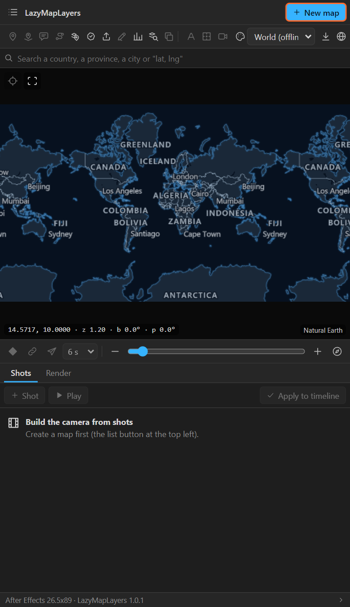

# 1. Installing, and opening the panel

LazyMapLayers installs in two minutes and then works without the internet: the map data for the
whole world, down to city level, comes in the same download.

## What you need

| | |
|---|---|
| After Effects | 2024 or newer |
| System | Windows 10 or 11. macOS should work but is experimental: it has not been run on a Mac yet |
| Graphics | A card with WebGL 2, which is any card from the last ten years |
| Disk | About 2.5 GB free: 45 MB for the panel, the rest for the offline map data |
| Internet | Only for the download, and later only when you ask for extra detail |

## Install

1. Download `LazyMapLayers-vX.Y.zip` from the
   [Releases](https://github.com/raisulsohan/LazyMapLayers/releases) page.
2. Unzip the whole file anywhere. The Desktop is fine. Do not run the installer from inside the zip:
   it needs the files next to it.
3. **Close After Effects.** A running After Effects holds on to the old panel's files.
4. Run the installer:
   - **Windows**: double-click **Install LazyMapLayers.bat**.
   - **macOS**: double-click **Install LazyMapLayers (macOS).command**. If macOS refuses, right-click
     it and choose **Open**.
5. Wait for **Installed**, then press a key. Copying the map data takes a minute or two.
6. Start After Effects and open **Window > Extensions > LazyMapLayers**.

The panel is signed, so there is no extension manager to install and no Adobe setting to change.

## What the installer puts where

| What | Where (Windows) | Where (macOS) |
|---|---|---|
| The panel | `%APPDATA%\Adobe\CEP\extensions\com.sohan.LazyMapLayers` | `~/Library/Application Support/Adobe/CEP/extensions/com.sohan.LazyMapLayers` |
| The map data, your downloads, settings | `%APPDATA%\LazyMapLayers` | `~/Library/Application Support/LazyMapLayers` |

The map data that comes with the download:

- **The world map** (Natural Earth) with the provinces of every country.
- **OpenStreetMap for the whole world to zoom 9**: coasts, rivers, lakes, roads, parks, places.
- **Elevation for the whole world** (Mapterhorn) for 3D ground and shaded slopes.
- **Satellite pictures** (NASA Blue Marble) and **shaded relief** (Natural Earth).
- **The districts of every country** (geoBoundaries).

`offline\CREDITS.txt` in the data folder lists every source and its licence.

## The first time it opens

The preview already shows the world: it is drawn from the data on your disk, so it works with the
network cable pulled out. Until a map exists, most tools are greyed out and the top right shows
**New map**. The status line at the bottom names the After Effects and LazyMapLayers versions.

Two quick ways in:

- **New map** makes an empty map on the view in the preview ([chapter 4](04-maps-screen.md)).
- **Maps** (the list icon) > **Build the world flight sample** makes a finished 36-second scene to
  take apart.

## Updating

Run the installer of the new version the same way. It replaces the panel and copies only the map data
that changed. Your downloaded areas, elevation packs, satellite areas, settings and renders are kept.
The panel tells you when a new version is out (Maps > About, [chapter 4](04-maps-screen.md)).

## Uninstalling

Double-click **Uninstall LazyMapLayers.bat** (Windows) or **Uninstall LazyMapLayers
(macOS).command**. Both ask before they delete the map data and your downloads.

## If it does not open

| What you see | What to do |
|---|---|
| LazyMapLayers is not in Window > Extensions | Restart After Effects. It only looks for new panels while it starts |
| The panel opens blank | Windows: run **Fix a blank panel.bat** and restart After Effects. macOS: run `defaults write com.adobe.CSXS.12 PlayerDebugMode 1` in Terminal, then restart |
| The preview stays black | Update the graphics driver. The panel needs WebGL 2 |
| The installer says the data could not be copied | Free about 2 GB on the system disk and run it again. The panel itself is already installed |

More in [chapter 40](40-troubleshooting.md).

## Related

- [2. The panel at a glance](02-panel-at-a-glance.md)
- [39. Data, downloads, credits and working offline](39-data-offline.md)
