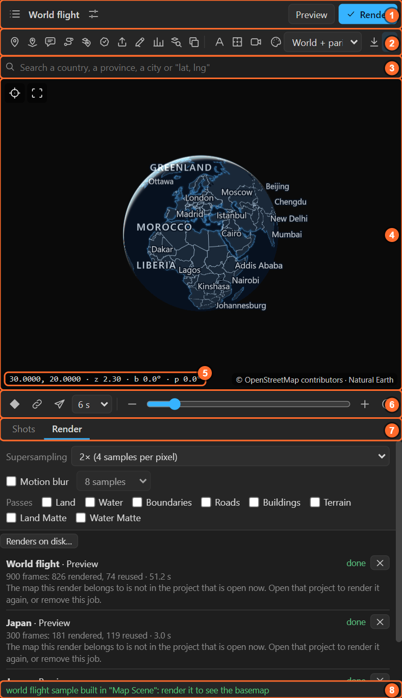
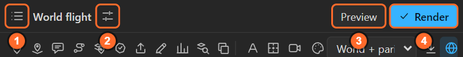
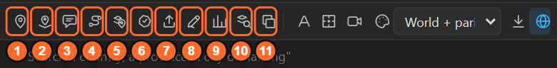
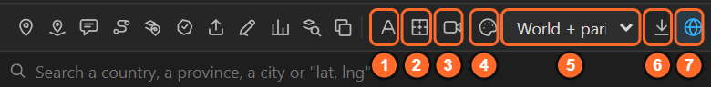
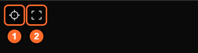
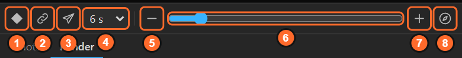
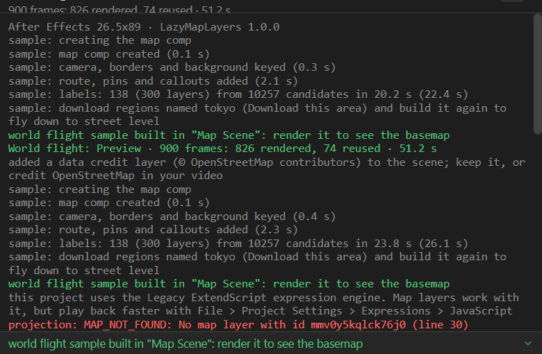

# 2. The panel at a glance

LazyMapLayers is one panel in After Effects (**Window > Extensions > LazyMapLayers**). Everything it
does starts from one of eight areas. This chapter names each one, so the rest of the manual can say
"the tool row" or "the strip" and you know where to look.

| # | Area | What it is for |
|---|---|---|
| 1 | **Header** | The map you are working on, its settings, and the two render buttons |
| 2 | **Tool row** | Everything you can put on a map, and the look of the map |
| 3 | **Search** | Find a country, a province, a district, a city, or a `lat, lng` |
| 4 | **Preview** | The exact frame the map will render. Moving it moves the camera |
| 5 | **Readout** | Latitude, longitude, zoom, bearing and tilt of the frame |
| 6 | **Strip** | Keyframe the camera, link it live, fly, zoom |
| 7 | **Tabs** | **Shots** (plan the camera shot by shot) and **Render** (quality, passes, the render queue) |
| 8 | **Status line** | The last thing the panel did. Click it for the whole log |

## 1. The header

1. **Maps** (the list icon): the maps in this project, **New map**, the two samples and About.
   See [chapter 4](04-maps-screen.md).
2. **Map settings** (the sliders icon): the map's name, its basemap and the globe. It only shows
   once a map is selected. See [chapter 5](05-map-settings.md).
3. **Preview**: renders the basemap at half size without supersampling. Fast, for checking the
   timing.
4. **Render**: renders at full quality with the settings of the Render tab. Only frames that changed
   since the last render are drawn again.

The name between the two icons is the selected map. When no map exists yet, the two render
buttons are replaced by **New map**.

## 2. The tool row

The left half puts things **on** the map:

| # | Tool | What it does | Chapter |
|---|---|---|---|
| 1 | Pin | A dot that stays on a place while the camera moves | [10](10-pins.md) |
| 2 | 3D pin | A pin that lies flat on the ground under the 3D camera | [10](10-pins.md) |
| 3 | Callout | A leader line and a title box next to a place | 11 |
| 4 | Route | A line between two places that draws on | 12 |
| 5 | Attach | Pins **your own** layers (an icon, a photo, a precomp) to a place | 13 |
| 6 | Highlight | Fills countries, provinces or districts with colour | 14 |
| 7 | Import | GPX, KML, KMZ, GeoJSON, CSV or a zipped shapefile | 16 |
| 8 | Your own drawing | Turns a Pen tool path you drew into a route or an area | 17 |
| 9 | Numbers | Colours the map from a table (CSV) | 28 |
| 10 | OpenStreetMap | Finds rivers, parks, airports, buildings… in the area you see | 18 |
| 11 | Save as GeoJSON | Writes what is on the map back out to a file | 19 |

The right half sets what the map **is**:

| # | Control | What it does | Chapter |
|---|---|---|---|
| 1 | Auto labels | Names of countries, cities, seas and mountains as text layers | 20 |
| 2 | Animate borders | Country borders draw on over four seconds | 21 |
| 3 | 3D camera | An After Effects camera that matches the map, for your own 3D layers | 8 |
| 4 | Look | Colours, relief, sky, imagery, terrain, scale bar, inset map | 22–26 |
| 5 | Basemap | What the map is drawn from: the world, or an area you downloaded | 5 |
| 6 | Download this area | Street-level detail for the area in the preview, kept offline | 27 |
| 7 | Globe | A planet at low zoom that turns into the flat map by zoom 8 | 5 |

A tool that is lit (like the globe above) is on. Most tools are greyed out until a map exists.

## 3. Search

Type a place in any of 26 languages: `Dhaka`, `ঢাকা`, `東京`, `Lagos`. Countries, provinces,
districts, cities, seas and mountains are found **offline**. Type `23.81, 90.41` to go to a
coordinate. For a street or an address, the last row offers **Search OpenStreetMap**. See
[chapter 6](06-search.md).

## 4. The preview

The preview is the frame of the map at the current time, in the shape of your comp.

- **Drag** to move, **scroll** to zoom, **right-drag** to turn and tilt.
- **Alt+click** drops a pin anywhere, without picking the Pin tool.
- **Esc** ends the tool that is on. **Space** plays the shot list.

Two buttons sit in its top-left corner:

1. **Match AE**: shows the camera of the current time in After Effects in the preview. Use it after
   you scrub the timeline.
2. **Exact look**: draws names and lines at the size they will render. Off, they are enlarged so you
   can read them in a small panel.

The credit line at the bottom right names the data the frame is drawn from.

## 5. The readout

`30.0000, 20.0000 · z 2.30 · b 0.0° · p 0.0°` is the frame's latitude, longitude, **z**oom,
**b**earing (turn) and **p**itch (tilt). These are the same five numbers the map layer carries as
controls in After Effects. When you move the pointer over the map, a second line says what is under
it: the place, its district, its province and its country.

## 6. The strip

1. **Keyframe view**: keys the preview's view at the current time.
2. **Live link**: while it is on, moving the preview moves the map at the current time.
3. **Fly here**: keys a smooth flight from the camera at the current time to the preview.
4. The **length** of that flight, 2 to 20 seconds.
5. – 7. **Zoom** out, the zoom slider, zoom in.
8. **North up**. Alt+click it to also look straight down.

All of these are in [chapter 8](08-quick-camera.md).

## 7. The tabs

- **Shots** builds the camera from a list of views, with a move between each two. See
  [chapter 9](09-shots.md).
- **Render** holds the supersampling, motion blur, passes and the list of render jobs. See
  [chapter 36](36-render.md).

## 8. The status line and the log

The bottom line repeats the last thing the panel did, in green when it worked and in red when it
did not. Click it to open the whole log:

The log is the first place to look when something does not happen. **Report a problem** in About
(chapter 4) attaches it to a report for you.

## Keys

| Key | Does |
|---|---|
| Esc | Ends the tool that is on |
| Space | Plays the shot list in the preview |
| Alt+click on the map | A pin |
| Alt+Shift+click on the map | A 3D pin |
| Alt+click on North up | North up and looking straight down |

## Related

- [3. How the panel thinks](03-how-it-thinks.md): what a "map" is in After Effects terms.
- [7. Moving the preview](07-moving-the-preview.md): everything about steering the preview.
