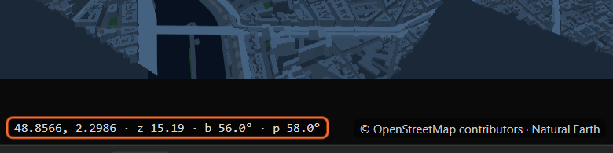
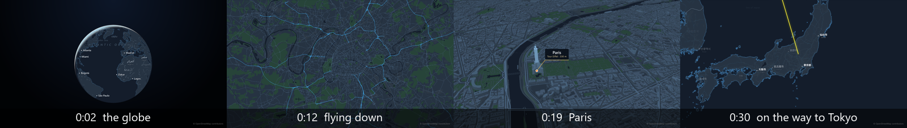
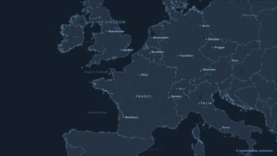

# 3. How the panel thinks

Five minutes with this chapter save hours later. It explains what the panel actually builds in
After Effects, so nothing it does is a surprise.

## A map is a comp with a camera

When you make a map, the panel builds two things:

1. A **map comp**, in a project folder called **LazyMapLayers**. The basemap (land, water, roads,
   borders, the globe) is rendered into it as an image sequence.
2. A **layer of that comp** in your scene. This **map layer** carries the camera as effects:

| Effect on the map layer | What it is |
|---|---|
| **Latitude**, **Longitude** | The point at the centre of the frame |
| **Zoom** | 0 is the whole world in 512 pixels; every step closer doubles the scale. A country is about 5, a city 11, a street 16 |
| **Bearing** | The turn, in degrees. 0 is north up |
| **Pitch** | The tilt, in degrees. 0 looks straight down; up to 85 |
| **Globe** | On: a planet at low zoom that turns into the flat map by zoom 8 |

Some maps get more sliders when you use the features that need them: **Borders Draw-on** (chapter
21), **Terrain Height** and **Ground Level** (chapter 25), **Data Time** (chapter 33).

**Animating the map means keyframing these five numbers.** You can do it by hand in the timeline,
or let the panel do it (chapters 8 and 9). The preview's readout shows the same five numbers:

## One camera, everything follows it

Everything else the panel makes (pins, routes, callouts, names, outlines, bubbles, spikes, your own
attached artwork) is an **ordinary After Effects layer in the scene**, above the map layer. Each one
reads the camera from the map layer through expressions and puts itself where its place is on that
frame. So when the camera moves, they all move with it, to the sub-pixel:

This has three results you will use every day:

- **Move or scale the map layer, and the layers follow.** They read the map layer's own transform.
  Put the map in a box, a split screen or a phone mock-up and everything stays aligned.
- **You can restyle anything.** A pin is a shape layer, a name is a text layer, a route is a shape
  layer with Trim Paths. Change fonts, colours, add effects, parent your own layers to them.
- **Only the basemap needs rendering.** Layers above it are live After Effects layers. The basemap
  is the only part drawn by the panel, and only after **Preview** or **Render**.

## The preview is the camera

The panel's preview is not a separate map that "looks like" your comp. It shows **the exact frame
the map will render**, with the camera of the map layer. Move the preview and you are choosing a
camera; the strip and the Shots tab turn that camera into keyframes.

**Match AE** (the target at the top left of the preview) shows the camera of the current time in
After Effects. Use it after scrubbing the timeline, to see where the camera is.

## The basemap is rendered, frame by frame

The land, water, roads and borders are drawn by the panel for every frame at its exact camera, then
imported into the map comp as an image sequence. That is why there are no tile steps, blurry zooms or
popping names. Two buttons do it:

- **Preview**: half the size, no supersampling. Fast; use it to check timing.
- **Render**: full size with the Render tab's settings. Once a final render exists, the preview
  becomes its After Effects proxy.

Only frames that changed since the last render are drawn again. Change a keyframe and only the frames
it moved are redrawn. See [chapter 36](36-render.md).

## Labels on everything: the `LML:` tag

Every comp and layer the panel makes carries a line starting with `LML:` in its **comment** (the
Comment column in the timeline). The panel finds its own work by that tag:

- It **never** changes, deletes or reorders a layer without a tag. Your own layers are safe.
- Running a tool again (placing names again, applying the shot list again) replaces only its own
  tagged layers.
- **Renaming is safe.** Layers are linked to their map through a **Map** effect (a Layer Control),
  not by name. Rename the map comp, the scene, a pin: nothing breaks.

Do not delete the `LML:` line from a comment, or the panel will treat that layer as yours and leave it
alone from then on.

## Every action is one undo

Every button in the panel is one step in After Effects' undo history, named *LazyMapLayers: …*.
**Ctrl+Z** (Cmd+Z) takes back a whole route, a whole set of names, a whole applied shot list.

## Where the scene comes from

**New map** puts the map into the comp you have open, at its size, frame rate and length, if you
tick **Put it into the open comp**. Otherwise it makes a new scene comp called **Map Scene**. The map
comp itself always goes into the LazyMapLayers folder of the project.

## Data on your disk, online only when you ask

The world down to city level is on your computer ([chapter 1](01-install.md)). The panel goes online
only for what you ask for: street-level detail for an area, finer elevation, a satellite picture,
an OpenStreetMap search, and a once-a-day look at the release list, which you can switch off. It
never sends anything about you or your project.

## Related

- [7. Moving the preview](07-moving-the-preview.md)
- [8. The quick camera](08-quick-camera.md) and [9. The Shots tab](09-shots.md)
- [36. Preview, Render and the Render tab](36-render.md)
