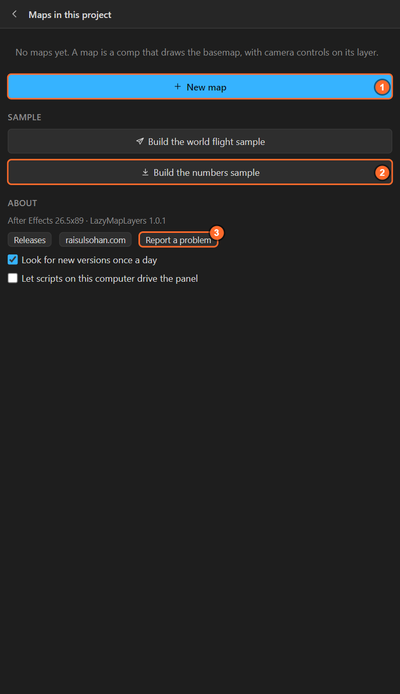
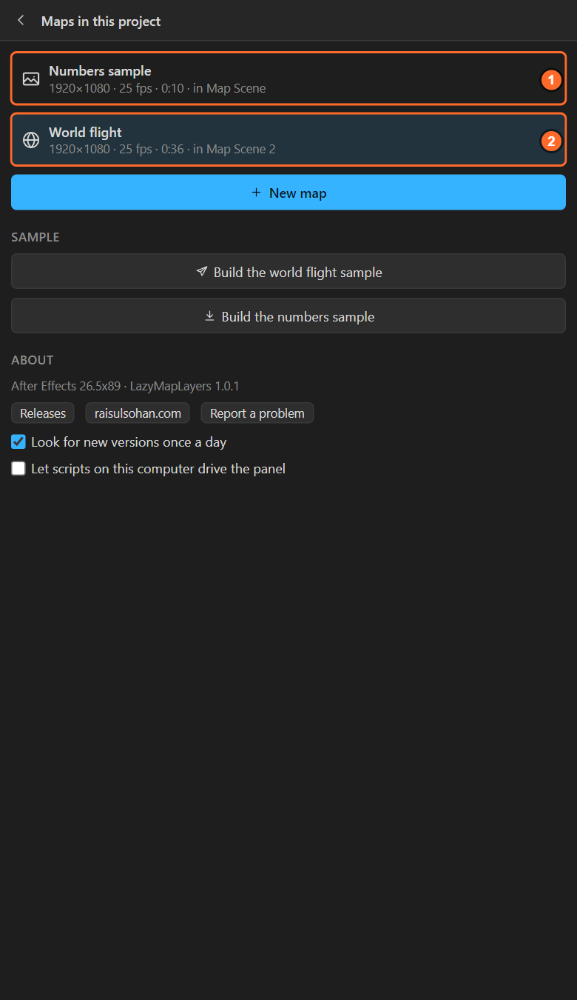
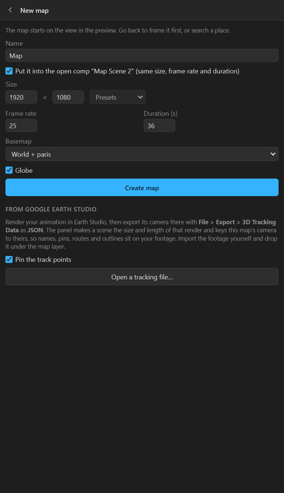
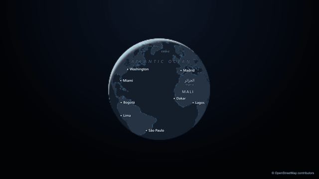
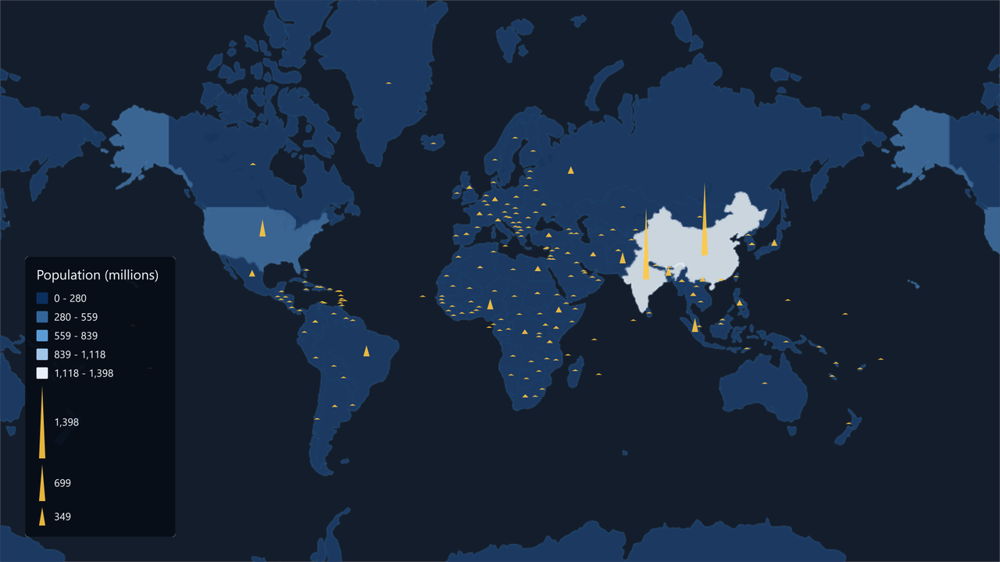
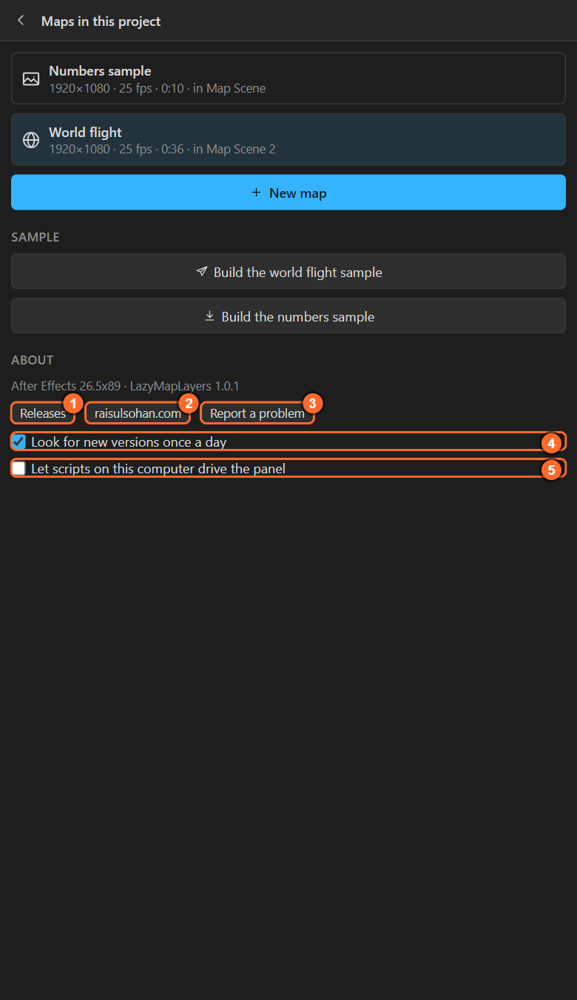

# 4. The Maps screen

The list icon at the top left of the panel opens the **Maps** screen: the maps in this project, a
new map, two ready-made samples, and About.

## The maps in this project

Every map in the open project is a card with its name, size, frame rate, length and the scene comp it
lives in. A **Shots** tag means it has a shot list ([chapter 9](09-shots.md)); a **3D camera** tag
means it has the matched camera ([chapter 8](08-quick-camera.md)).

**Click a card** to select that map. The header, the tools, the preview and the Render tab all work
on the selected map. Selecting a map also opens its scene comp in the After Effects viewer; it
changes nothing in the project.

The panel reads the maps from the project itself, so a project made on another computer shows its
maps here as soon as it is open. If you duplicate a scene in After Effects, the copy gets a map of
its own the next time the panel looks (the log says so).

## New map

| Field | What it does |
|---|---|
| **Name** | The map comp's name. The panel proposes one from the place in the preview: *Osaka Map* |
| **Put it into the open comp "…"** | Shown when a comp is open. Ticked: the map goes into that comp at its size, frame rate and length. Unticked: a new scene comp called **Map Scene** |
| **Size** | Width and height in pixels, or a preset: 1920 × 1080, 3840 × 2160, 1080 × 1920 (vertical), 1080 × 1080 (square) |
| **Frame rate**, **Duration (s)** | For a new scene. Default 25 fps and 30 seconds |
| **Basemap** | World, or an area you downloaded ([chapter 27](27-download-area.md)) |
| **Globe** | Start as a globe ([chapter 5](05-map-settings.md)) |
| **Create map** | Builds it. One undo step |

The map starts on **the view in the preview**. Frame your place first (search it, scroll to the
zoom), then make the map.

The section **From Google Earth Studio** at the bottom makes a map whose camera follows an Earth
Studio render: see [chapter 37](37-earth-studio.md).

## The two samples

Samples are the fastest way to see what the panel can do, and to learn by taking a finished scene
apart. Each builds a complete scene in a few seconds; press **Preview** or **Render** to draw the
basemap.

### Build the world flight sample

A 36-second scene, built only from the panel's own features:

| Time | What happens |
|---|---|
| 0–6 s | The globe turns in space while the country borders draw on |
| 6–16 s | One continuous flight down to the Eiffel Tower in Paris |
| 16–21 s | A slow orbit, with a pin and a callout |
| 21–33 s | A flight to Tokyo along a great-circle route that draws on |
| 33–36 s | Arrival, with a pin and a callout |

Country and city names in their own languages run along the whole timeline.

The street-level ending needs the two cities downloaded: move the preview over Paris, **Download this
area**, name it `paris`; the same for Tokyo as `tokyo`; then build the sample again.

### Build the numbers sample

A world map of every country coloured by its population, from the data that comes with the panel,
with spikes for the numbers and a legend. Take it apart, then bring your own table
([chapter 28](28-numbers-colour.md)).

## About

Scroll to the bottom of the Maps screen:

1. **Releases**: every version on GitHub, with what changed.
2. **raisulsohan.com**: the author's site.
3. **Report a problem**: writes a report with the panel's last messages and your versions to your
   LazyMapLayers folder, and opens a new GitHub issue for you to paste it into. **Nothing is sent by
   itself**: you see the report and decide.
4. **Look for new versions once a day**: one request a day to GitHub's release list, sending nothing
   but the request. When a newer version is out, a bar at the top of the panel says so, with **Get
   it** and **Later**. Off: the panel never goes online by itself.
5. **Let scripts on this computer drive the panel**: off by default. See
   [chapter 38](38-scripting.md).

The line above the buttons names your After Effects and LazyMapLayers versions. Put it in any message
about a problem.

## Related

- [5. Map settings](05-map-settings.md)
- [37. A camera from Google Earth Studio](37-earth-studio.md)
