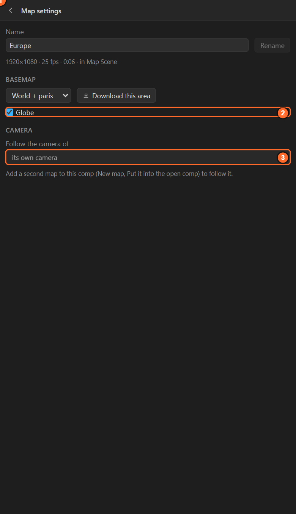
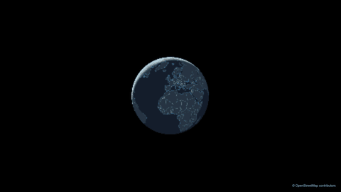
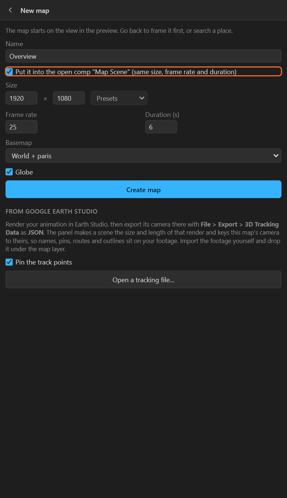
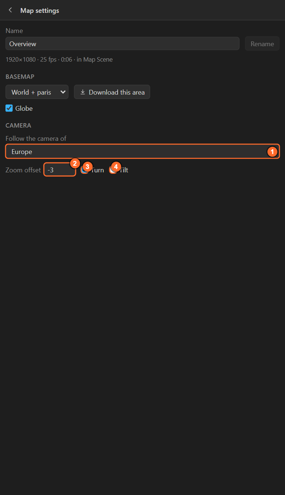
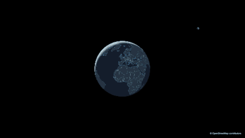

# 5. Map settings

The sliders icon next to the map's name in the header opens the selected map's settings: its name,
what it is drawn from, the globe, and whose camera it follows.

## Name

Type a new name and click **Rename**. This renames the map comp. Renaming is safe: pins, names and
routes find their map through an effect, not through its name. The line under the name says the
map's size, frame rate, length and the scene comp it is in.

## Basemap

What the map is drawn from:

| Choice | What you get |
|---|---|
| **World (offline)** | The data that came with the panel: the whole world to city level (zoom 9) |
| **An area you downloaded** (its name and size) | That area's street-level OpenStreetMap detail: streets, buildings, the names inside a city |
| **World + all N regions** | The world, with every downloaded area drawn over it where it has detail. Shown when you have two or more areas |

You rarely need to switch: the world is always drawn under a downloaded area, so a flight from space
into a city you downloaded lands on its streets either way. **Download this area** next to the list
fetches the area in the preview ([chapter 27](27-download-area.md)).

The same list is in the tool row, next to **Look**.

## Globe

On, the map is a **planet** at low zoom, with an atmosphere around it, and **turns into the flat
map by zoom 8**. Off, the map is flat (Web Mercator) at every zoom. Use the globe for anything that
starts from space or crosses oceans; leave it off for a map that stays inside one country.

The switch sets the map layer's **Globe** checkbox. Pins, routes and names follow either way. On the
globe, a layer whose place is on the far side is hidden, the way the planet would hide it.

The globe button at the right end of the tool row does the same.

## Follow the camera of

One map can take its camera from another. This is how you make a **split screen**, or an
**overview in the corner** that follows a close-up.

| Setting | What it does |
|---|---|
| **Follow the camera of** | *its own camera*, or another map. A map in the **same comp** is linked live by expressions: animate the first and the second moves with it. A map in **another comp** has its camera **copied** once (choose it again after you change that camera) |
| **Zoom offset** | Steps of zoom further out (below 0) or closer in (above 0) than the map it follows. −3 is an overview three steps wider |
| **Turn** | Follow the bearing as well |
| **Tilt** | Follow the pitch as well. Switch it off to keep an overview flat under a tilted flight |

### Step by step: an overview in the corner

1. Make and animate the main map (here *Europe*, a flight from space into Germany).
2. With the scene comp open, **New map**, name it *Overview*, and tick **Put it into the open comp**.

   

3. In After Effects, scale the new map layer down (30 %) and move it into a corner.
4. Select the overview map, open **Map settings**, and set **Follow the camera of** to *Europe*,
   **Zoom offset** to −3, and switch **Tilt** off.

   

5. **Preview** both maps (select each and press Preview). Now animate only *Europe*: the overview
   follows it.

Give the overview its own look ([chapter 22](22-looks.md)), its own names, a frame of your own (a
shape layer above it), and render it like any other map. For a ready-made locator with a moving box
on it, use **Inset map** instead ([chapter 26](26-inset-scale-north.md)).

## Related

- [3. How the panel thinks](03-how-it-thinks.md)
- [26. Inset map, scale bar and north arrow](26-inset-scale-north.md)
- [27. Downloading an area for street-level detail](27-download-area.md)
