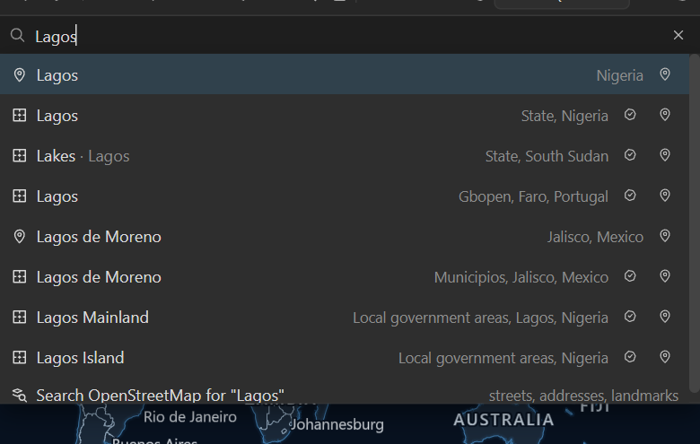
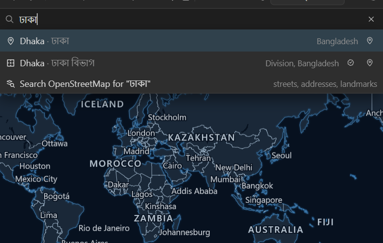
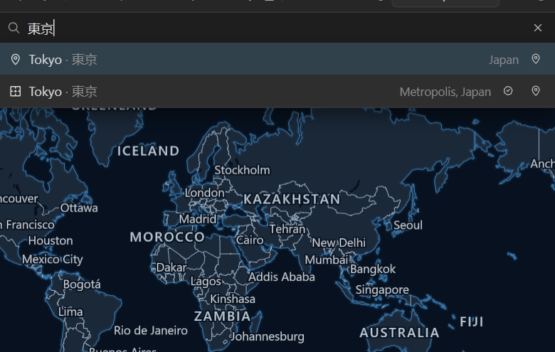
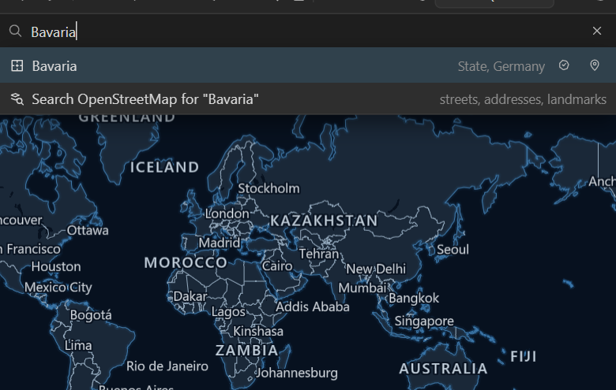
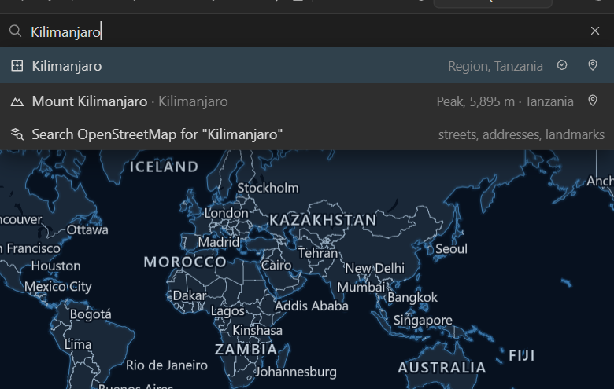
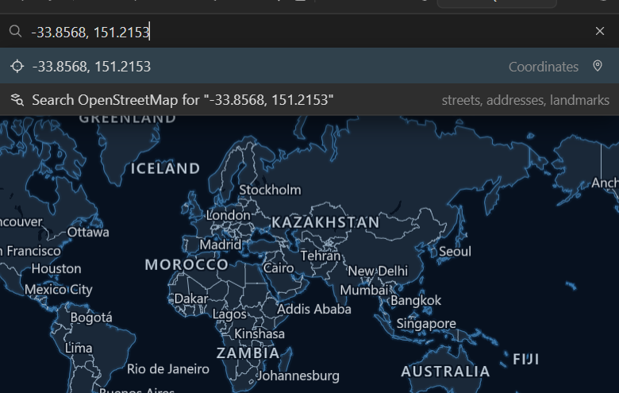
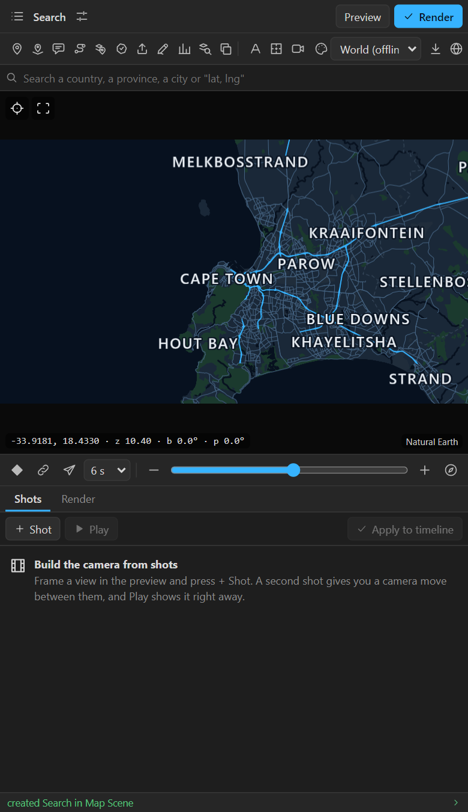
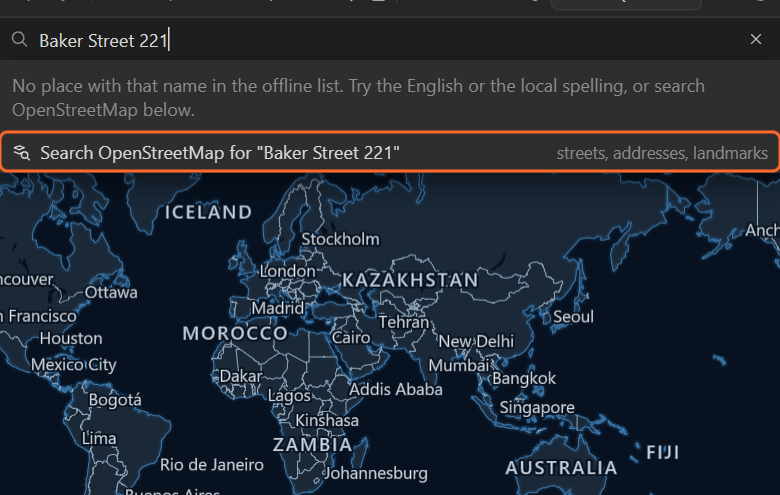

# 6. Search

The search box under the tool row finds places **offline**, while you type, in 26 languages. For a
street or an address it can also ask OpenStreetMap, but only when you say so.

## What it finds offline

| Kind | Example | Icon |
|---|---|---|
| Countries | `Nigeria`, `Deutschland`, `ভারত` | globe |
| Provinces, states, regions | `Bavaria`, `Gironde`, `California` | outline |
| Districts | the districts of every country | outline |
| Cities and towns | `Lagos`, `Osaka`, `Medellín` | pin |
| Seas, lakes, rivers | `Caspian Sea`, `Lake Victoria` | wave |
| Mountains, ranges, deserts | `Kilimanjaro`, `Andes`, `Sahara` | mountain |
| Coordinates | `-33.8568, 151.2153` | target |

Names are found in English and in the place's own language and script. Type Dhaka in Bengali or
Tokyo in Japanese:

When the name you typed is another language's spelling, the row shows which one matched after a dot.

A province or a mountain:

## Coordinates

Type latitude and longitude separated by a comma: `-33.8568, 151.2153`. Negative latitudes are south,
negative longitudes west. The preview goes there at street zoom (or stays closer if you were already
closer).

## Going to a result

- **Click** a row, or press **Enter** for the highlighted one (**↑** and **↓** move it).
- The preview flies there and frames the place: a country whole, a city at city zoom. The bearing and
  tilt you had are kept.
- **Esc** closes the list; the **×** in the box clears it.

The panel remembers the name you went to: the next **New map** is called after it, and so is the next
shot.

## Buttons on a result row

When a map is selected, every row has small buttons at its right end:

| Button | On | Does |
|---|---|---|
| **Pin** | every row | Adds a pin on that place without going there ([chapter 10](10-pins.md)) |
| **Highlight** | countries, provinces, districts | Highlights it, or takes the highlight off again ([chapter 14](14-highlights.md)) |

So you can pin ten cities or light up five countries from the list, without touching the map.

## Streets and addresses: OpenStreetMap

The offline list knows places, not streets. For anything smaller (a street, an address, a building,
a landmark), the last row offers **Search OpenStreetMap for "…"**:

Click it, or press **Enter** when nothing offline matched. The panel sends **what you typed, and
nothing else**, to nominatim.openstreetmap.org, OpenStreetMap's public search, preferring results near
the area in the preview. Results come back in the same list, with an OpenStreetMap icon, and act like
any other row; an address can take the preview down to a single building.

It never searches online while you type, only when you click or press Enter.

## Tips

- **No result?** Try the English or the local spelling. The message under the box says so too.
- **Two places with one name** (Paris, France and Paris, Texas): the detail on the right of each row
  names the province and country. Larger places come first.
- **Search is for the preview.** It does not key the camera. Use **Keyframe view**, **Fly here** or
  **+ Shot** after it ([chapter 8](08-quick-camera.md), [chapter 9](09-shots.md)).

## Related

- [7. Moving the preview](07-moving-the-preview.md)
- [18. Finding things on OpenStreetMap](18-openstreetmap.md): rivers, parks, buildings as shapes, not
  just a place to go to.
