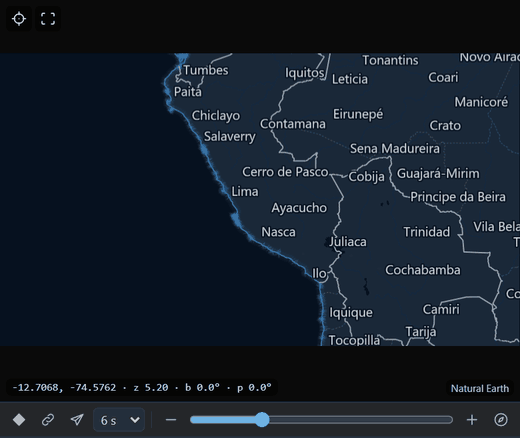
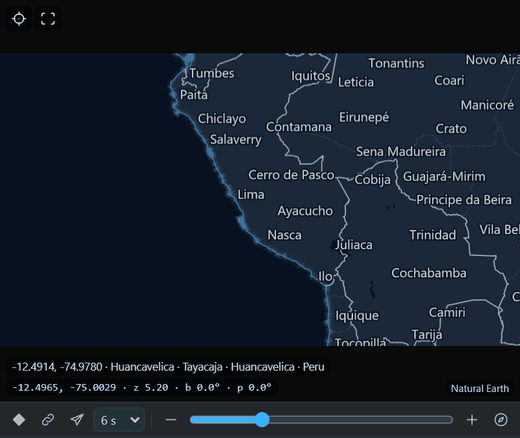
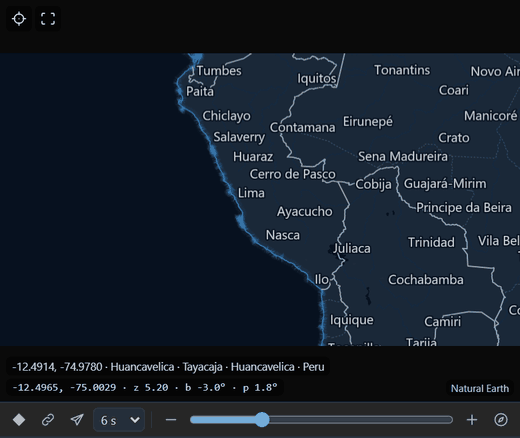
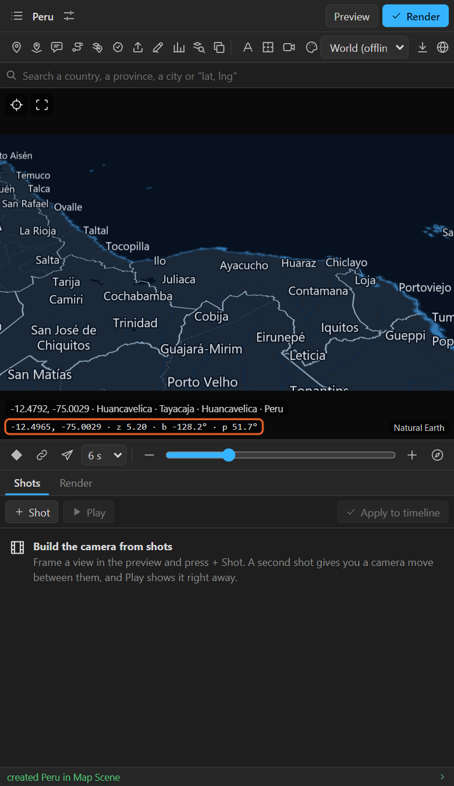
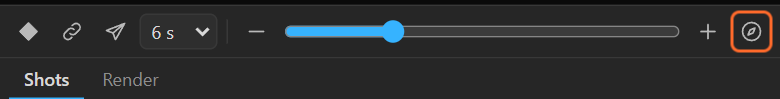
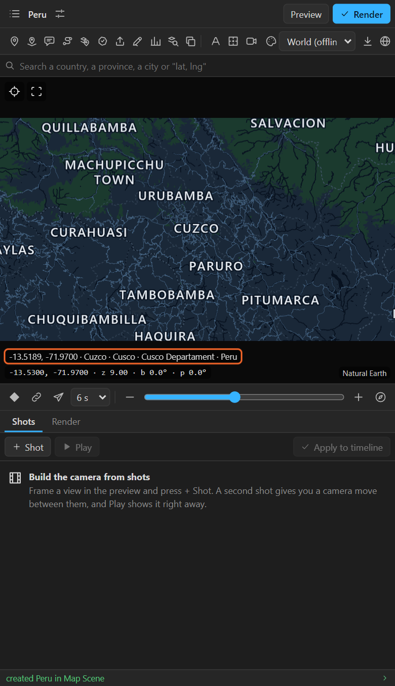
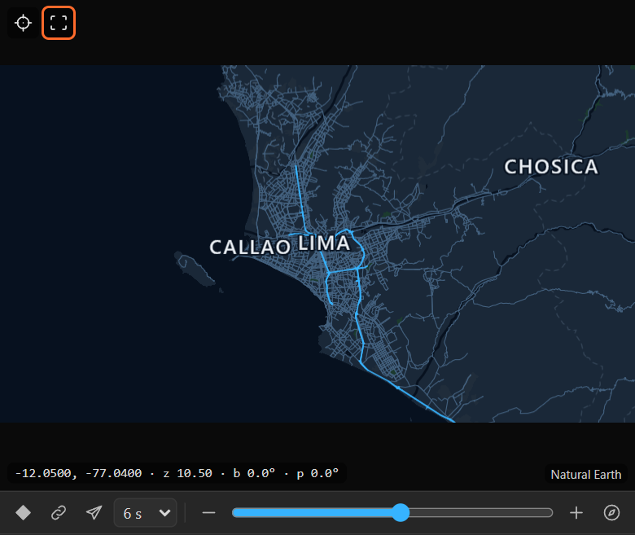
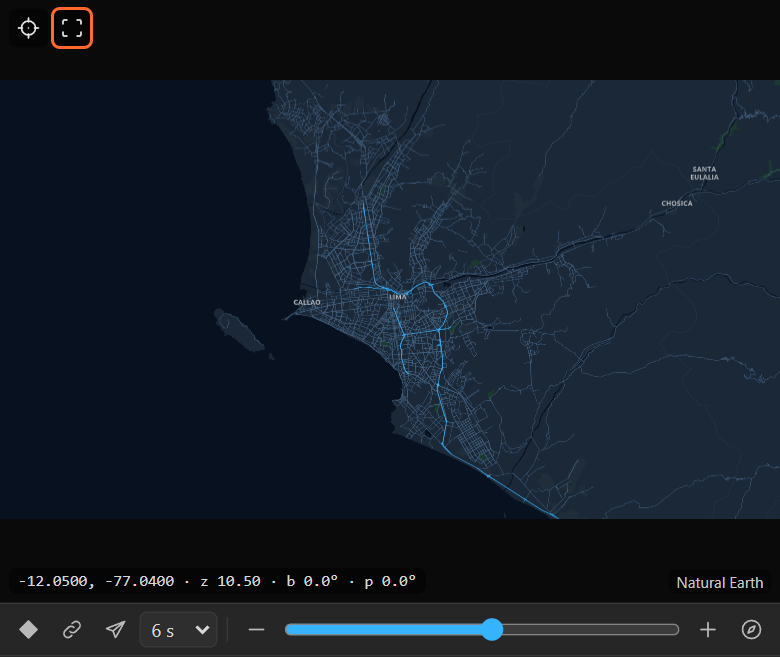

# 7. Moving the preview

The preview is your camera. Every view you frame in it can become a keyframe, a shot, the start of a
new map, or the area for a download. This chapter is about steering it.

## Mouse

| Do | To |
|---|---|
| **Drag** | Move the map |
| **Scroll** | Zoom in and out, around the pointer |
| **Right-drag** | Sideways: turn (bearing). Up and down: tilt (pitch) |
| **Alt+click** | Drop a pin ([chapter 10](10-pins.md)) |
| **Alt+Shift+click** | Drop a 3D pin |

Tilt goes up to 85°. On a tilted map the horizon shows: with **Sky** on (Look, [chapter 23](23-sky-relief-layer-style.md)),
the look's sky fills it; off, it stays transparent for a sky of your own.

## The strip's zoom controls and the compass

- **–** and **+** zoom out and in by half a step; the slider between them sets any zoom from 0 to 20.
- **North up** (the compass) turns the map back to bearing 0, keeping the tilt.
- **Alt+click** the compass: north up **and** straight down (tilt 0).

## The readout

The line at the bottom left of the preview is the frame's camera:

`-12.5000, -75.0000 · z 5.20 · b 0.0° · p 0.0°`

latitude, longitude, zoom, bearing, pitch: the five controls of the map layer
([chapter 3](03-how-it-thinks.md)). Use it to type exact values into the map layer's effects, or
to note a view you want to come back to.

### What is under the pointer

Move the pointer over the map and a line above the readout says where the pointer is and what is
there: its coordinates, the nearest place, its district, its province and its country.

It is a quick way to check a name before you highlight a district or pin a town.

## Match AE

The target at the top left of the preview shows **the camera of the current time** in After
Effects. The preview does not follow the timeline by itself, so press it after you scrub, or after
changing keys by hand.

## Exact look

The square next to it switches **Exact look**.

- **Off** (default): names and lines are drawn larger than they will render, so you can read them in
  a small panel.
- **On**: names and lines at the size they render, relative to the comp. Use it to judge how busy the
  final frame is.

## The preview's size

The preview always has the shape of the comp (16:9, 9:16, square). It is the frame scaled down to the
panel's width; make the panel wider for a larger preview. The map is drawn at the comp's own size
behind it, so what you see is what renders.

## Tips

- **The preview moved by itself.** Selecting a shot, applying the shot list or Match AE all move it.
- **I want the preview to follow the timeline.** Use **Match AE** after scrubbing. Or turn **Live
  link** on ([chapter 8](08-quick-camera.md)) to work the other way: the preview moves the map.
- **Zooming is jumpy with a mouse wheel.** Use the slider in the strip for fine steps.

## Related

- [8. The quick camera](08-quick-camera.md)
- [6. Search](06-search.md): jump the preview to a place.
