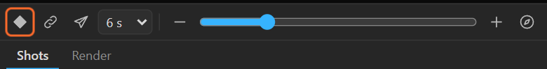
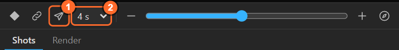
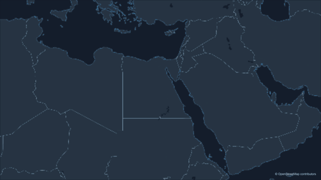
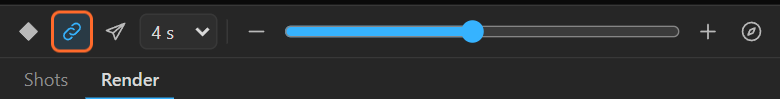
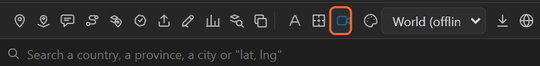

# 8. The quick camera

For a single move, you do not need a shot list. The strip under the preview keys the camera
straight from the preview: one view, one flight, or the map following your hand. The **3D camera**
in the tool row matches an After Effects camera to the map.

## Keyframe view

1. Put the time indicator where the camera should be.
2. Frame the view in the preview.
3. Click **Keyframe view** (the diamond).

The map layer's five controls (Latitude, Longitude, Zoom, Bearing, Pitch) get a key at the current
time with the preview's view. Do it again at another time and After Effects interpolates between
the two keys. That is a plain After Effects move: fine for small changes, but for long distances use
**Fly here**, which keeps the speed right.

If the controls have no keys yet, the first **Keyframe view** starts them.

## Fly here

1. Put the time indicator where the flight should **start**.
2. Frame where it should **end** in the preview.
3. Pick the length next to the plane: 2 to 20 seconds.
4. Click **Fly here** (the plane).

The panel keys one smooth flight from the camera at the current time to the preview: it rises out
of the start, travels and lands without stopping, the way a camera on a plane would. The time
indicator jumps to the end of the flight, so the next **Fly here** carries on from there. The log
says how many keys it wrote and how high the flight went.

**Why not just two keys?** Between two keys After Effects changes the zoom and the position at the
same rate, so a long move crawls at the start and races at the end, or the destination falls out of
the frame. A flight keys every frame along a curve that keeps the motion even on screen
(van Wijk and Nuij's smooth zoom and pan).

## Live link

While **Live link** (the chain) is on, moving the preview moves the map **at the current time** in
After Effects, a quarter of a second after you stop. With no keys on the controls, it changes their
values; with keys, it sets a key at the current time.

Use it to fine-tune a key: put the time indicator on it, switch Live link on, nudge the preview. Turn
it off before you go exploring, or every move you make lands in the timeline.

## 3D camera

**3D camera** (the camera icon in the tool row) adds an After Effects camera, **Map Camera**, that
matches the map frame by frame: same position, same zoom, same turn, same tilt. A 3D layer of your
own, laid on the ground plane, stays glued to the map in perspective; the easy way to put one on a
place is a **3D pin** ([chapter 10](10-pins.md)) with your artwork parented to it.

The ground plane is anchored on the map layer by three sliders the camera adds: **3D Origin
Latitude**, **3D Origin Longitude** and **3D Reference Zoom**. Leave them as they are.

The camera is linked to the map's controls, so it follows every move you key, now or later. The
button lights up once the map has its camera; a map has one. The first **3D pin** adds it for you.

The log names the camera with its **ground scale**, the zoom at which one pixel on the ground is one
pixel on screen: *Map Camera (ground scale of zoom 6)*. Layers on the ground are their own size at that
zoom, and twice as large one zoom closer.

## Which one when

| You want | Use |
|---|---|
| A still camera, or a small adjustment | Keyframe view |
| One move from A to B | Fly here |
| Several places, holds, orbits, a route to follow | The Shots tab ([chapter 9](09-shots.md)) |
| To push a key around by hand | Live link |
| Your own 3D layers on the ground | 3D camera |

All of them are one Ctrl+Z each.

## Related

- [9. The Shots tab](09-shots.md)
- [10. Pins and 3D pins](10-pins.md)
