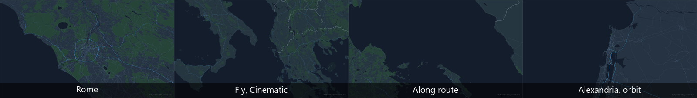
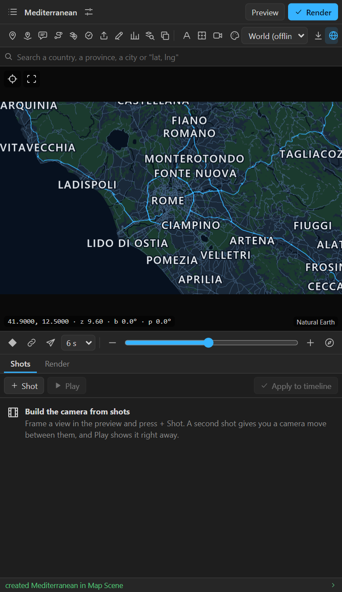
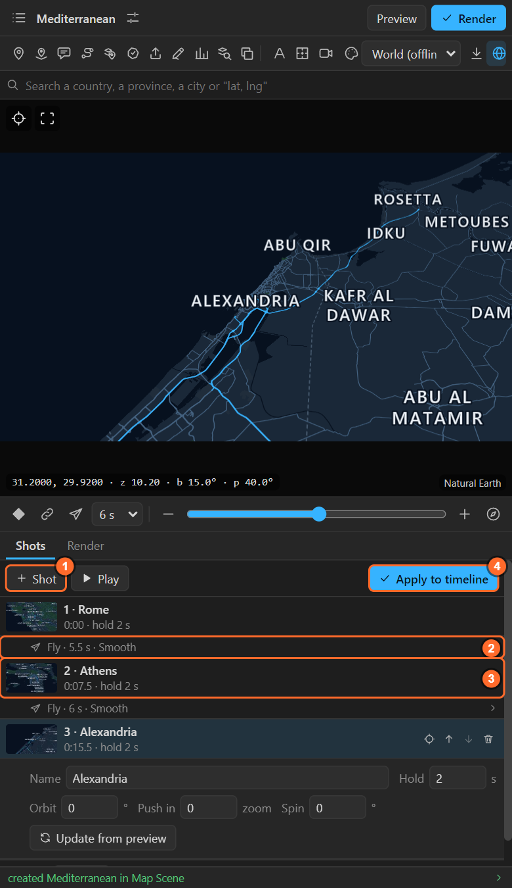
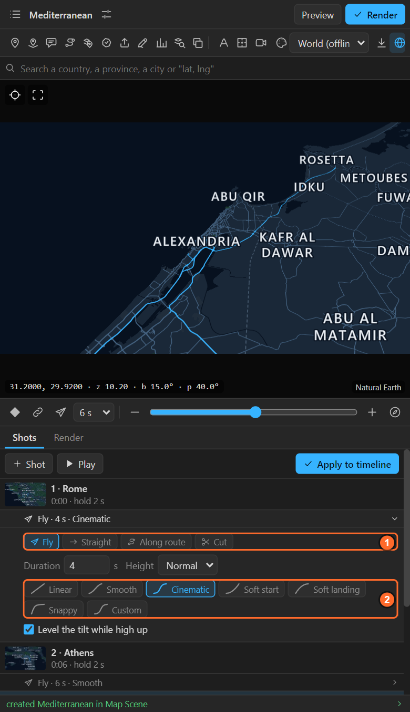
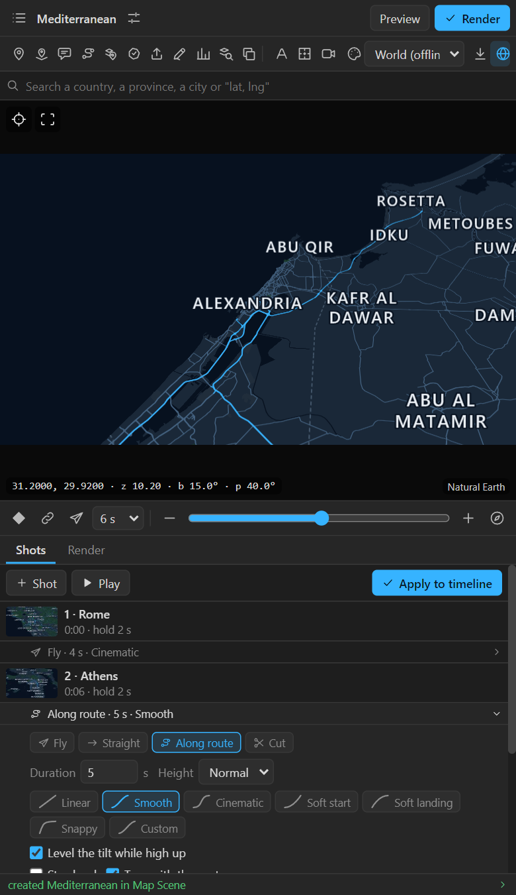
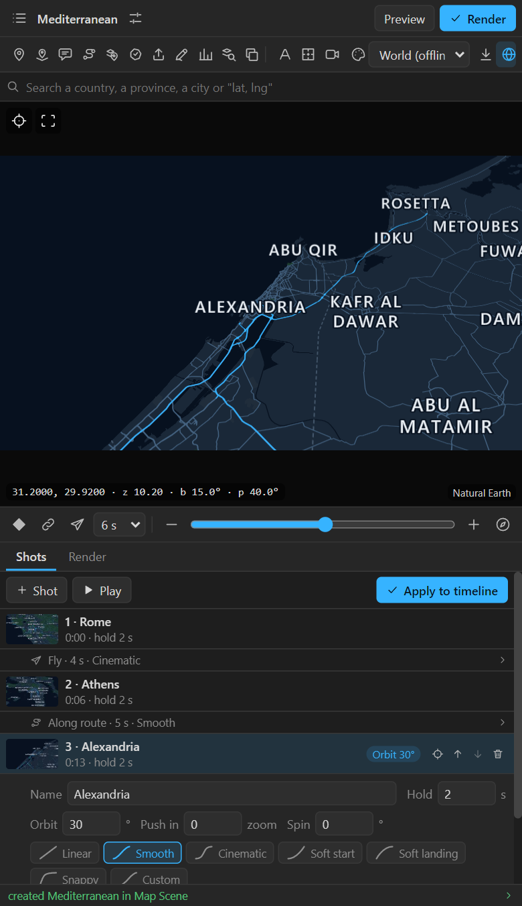
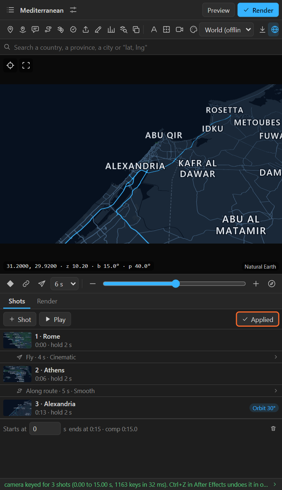
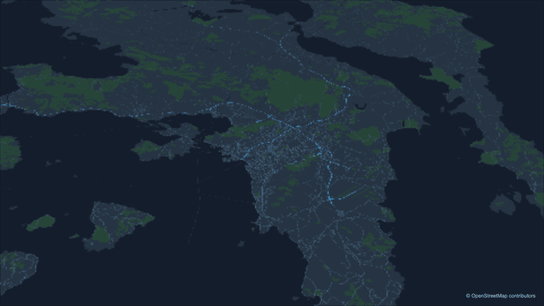

# 9. The Shots tab

The Shots tab builds a whole camera from a list of views. Each **shot** is a view the camera stops
on. Between two shots is a **move**: how the camera gets from one to the next. Play it in the
preview as often as you like; when it is right, **Apply to timeline** writes it as keys.

## Build a shot list

1. Select a map and open the **Shots** tab under the strip.
2. Frame the first view in the preview (search a place, zoom, tilt). Click **+ Shot**.
3. Frame the next view. **+ Shot** again. Each new shot goes after the selected one, or at the end.
4. Click **Play** (or press **Space**) to watch the camera in the preview. Nothing is rendered and
   After Effects is not touched.
5. **Apply to timeline** when it is right.

1. **+ Shot** takes the preview's view.
2. A **move** row: click it to change the move.
3. A **shot** row: click it to change the shot. Double-click it to see it in the preview.
4. **Apply to timeline** is blue while the list has changes that are not in the timeline yet.

A shot is named after the place you searched for last, or what the preview shows. Its thumbnail is
the view.

## Moves

Click a move row to open it:

| Move | What the camera does | Use it for |
|---|---|---|
| **Fly** | Rises out of the first shot, travels and lands on the next in one curve, without stopping | Anything far apart: cities, countries, continents |
| **Straight** | Moves and zooms evenly, without rising | Two views close together: a street to the next street |
| **Along route** | Travels along the great-circle route between the two shots, like an airliner | Journeys, where the path itself is the story |
| **Cut** | Jumps to the next shot | A hard edit |

Settings of a move:

| Setting | What it does |
|---|---|
| **Duration** | Seconds the move takes. A new move gets a length suited to the distance |
| **Height** | Fly and Along route: **Low**, **Normal** or **High**, how far the camera rises on the way |
| **Easing** | How the speed changes, see below |
| **Level the tilt while high up** | Fly and Along route: a tilted shot looks straight down while the camera is high, and tilts again on the way down. On by default; off keeps the tilt all the way |
| **Stay level** | Along route: keeps the zoom between the two shots instead of rising (for short routes) |
| **Turn with the route** | Along route: the camera turns with the direction of travel, looking a little ahead, with smoothed corners |

### Easing

| Easing | Feels like |
|---|---|
| **Linear** | Constant speed |
| **Smooth** | Easy Ease at both ends (the default) |
| **Cinematic** | A long, gentle start and landing |
| **Soft start** | Starts gently, arrives at speed: for a move that hands over to the next |
| **Soft landing** | Leaves at speed, settles gently |
| **Snappy** | A quick move with a long settle |
| **Custom** | Your own curve: x1, y1, x2, y2, as in After Effects' speed graph or CSS cubic-bezier |

Each chip draws its curve, so you can see the shape.

## Shots

Click a shot row to open it:

| Setting | What it does |
|---|---|
| **Name** | The shot's name, also on its marker in the timeline |
| **Hold** | Seconds the camera stays on this shot before the next move. Default 2 |
| **Orbit** | Degrees the camera turns around the centre during the hold. Negative turns the other way |
| **Push in** | Zoom levels gained during the hold. Negative pulls out |
| **Spin** | On the globe only: degrees of longitude the globe turns during the hold |
| **Update from preview** | Replaces the shot's view with the preview's |

Orbit, push and spin need a hold longer than 0. When one is set, the hold gets its own easing, and
the row shows it as a tag (*Orbit 30°*).

The buttons at the right of a row: **show** (the target: the preview goes to the shot and the time
indicator to its time), **up**, **down**, **remove**.

## Apply to timeline

**Apply to timeline** writes the list as keys on the map layer's five controls, plus a **layer
marker** named after each shot, in **one undo step**. After that, the button reads **Applied** until
you change the list.

- **Change and apply again**: the keys between the list's start and end are replaced. Keys outside
  that range are left alone.
- **The comp is too short**: the line under the list says so in orange; Apply makes the map and its
  scene longer to fit.
- **Starts at**: the scene time of the first shot. Move the whole list later in the comp.
- **You edited the keys by hand**: the tab warns you that Apply will replace the keys in its range.

The list is saved **with the map layer**, so it travels with the project and is there when you open
it again.

## Remove the list

The bin at the bottom right removes the whole shot list and keeps the keys. **Alt+click** it to
remove the keys as well.

## Recipe: a three-city tour in two minutes

1. New map with **Globe** on. Search the first city, frame it, tilt it, **+ Shot**.
2. The same for the second and third city.
3. First move: Fly, Cinematic. Second move: Along route, **Turn with the route**.
4. Last shot: Hold 3 s, Orbit 30°.
5. **Play**. Adjust. **Apply to timeline**. **Preview**.
6. Add a **Route** ([chapter 12](12-routes.md)) along the same cities, starting where the move starts.

## Related

- [8. The quick camera](08-quick-camera.md): one move without a list.
- [16. Importing files](16-import.md): **Camera** on an imported line makes shots along it.
- [12. Routes](12-routes.md)
