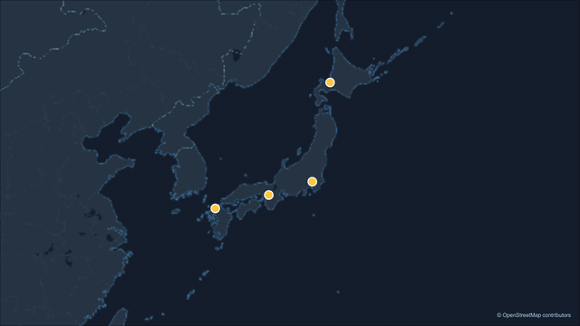
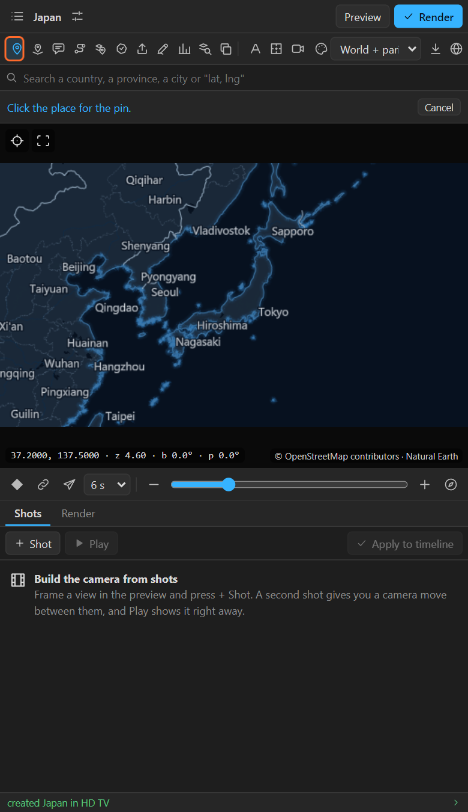
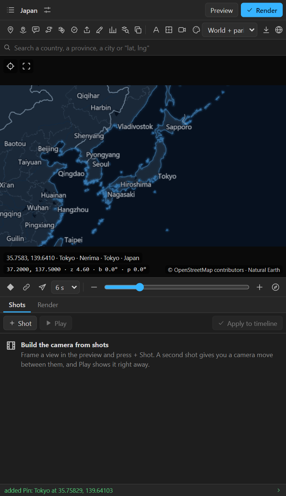
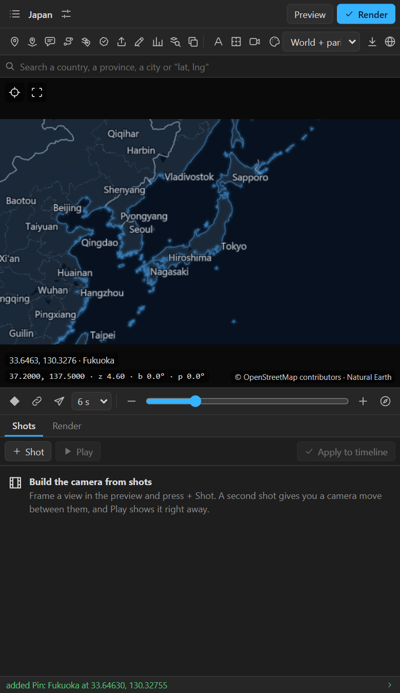
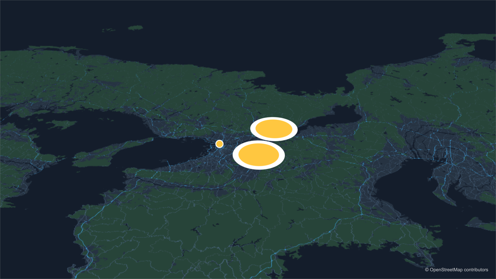
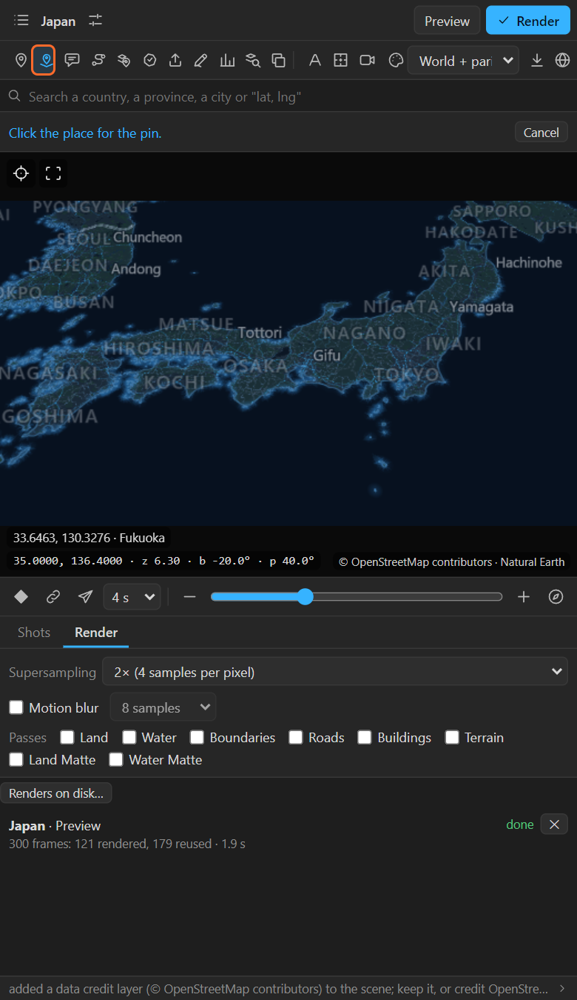

# 10. Pins and 3D pins

A **pin** is a dot that stays on its place whatever the camera does: it follows the map through
flights, zooms, turns, tilts and the globe. A **3D pin** lies flat on the ground under the map's 3D
camera, so it tilts with the land.

Both are ordinary After Effects shape layers. You can recolour them, resize them, animate their
opacity, parent things to them, or replace the dot with your own drawing.

## Where to find it

The first two icons of the tool row: **Pin** and **3D pin**.

## Add a pin

1. Select the map in the header (or make one with **New map**).
2. Click **Pin**. The bar under the search box says *Click the place for the pin*.
3. Click the place on the preview. A layer called **Pin: Tokyo** appears in the scene comp, and the
   status line says `added Pin: Tokyo at 35.69024, 139.68535`.

The tool switches itself off after each pin. For the next one, click **Pin** again, or:

- **Alt+click** the preview: a pin, with no tool picked. This is the fastest way to drop many.
- **Alt+Shift+click**: a 3D pin.

## The pin is named after its place

The panel looks up the nearest named place within a third of a degree and names the layer after
it: *Pin: Tokyo*, *Pin: Osaka*. A second pin on the same place becomes *Pin: Tokyo 2*. Out at sea or
in the desert, where nothing is near, it is *Pin 1*, *Pin 2*. Renaming the layer is safe: the pin is
tied to the map by an effect, not by its name.

## What a pin carries

Open **Effect Controls** for a pin layer:

| Effect | What it does |
|---|---|
| **Map** (Layer Control) | The map layer this pin belongs to. This link is what keeps it on its place |
| **Latitude**, **Longitude** | Where the pin is. Change them, or keyframe them to move the pin across the map |
| **Elevation (m)** | Only with an elevation pack (chapter 25): the ground's height at the pin |
| **Scale with Map** | Off: the dot keeps its size. On: it grows when the camera zooms in, like something painted on the ground |
| **Rotate with Map** | On: the layer turns with the map's bearing (north stays north for the layer) |
| **Reference Zoom** | The zoom at which a pin that scales with the map has its own size. Set when the pin is made |

The pin's **Position**, **Scale**, **Rotation** and **Opacity** carry expressions that read the
map's camera. Opacity goes to zero when the place is behind the globe or behind the camera, so a pin
never shows through the planet.

## 3D pins

A 3D pin needs the map's **3D camera**. The first 3D pin adds it for you (the log says *added Map
Camera*). From then on, the 3D pin is a 3D layer lying on the ground plane, so it foreshortens when
you tilt the map, like the two ellipses here, one placed with the tool and one with Alt+Shift+click, next to the flat pin on Osaka:

A 3D pin has **Altitude (m)** instead of the scale and rotate switches: raise it above the ground
(a plane in the sky, a marker on a balloon). It needs no scale or rotation switches because the
camera already scales and turns it with the map.

Because it lies on the ground, a 3D pin has a size **on the ground**, not on screen: it has its own
size at the zoom where the 3D camera was added (zoom 6 above, so *Map Camera (ground scale of zoom
6)*), and doubles with every zoom level closer. Above, the camera is at zoom 8.6, so the two 3D pins
are about six times larger than the flat one. Scale the layer down to suit your closest shot.

When should you use which?

| Use a **pin** when | Use a **3D pin** when |
|---|---|
| The marker should face the viewer, like a label | The marker should feel painted on the land |
| The map stays flat or tilts only a little | The camera tilts a lot, or flies low |
| You want it to stay the same size on screen | You want it to shrink into the distance |

## Make it your own

The dot is a shape group called **Marker** inside the layer. Everything about it is yours:

- **Colour**: the pin takes the map's layer colour (Look > Pins, routes and callouts, chapter 23).
  To change one pin, change the Fill of its Marker group.
- **Your own icon**: instead of drawing into a pin, use **Attach** (chapter 13) to pin your own
  layer to a place. It gets the same controls.
- **Pop on**: keyframe the layer's Scale from 0 to 100 % at the moment you want it to appear. The
  expression multiplies your value, so your keys keep working.
- **A name next to it**: a text layer parented to the pin, or **Callout** (chapter 11), or
  **Auto labels** (chapter 20) for every place at once.

## Tips and pitfalls

- **Nothing happens when I click the map.** The tool switched itself off after the last pin; click
  **Pin** again, or use Alt+click. If the tool row is grey, select a map first.
- **The pin jumps or slides.** It was moved by hand. Its Position is driven by an expression; move
  it with **Latitude** and **Longitude** instead.
- **The pin disappears at the edge of the globe.** That is on purpose: it is behind the planet.
- **I moved the map layer and the pins stayed put.** They follow the map layer's own transform; if
  they did not, the **Map** effect points at another layer. Pick the map layer in it again.
- **I need a hundred pins from a spreadsheet.** Import a CSV with a name column and coordinates
  (chapter 16): every row becomes a pin.

## Related

- [11. Callouts](11-callouts.md): a pin with a leader line and a title.
- [13. Attaching your own layers](13-attach.md): your own icon on a place.
- [8. The quick camera](08-quick-camera.md): the 3D camera, and the flight in the animation above.
