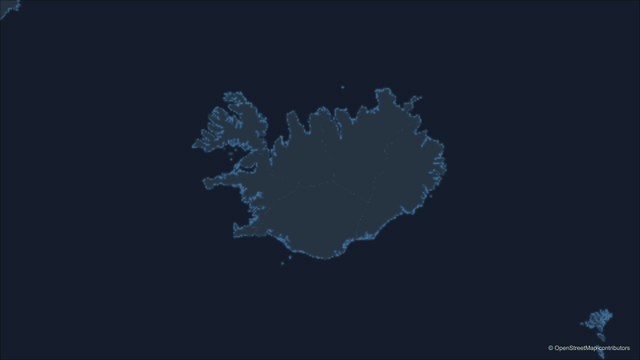
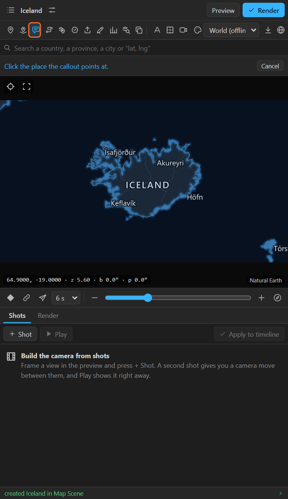
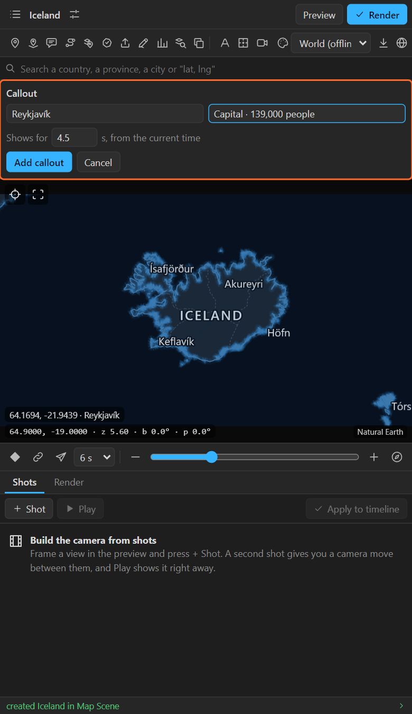
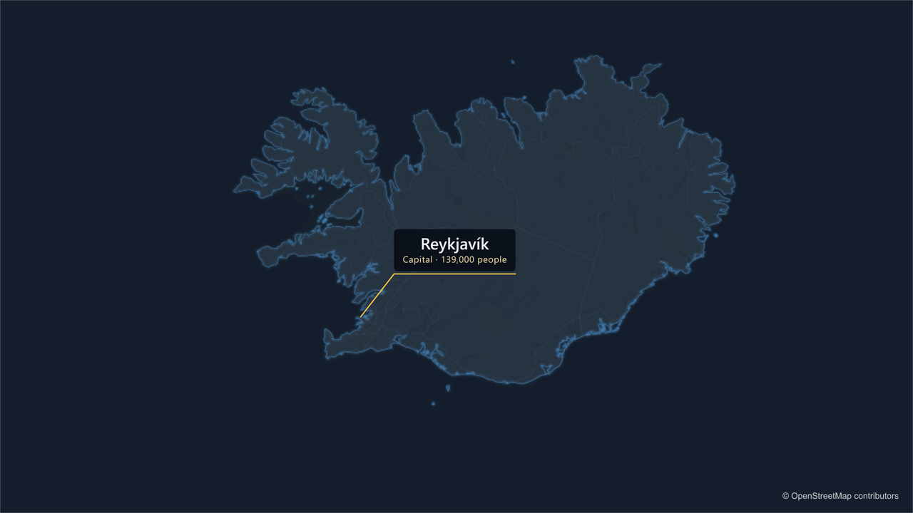

# 11. Callouts

A **callout** points at a place with a leader line and opens a box with a title and a subtitle. It
animates in by itself, stays on its place while the camera moves, and goes away when you say.

## Add a callout

1. Put the time indicator where the callout should appear.
2. Click **Callout** in the tool row (the speech bubble). The bar says *Click the place the callout
   points at*.

   

3. Click the place on the preview. The **Callout** sheet opens:

   

4. Type the **Title** (required) and a **Subtitle** (optional).
5. **Shows for**: how many seconds it stays, from the current time.
6. **Add callout**.

## What it does over time

| When | What happens |
|---|---|
| The current time | The leader line draws out from the place (10 frames) |
| 8 frames in | The box opens sideways (8 frames) and the title and subtitle fade in |
| *Shows for* seconds later | Everything fades out over the last 8 frames |

## The layers it makes

A callout is a few ordinary layers, named after its title:

| Layer | What it is |
|---|---|
| **Callout leader: Reykjavík** | A shape layer: the line from the place to the box, drawn on with Trim Paths |
| **Callout box: Reykjavík** | A shape layer: the rounded box, in the look's panel colour at 88 % |
| The title and the subtitle | Text layers, set in the same font as the map's names |

They all read the map's camera, so they stay on the place. Retime them by moving their keys, restyle
them like any layer: change the box colour, the font, add a drop shadow.

## Style

- **Colours** come from the look: the leader in the map's layer colour, the box in the look's panel
  colour, so it reads on the box rather than on the map. Change the layer colour for every new
  callout in Look > **Pins, routes and callouts** ([chapter 23](23-sky-relief-layer-style.md)).
- **Font**: the callout uses the font of the map's names. If you styled the names yourself in Auto
  labels ([chapter 20](20-auto-labels.md)), callouts follow.
- **Any script**: Arabic, Hebrew, Bengali, Devanagari, Thai, Chinese, Japanese, Korean all shape
  correctly; right-to-left titles run right to left.
- **Size**: everything is sized for the comp's height (a 4K comp gets a callout twice as large as an
  HD comp, so it looks the same).

## Tips and pitfalls

- **"A callout needs a title"**: the title is required; the subtitle is not.
- **The box runs off the frame**: the box opens to the right of the place. For a place near the right
  edge, move the camera, or move the box and title layers by hand (their Position carries an offset
  from the place).
- **I want it to stay to the end**: give *Shows for* the remaining length of the comp, or delete the
  fade-out keys.
- **Many places at once**: use **Auto labels** with your own label design ([chapter 20](20-auto-labels.md)):
  it puts a callout-style design on every place without overlaps.

## Related

- [10. Pins](10-pins.md)
- [20. Auto labels](20-auto-labels.md)
