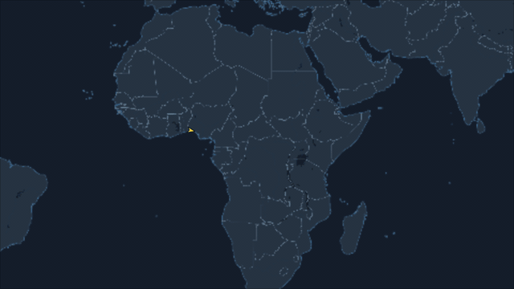
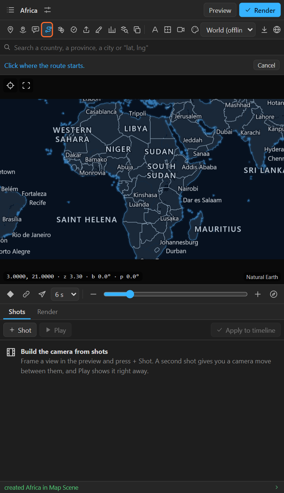
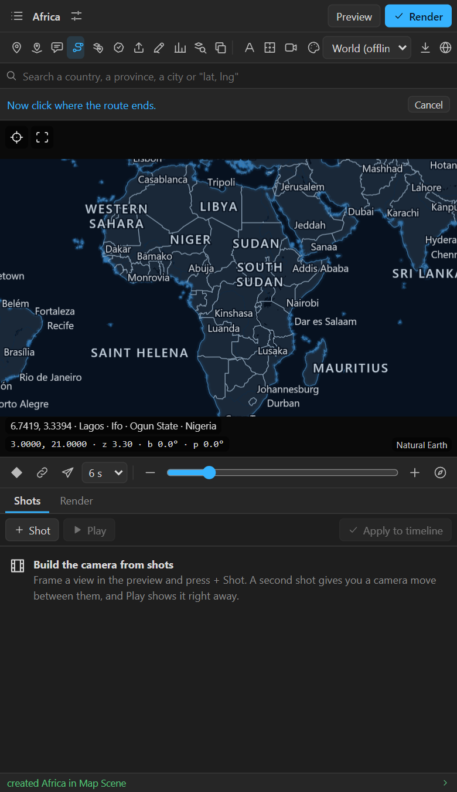
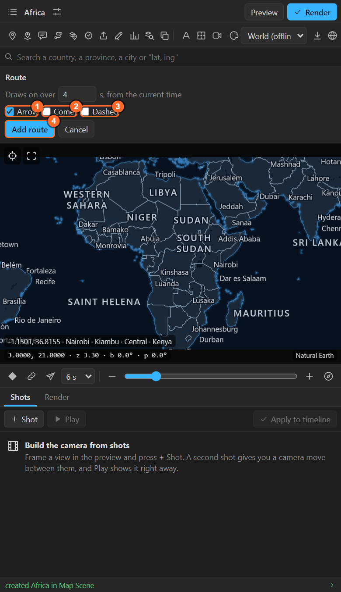
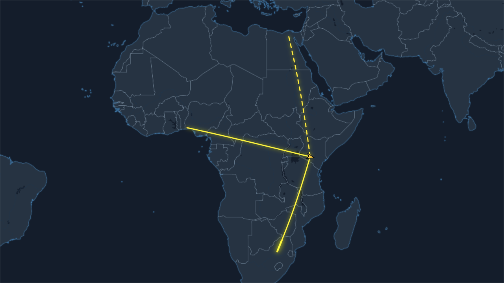

# 12. Routes

A **route** is a line between two places that draws on. It follows the **great circle**, the
shortest way over the Earth, so a long route bends on a flat map the way a flight does. It can carry
an **arrow** that rides it, a bright **comet** head, or **dashes**.

## Draw a route

1. Put the time indicator where the line should start drawing.
2. Click **Route** in the tool row. The bar says *Click where the route starts*.

   

3. Click the start on the preview. The bar now says *Now click where the route ends*.

   

4. Click the end. The **Route** sheet opens:

   

| Setting | What it does |
|---|---|
| **Draws on over** | Seconds the line takes to draw, from the current time |
| 1. **Arrow** | An arrow travels along the line as it draws and turns with it |
| 2. **Comet** | A bright head runs along the line while it draws, like a comet |
| 3. **Dashed** | Dashes instead of a solid line |
| 4. **Add route** | Makes it. One undo step |

The route is named after its ends: **Lagos to Nairobi**. Arrow, Comet and Dashed stay as you left
them for the next route.

## The layers it makes

| Layer | What it is |
|---|---|
| **Lagos to Nairobi** | A shape layer: the line, with Trim Paths keyed from 0 to 100 % with an ease. A soft glow when the look has one |
| **Comet: …** | With Comet: the same line, thicker and brighter, trimmed at both ends so only a short head shows, chasing the tip |
| **Traveller: …** | With Arrow: a layer with an arrow, a **Progress** slider (keyed with the line) and **Rotate along Route** |

### Your own plane, car or ship on the route

The Traveller is there to carry your artwork:

1. Draw or import your plane. Point it to the **right** (the direction of travel).
2. Parent it to the **Traveller** layer and put it at the Traveller's position.
3. Switch off the Traveller's own **Contents** (the arrow) if you only want your plane.

Retime the journey by moving the **Progress** keys (and the line's Trim Paths keys with them).
**Rotate along Route** off keeps the artwork upright.

## Lines in the air and on the ground

A long route is lifted slightly in the middle, like a flight path, so it reads as an arc on a tilted
map and the globe. With an elevation pack on the map ([chapter 25](25-terrain.md)), the route sits on
the 3D terrain.

## More than two points

The Route tool joins two places. For a route through many places, or a real track:

- **Import** a GPX, KML or GeoJSON line and press **Draw** or **Draw + arrow**
  ([chapter 16](16-import.md)). A GPS track can draw at its **recorded pace**.
- **Draw it** with the Pen tool over the map ([chapter 17](17-your-own-drawing.md)).
- Make several routes end to end, each starting when the last one ends.

## Tips and pitfalls

- **The line is straight, not curved**: two places close together follow a great circle that is
  almost straight. That is correct.
- **The arrow is too small or too large**: scale the Traveller layer. It is sized for the comp's
  height.
- **The line colour**: the map's layer colour (Look > Pins, routes and callouts,
  [chapter 23](23-sky-relief-layer-style.md)), or change the stroke of the route layer.
- **A camera that follows the route**: in the Shots tab, an **Along route** move between two shots
  on the same places ([chapter 9](09-shots.md)).

## Related

- [16. Importing files](16-import.md)
- [17. Your own drawing](17-your-own-drawing.md)
- [32. Flows between places](32-flows.md): many arcs from a table, their width by an amount.
