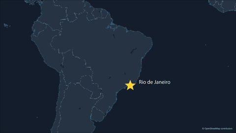
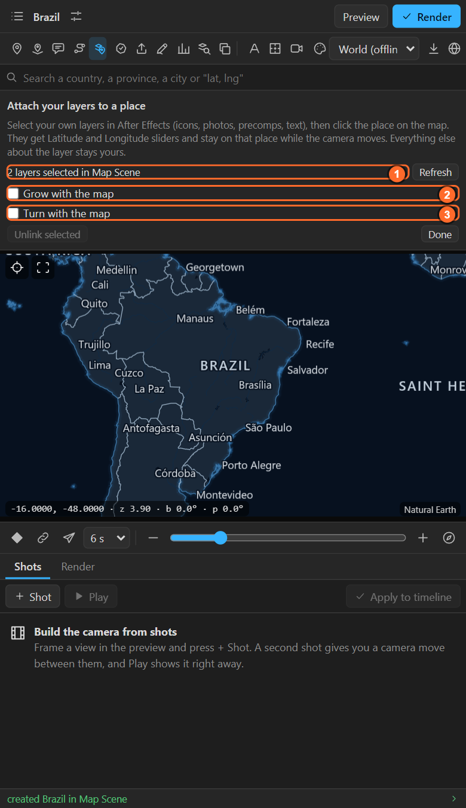
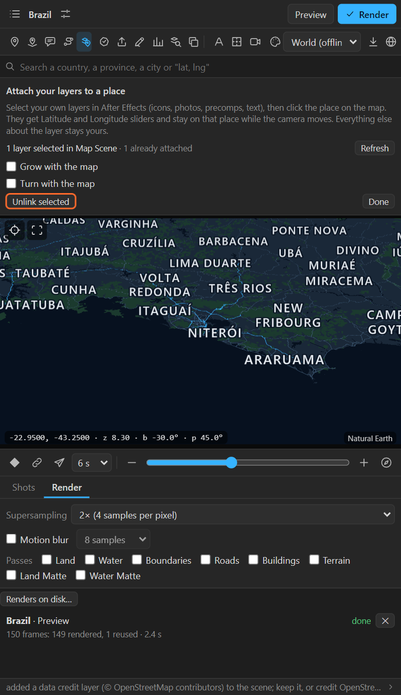

# 13. Attaching your own layers

**Attach** puts **your own** layers on a place: an icon, a photo, a logo, a precomp, a text layer.
They get the same controls a pin has and stay on their place while the camera moves. Everything else
about the layer stays yours.

## Attach

1. Select a map in the panel.
2. In After Effects, **select your layers** in the map's scene comp. One or many.
3. Click **Attach** in the tool row (the paper clip). The sheet says how many usable layers are
   selected; press **Refresh** if you changed the selection after opening it.

   

4. Choose how they follow the map:

| Switch | Off | On |
|---|---|---|
| **Grow with the map** | The layer keeps its size on screen | Its size is multiplied by the map's zoom, so it grows as the camera comes closer, like something painted on the ground |
| **Turn with the map** | The layer stays upright | It turns with the map's bearing, keeping its direction on the ground |

5. Click the place on the preview.

All the selected layers go to that place. The **anchor point** of each layer is what sits on the
place, so set the anchor point first: the bottom tip of a map-pin icon, the centre of a logo. In the
example, the label's anchor is moved to its left so the text sits beside the star.

## What it adds to your layer

| Effect | What it does |
|---|---|
| **Map** | The map it follows |
| **Latitude**, **Longitude** | The place. Keyframe them to move the layer across the map |
| **Elevation (m)** | The ground height, with an elevation pack |
| **Scale with Map**, **Rotate with Map** | The two switches above, changeable later |
| **Reference Zoom** | The zoom at which the layer has its own size (when it scales with the map) |

And expressions on **Position**, **Scale**, **Rotation** and **Opacity**, which multiply your own
values: keyframe Scale from 0 to 100 % to pop it on, or Opacity to fade it, and it still works.

The panel never touches anything else: your effects, masks, your own comment text are kept. A
property you already drive with an expression of your own is left alone.

## Unlink

Select attached layers in After Effects, open the Attach sheet and press **Unlink selected**. The
controls and expressions are removed and the layer stays where it is, as an ordinary layer again.

## Attach or pin?

| | Pin | Attach |
|---|---|---|
| The layer | Made by the panel (a dot) | Your own layer |
| Named after the place | Yes | Keeps its name |
| Best for | Quick markers | Branded icons, photos, precomps, anything designed |

To put a copy of one layer on **every** place of a table (a flag per country, an icon per city),
use **Copy selected layer onto places** in the Numbers sheet ([chapter 30](30-values-and-copies.md)).

## Tips and pitfalls

- **"Nothing usable selected"**: select the layers in the **map's scene comp**, not inside the map
  comp, and not layers the panel made.
- **The layer jumps off the place**: the anchor point is not where you think. Move the anchor point,
  not the position.
- **A 3D layer of your own**: attach places the layer on screen; a 3D layer keeps its own depth (Z)
  but is not laid on the ground. For a layer lying on the ground, parent it to a **3D pin**
  ([chapter 10](10-pins.md)).

## Related

- [10. Pins](10-pins.md)
- [30. Numbers as text, and copies of your own layer on every place](30-values-and-copies.md)
