# 14. Highlights

**Highlight** fills countries, provinces or districts with colour. Every highlight renders as its
own layer above the basemap, so you can fade them in one by one, recolour them or give them a glow
in After Effects. An outline can also become an editable **shape layer** that draws on.

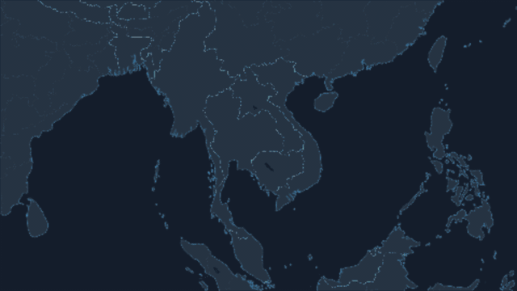

## Highlight by clicking

1. Click **Highlight** in the tool row (the check badge). The sheet opens:

   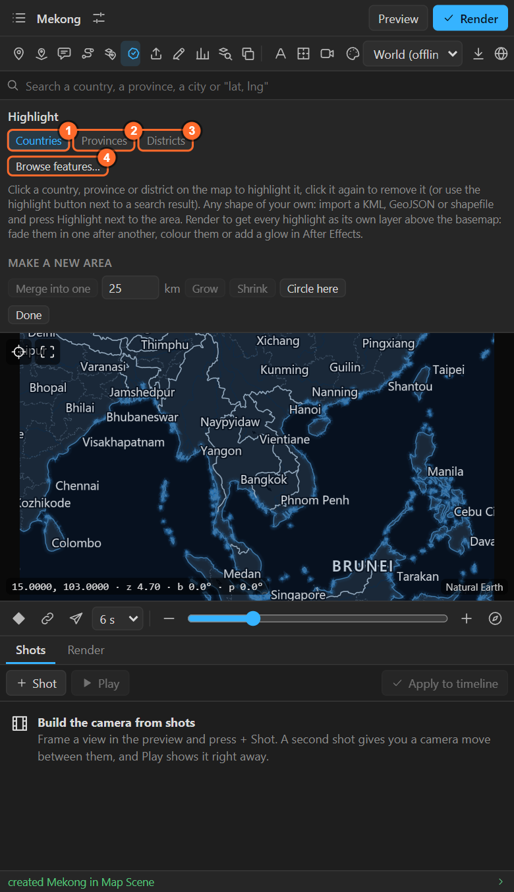

2. Choose what a click picks: 1. **Countries**, 2. **Provinces** (states, regions, divisions) or
   3. **Districts** (counties, departments, the next level down).
3. Click on the preview. Click again to take it off.
4. **Preview** or **Render**: each highlight arrives as a layer in the map comp, above the basemap (open the map comp to time or style them).

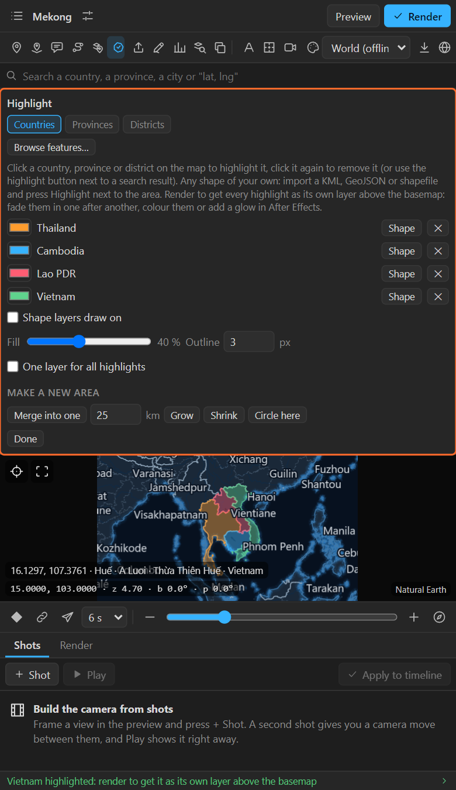

Other ways to highlight:

- The **highlight button** on a country, province or district in the search list ([chapter 6](06-search.md)).
- **Browse features…** (4 above): pick from a list, filter by numbers ([chapter 15](15-feature-browser.md)).
- **Highlight** next to an area of an imported file ([chapter 16](16-import.md)) or one you drew
  ([chapter 17](17-your-own-drawing.md)).

## Each highlight's settings

Every highlight is a row in the sheet:

| Control | What it does |
|---|---|
| **Colour** (the swatch) | Its colour. New highlights take turns through six colours (orange, blue, pink, green, violet, yellow), so neighbours differ |
| Its name | The country, province or district |
| **Shape** | Adds its outline as an editable shape layer (below) |
| **✕** | Takes the highlight off |

For all of them together:

| Control | What it does |
|---|---|
| **Fill** | How solid the fill is, 0 to 100 %. 0 leaves only the outline |
| **Outline** | The outline width in comp pixels, 0 for none |
| **One layer for all highlights** | Off (default): each highlight is its own layer, to time and style alone. On: one layer holds them all, which renders faster for many highlights |
| **Shape layers draw on** | Shape layers made from now on draw on with Trim Paths over four seconds from the current time |

## Rendered layer or shape layer?

| | Highlight (rendered) | **Shape** (shape layer) |
|---|---|---|
| Made by | The renderer, with the basemap | After Effects, as real paths |
| Edges | Exact at every zoom, under the names and lines of the map | A coarse outline for world zooms, a fine one for close-ups |
| Animate | Opacity, effects, blending | Everything: Trim Paths, stroke, fill, path effects, per country |
| Needs a render | Yes | No: it is there at once |

Use rendered highlights for flat colour that sits **in** the map; use shape layers for outlines that
draw on, glow, wiggle or get their own design.

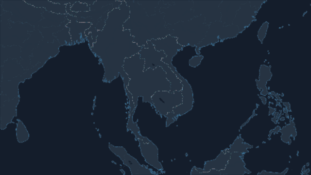

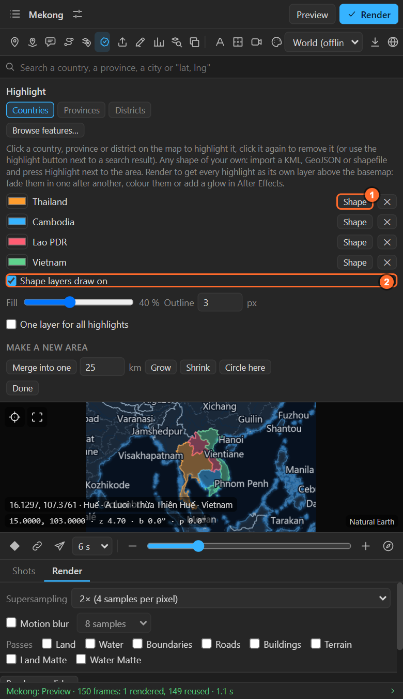

The shape layer has real paths that follow the map: an even-odd fill (lakes and holes stay open), a
stroke, and the outline switched between coarse and fine with the zoom. Its paths, fill and stroke
are yours to restyle.

## Make a new area

The bottom of the sheet makes **new** areas out of the highlights:

| Button | What it makes |
|---|---|
| **Merge into one** | One area out of every highlight, with the borders between the touching ones gone. It replaces them |
| **Grow** | Pushes the edge of every highlight out by the distance in **km**. Parts that come within it of each other join up |
| **Shrink** | Pulls the edge in by the distance. Parts narrower than it disappear |
| **Circle here** | A circle of that distance around the centre of the preview: a distance ring around a city, a site, an event |

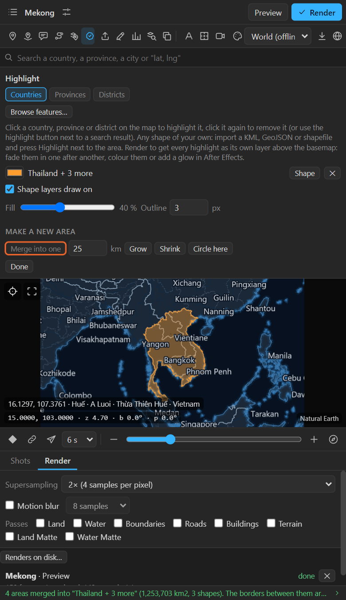

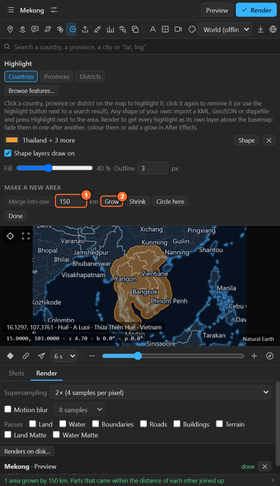

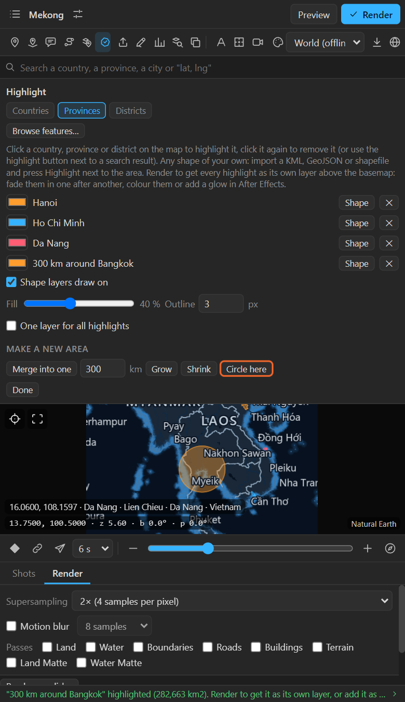

A new area is like any other: highlight it, make a **Shape** of it, browse it under **On this map**
in the feature browser, or save it with **Save as GeoJSON** ([chapter 19](19-save-geojson.md)).

## Provinces and districts

**Provinces** come with the panel for every country (Natural Earth).

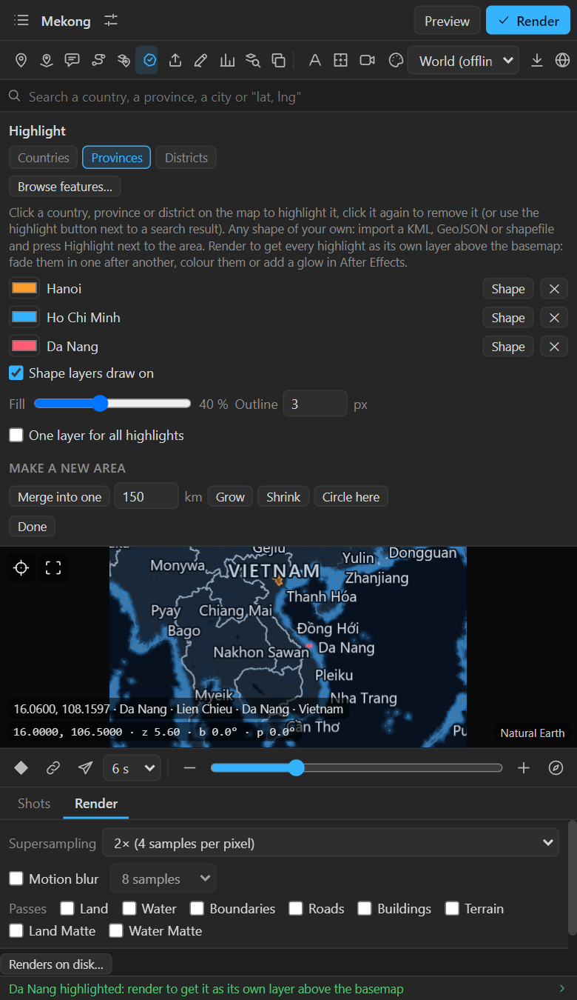

**Districts** come from geoBoundaries, open data per country. The installer puts the districts of
every country it has on your computer; the Districts chip lists the countries that are there, with
their number of districts. For a country that is not there, click it on the map: the sheet offers
the download with its size and its source's licence.

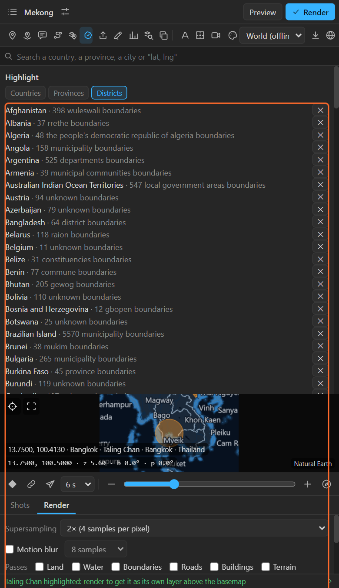

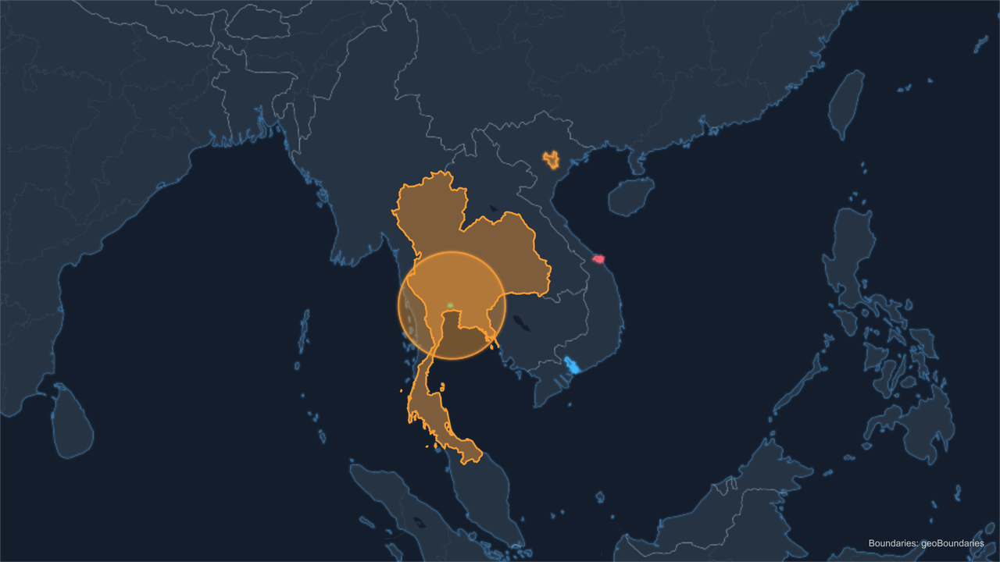

The **✕** next to a set removes it from the computer; highlights already on maps keep their shapes.
Rendering district boundaries adds a small *Boundaries: geoBoundaries* credit layer to the scene.

## Tips and pitfalls

- **Clicking does nothing**: the Highlight tool must be on (lit), and the right level picked.
- **A country has islands far away** (France, the United States): the highlight includes them. To keep
  only the mainland, open the feature browser and **Break apart** ([chapter 15](15-feature-browser.md)).
- **The colours of many highlights at once**: use **Numbers** ([chapter 28](28-numbers-colour.md))
  to colour places by a value or a category.
- **Done** closes the sheet and switches the tool off. The highlights stay.

## Related

- [15. The feature browser](15-feature-browser.md)
- [Historical borders](historical-borders.md): with a year on the map, a click picks that year's state, Shift+click its whole empire.
- [28. Colouring places by a number](28-numbers-colour.md)
