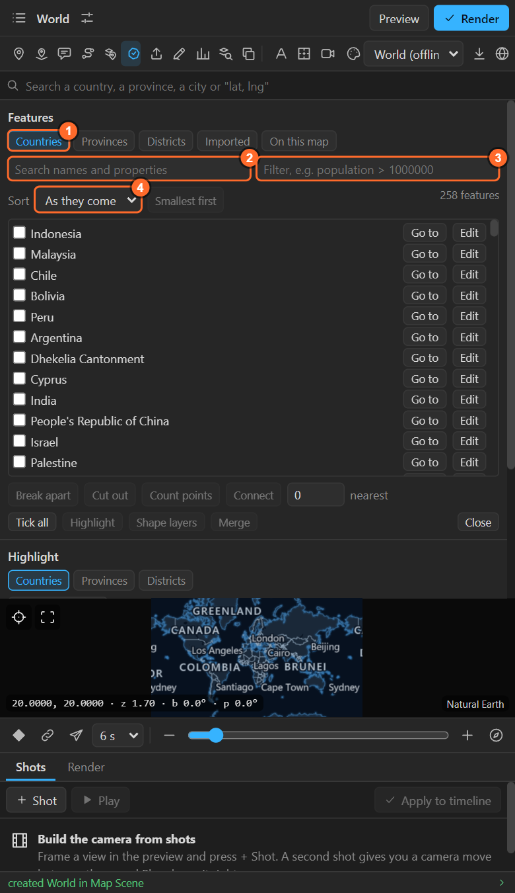
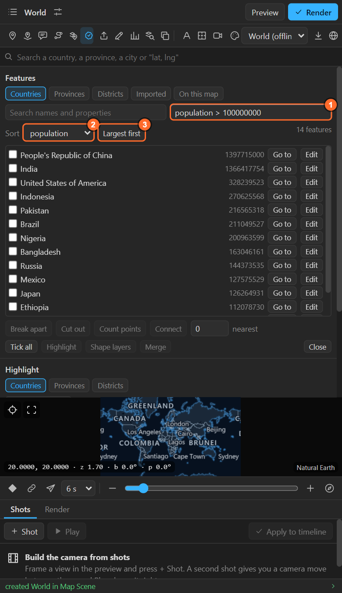
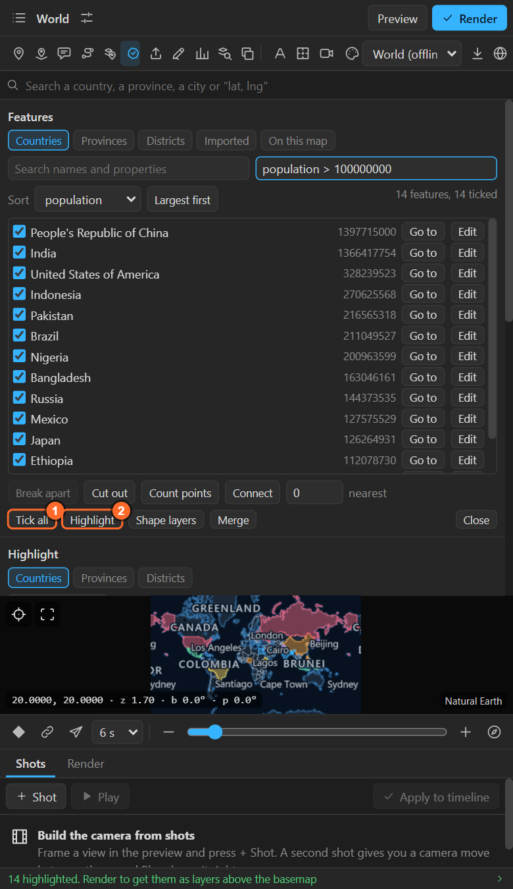
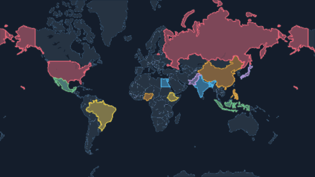
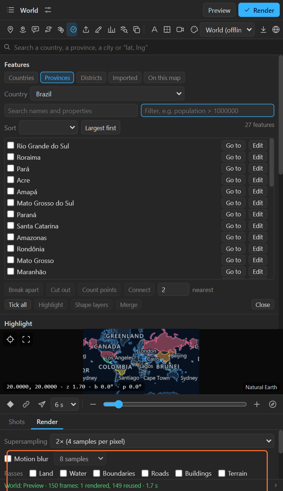

# 15. The feature browser

The feature browser lists everything the panel can put on a map (every country, the provinces or
districts of one country, the shapes of an imported file, the areas of this map) in one list you can
search, filter, sort and act on together.

Open it from the Highlight sheet: **Highlight** in the tool row > **Browse features…**

## What to list

| Chip | Lists |
|---|---|
| **Countries** | Every country, with its code, population and region |
| **Provinces** | The provinces, states or divisions of the country you pick |
| **Districts** | The districts of the country you pick, from its district set ([chapter 14](14-highlights.md)) |
| **Imported** | The shapes of the file you imported last, with the properties the file gave them |
| **On this map** | The areas this map already holds: merged, grown, circles, drawn |

When you colour the map by numbers ([chapter 28](28-numbers-colour.md)), each country, province or
district also carries its value under the column's name.

## Search, filter, sort

- **Search** looks through names **and every property**: `asia` finds the countries of Asia.
- **Filter** is one written test: a property, a test and a value.

| Test | Means | Example |
|---|---|---|
| `>` `>=` `<` `<=` | Numbers | `population > 100000000` |
| `=` `!=` | Equal, not equal | `kind = country`, `region != Europe` |
| `has` | Text that contains | `name has island` |

  A feature that does not carry the property is left out. A filter the panel cannot read says so in
  orange.
- **Sort** by any property, **Largest first** or **Smallest first**. The value shows on each row.

The line on the right counts the features, how many are not shown, and how many are ticked.

## Tick, then act

Tick features (or **Tick all** for everything the list shows), then:

| Button | Needs | What it does |
|---|---|---|
| **Highlight** | 1 or more | Highlights every ticked feature |
| **Shape layers** | 1 or more | Every ticked feature as its own editable shape layer |
| **Merge** | 2 or more | One area out of them, with the borders between touching ones gone |
| **Break apart** | exactly 1 | Splits one outline into its separate parts, largest first: a mainland away from its islands |
| **Cut out** | 2 or more | Takes the other ticked shapes out of the **first**: a shape inside becomes a hole, a shape across its edge is clipped off, and the first may fall into pieces |
| **Count points** | 1 or more | Counts the imported points inside each, as a property called `inside` you can sort and filter on |
| **Connect** | 2 or more | A line between the ticked features, all drawing on together from the current time. With **nearest** set to a number, each joins only that many nearest neighbours; 0 joins every pair |

## Go to and Edit

Each row has two buttons:

- **Go to**: frames that feature in the preview.
- **Edit**: its name and its properties.

| In the editor | Does |
|---|---|
| **Name** | The name its highlight, shape layer and label carry |
| A property | Change its value; empty takes it away |
| **Add** | A property of your own: type `status: sold` |
| **As it came** | Back to what its data says |

Filters, sorting and everything you make from it see the change. The data it came from is never
changed.

## Recipes

- **Every country of one region**: Countries, filter `region = Africa`, Tick all, Highlight.
- **A mainland without its islands**: tick the country, **Break apart**, highlight only the first
  (largest) part.
- **A park with a lake cut out**: import both shapes, tick the park first, then the lake, **Cut out**.
- **Which districts hold the most shops**: import a CSV of shop locations, list the districts, tick
  all, **Count points**, sort by `inside`, **Largest first**.
- **A network map**: tick the cities' countries, **Connect** with 2 nearest.

## Related

- [14. Highlights](14-highlights.md)
- [16. Importing files](16-import.md)
