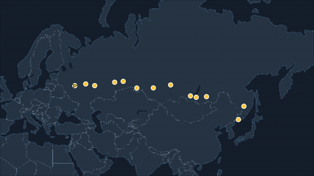
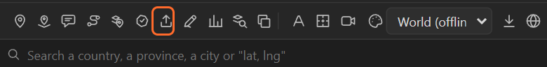
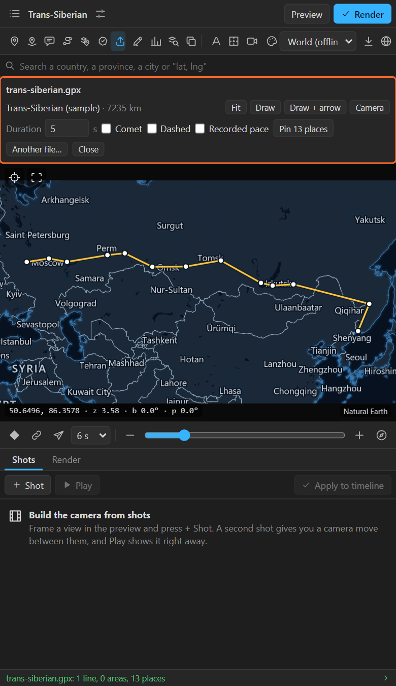
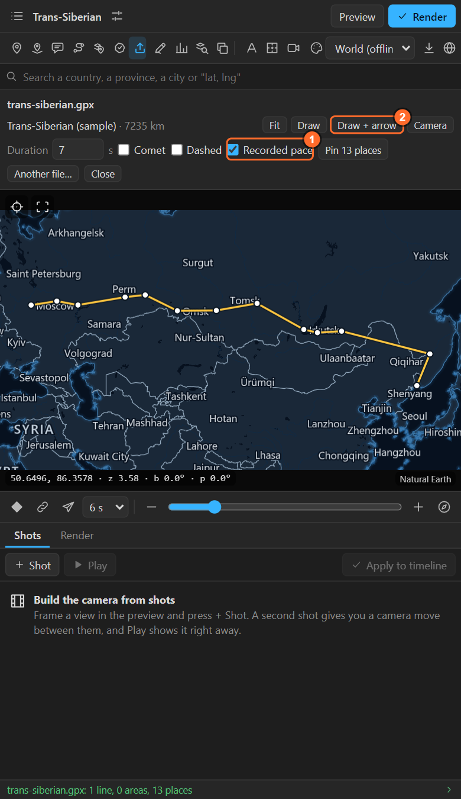
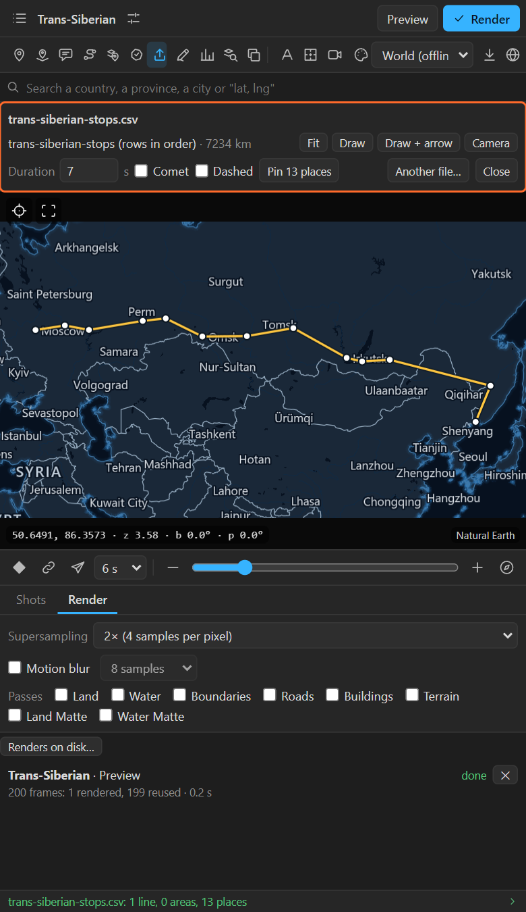
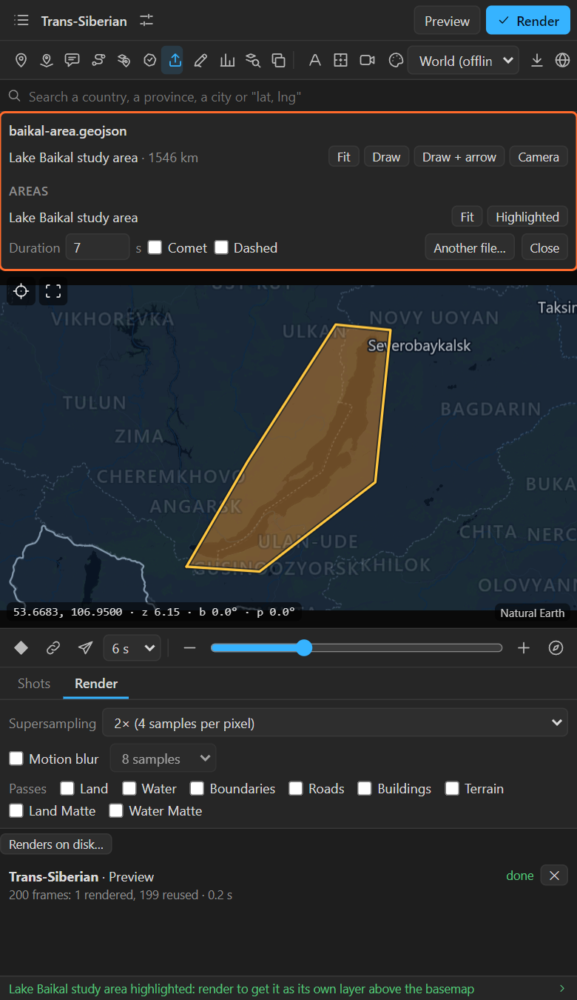

# 16. Importing files

**Import** reads a file of geography (a GPS track, a KML from Google Earth, a GeoJSON, a
shapefile, a spreadsheet of places) and lets you put every part of it on the map: lines as routes
that draw on, places as pins, areas as highlights, and lines as a camera path.



## Formats

| File | What comes in |
|---|---|
| **GPX** (`.gpx`) | Tracks and routes as lines (with their times), waypoints as places |
| **KML**, **KMZ** (`.kml`, `.kmz`) | From Google Earth or My Maps: paths as lines, polygons as areas, placemarks as places |
| **GeoJSON** (`.geojson`, `.json`) | LineStrings as lines, Polygons as areas, Points as places, with their properties |
| **Shapefile** (a `.zip` with the `.shp`, `.dbf` and `.prj`, or a `.shp`) | Lines, areas and points with their attributes |
| **CSV**, **TSV**, **TXT** | A table. With coordinates and a name column: places. With names and numbers: the **Numbers** sheet ([chapter 28](28-numbers-colour.md)) |

## Import a file

1. Click **Import** in the tool row (the upward arrow) and pick the file. Once a file is open, the
   same button shows and hides its sheet.

   

2. The preview frames the first line (or all the places), and the sheet lists what the file holds:

   

The status line counts the lines, areas and places, and how many parts it skipped.

## Lines

Each line (up to twelve, longest first) is a row with its name and length:

| Button | What it does |
|---|---|
| **Fit** | Frames the line in the preview |
| **Draw** | A route layer along the line that draws on from the current time |
| **Draw + arrow** | The same, with a Traveller arrow riding it ([chapter 12](12-routes.md)) |
| **Camera** | Adds shots to the Shots tab that move the camera along the line ([chapter 9](09-shots.md)) |

Settings for all of them, at the bottom of the sheet:

| Setting | What it does |
|---|---|
| **Duration** | Seconds the line takes to draw, and the camera move along it |
| **Comet** | A bright head runs along the line as it draws |
| **Dashed** | Dashes instead of a solid line |
| **Recorded pace** | Shown when a line has **times** (a GPS track, a flight log): it draws fast where the journey was fast and slow where it was slow, with long stops shortened. Off: an even pace |



Long tracks are thinned to 300 points for the route layer, which keeps the shape and keeps After
Effects fast. An imported line follows the ground on a map with an elevation pack.

## Places

**Pin N places** puts a pin on every place of the file, named after it. A CSV of places needs a
name column and coordinate columns named `lat` and `lng`, or `latitude` and `longitude`:

```
name,lat,lng
Moscow,55.7766,37.6556
Kazan,55.7887,49.1006
```



## Areas

Each area (up to forty) is a row with **Fit** and **Highlight**. A highlighted area renders like a
highlighted country ([chapter 14](14-highlights.md)), with its own colour and layer; it also shows
in the feature browser under **Imported**, with the file's properties, where you can turn it into
shape layers, merge it, cut it or count points in it ([chapter 15](15-feature-browser.md)).



## Tips and pitfalls

- **"0 lines, 0 areas, 0 places"**: the file has a projection the panel does not read, or only
  attributes. Shapefiles need their `.prj`; export from your GIS as WGS 84 (EPSG:4326) if in doubt.
- **The CSV opened the Numbers sheet**: it has a column of names and a column of numbers and no
  coordinates. That is the data-map path; add `lat` and `lng` columns for pins.
- **Recorded pace is not offered**: the line has no times. GPX tracks from a phone or a watch have
  them; drawn routes do not.
- **Another file…** opens the next file into the same sheet; **Close** hides it (the file stays
  open under the Import button).

## Related

- [12. Routes](12-routes.md)
- [17. Your own drawing](17-your-own-drawing.md)
- [18. Finding things on OpenStreetMap](18-openstreetmap.md): an import from OpenStreetMap itself.
