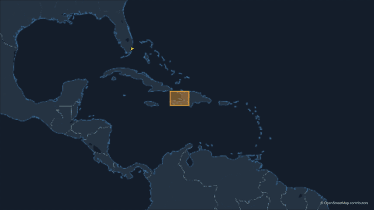
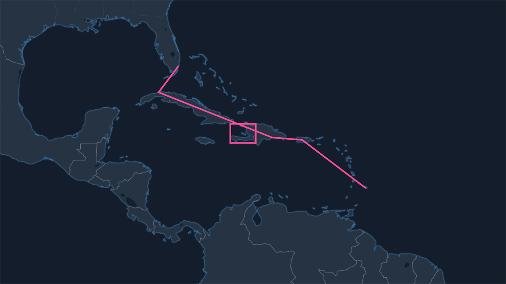
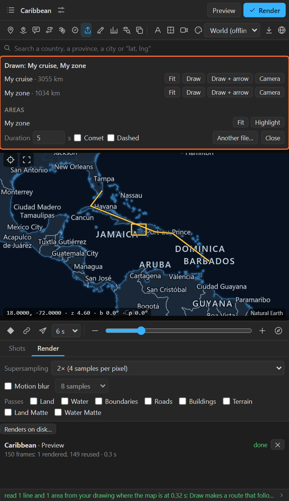

# 17. Your own drawing with the Pen tool

Sometimes the line you want is not in any file: a cruise that goes this way and not that, a zone
someone sketched in a meeting. Draw it with After Effects' own **Pen tool** over the map, and the
panel turns it into a route or an area that **follows the map** from then on, curves and all.

## Step by step

1. In the map's scene comp, at a time when the camera shows the area, draw over the map with the
   **Pen tool**:
   - a **new shape layer** (click the Pen with no layer selected), or
   - **masks** on any 2D layer.

   Open paths become **lines**; closed paths become **areas**. Draw as many as you like on one layer,
   or several layers.

   

2. Select the layer (or several) in the timeline.
3. Click **Your own drawing** in the tool row (the pen).

The drawing is read **where the camera is at the current time** and opens like an imported file:

4. For lines: **Draw**, **Draw + arrow** or **Camera**, with Duration, Comet, Dashed, as for any
   import ([chapter 16](16-import.md)). For areas: **Highlight**.
5. **Hide or delete your drawing.** It stays as you left it, fixed on screen; the new route and area
   follow the map.

## What is read

- **Bezier curves** are kept: a curved path stays curved on the map.
- **Stars, polygons, rectangles and ellipses** of a shape layer are not paths yet: select them and
  use **Layer > Convert To Bezier Path** first.
- **2D layers only.** A 3D layer's drawing cannot be read back onto the ground.
- A path drawn **where there is no ground** (the sky of a tilted map, around the globe) is left out,
  and the log says which.

## Why draw instead of importing?

| Draw | Import |
|---|---|
| Fast for a rough shape you invent on the spot | Exact for a shape that exists (a track, a boundary) |
| Uses the tools you know | Needs a file |
| Accurate to the pixels you drew at that zoom | Accurate to the data |

Draw at the closest zoom the shape will be seen at: a line drawn over a whole continent is only as
precise as a few pixels of that continent.

## Related

- [16. Importing files](16-import.md)
- [12. Routes](12-routes.md)
- [14. Highlights](14-highlights.md)
