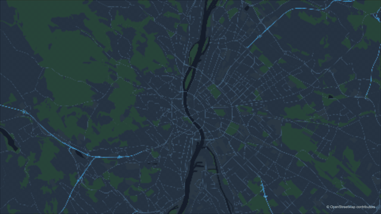
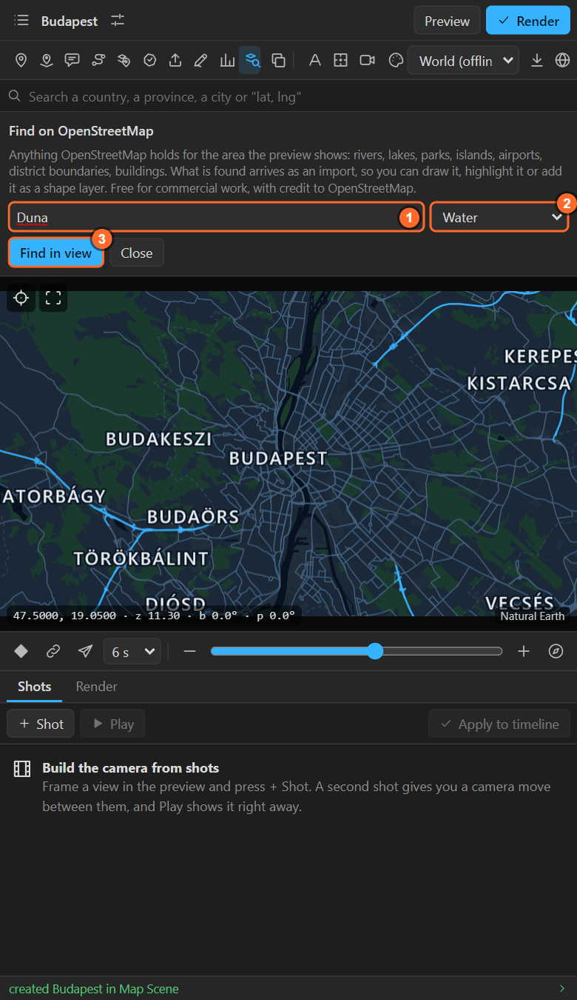
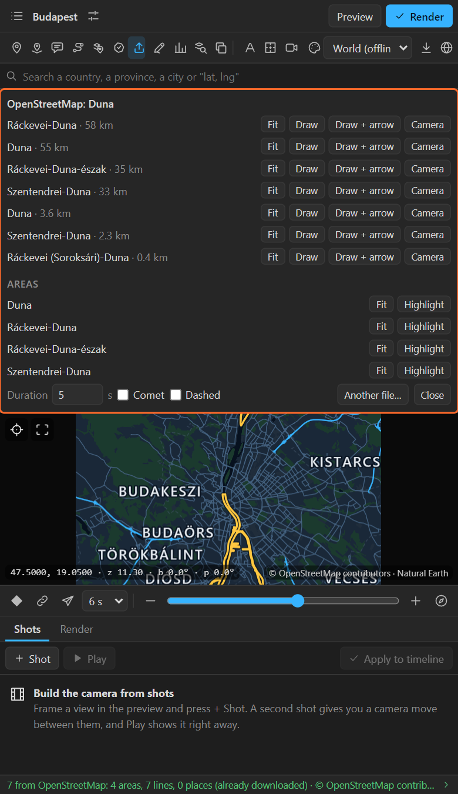

# 18. Finding things on OpenStreetMap

**OpenStreetMap** in the tool row asks OpenStreetMap what it holds **for the area the preview
shows**: a river, a lake, a park, an island, an airport, a district boundary, a building, a road. What
it finds arrives **as an import**, so you can draw it as a route, highlight it, or add it as a shape
layer. It is free for commercial work, with credit to OpenStreetMap.

## Find something

1. Frame the area in the preview. **The smaller the area, the faster and surer the answer**: the
   panel refuses to ask about the whole planet.
2. Click **OpenStreetMap** in the tool row (the map with a magnifier). The sheet opens:

   

3. Type **a name, or part of one** (`Danube`, `Central Park`, `Heathrow`), and/or pick a **kind**:

| Kind | Finds |
|---|---|
| **Anything named** | Whatever carries that name |
| **Water** | Lakes, reservoirs, rivers, streams, canals |
| **Parks and forest** | Parks, gardens, nature reserves, woods, heath, grassland |
| **Islands** | Islands, islets, archipelagos |
| **Airports** | Aerodromes, runways, terminals |
| **Boundaries** | Administrative boundaries: districts, municipalities |
| **Buildings** | Buildings |
| **Roads** | Motorways down to tertiary roads |
| **Railways** | Rail, subway, light rail, tram |

   With a kind picked, the name may be left empty, in a small enough area.

4. **Find in view** (or Enter). The answer opens in the import sheet ([chapter 16](16-import.md)):
   lines with **Draw**, **Draw + arrow** and **Camera**; areas with **Highlight**.

## What to do with it

| Found | Do |
|---|---|
| A river, a road, a railway | **Draw** it as a route that draws on; **Camera** to fly along it |
| A lake, a park, an island, a district | **Highlight** it; in the feature browser, **Shape layers** for an outline that draws on |
| An airport | Highlight its area, pin it |
| Many buildings | Highlight them, or browse them in the feature browser and pick |

## Good to know

- The question goes to **Overpass**, the public OpenStreetMap query service, with only the name, the
  kind and the area's corners.
- A busy area with a broad kind (all buildings of a city) can be large or slow: zoom in, or add a name.
- Rendering OpenStreetMap data adds a small *© OpenStreetMap contributors* credit layer to the scene.
- For a whole city's streets and buildings as the basemap, **Download this area** instead
  ([chapter 27](27-download-area.md)).

## Related

- [16. Importing files](16-import.md)
- [14. Highlights](14-highlights.md)
- [6. Search](06-search.md): to **go to** a street or address rather than draw it.
