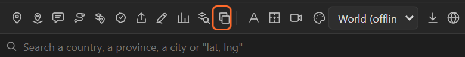

# 19. Saving the map as GeoJSON

**Save as GeoJSON** writes what is on the selected map back out to a file: the pins, the routes,
the shape-layer outlines, the callouts and the areas you made. Use it to hand the geography of a
piece to someone else, keep it with the project, open it in a GIS, or bring it into the next map.

## Save

1. Select the map.
2. Click **Save as GeoJSON** (the two squares).
3. Choose where to save. The name proposed is the map's: `Export.geojson`.

The log says how many features were written and where.

## What goes in

| On the map | In the file |
|---|---|
| Pins and 3D pins | Points, named after their layer |
| Your attached layers ([chapter 13](13-attach.md)) | Points, named after their layer |
| Routes (drawn, imported, from the Route tool) | LineStrings |
| Callouts | Points with their title |
| Shape layers of outlines | Polygons |
| Areas you made (merged, grown, shrunk, circles, drawn) | Polygons, with their names |

The coordinates are read from the layers' own controls, so a pin you moved with its Latitude and
Longitude sliders is saved where it is now. Names, labels, highlights of countries and provinces and
the basemap are not saved: they come from the panel's own data and can be made again.

If nothing on the map can go out, the log says so: add pins, routes, outlines or callouts first.

## Bring it back

Import the file into any map ([chapter 16](16-import.md)): lines come back as lines to draw,
points as places to pin, polygons as areas to highlight.

## Related

- [16. Importing files](16-import.md)
- [38. Driving the panel from a script](38-scripting.md)
