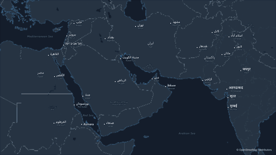
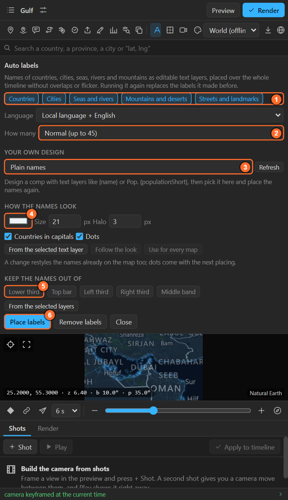
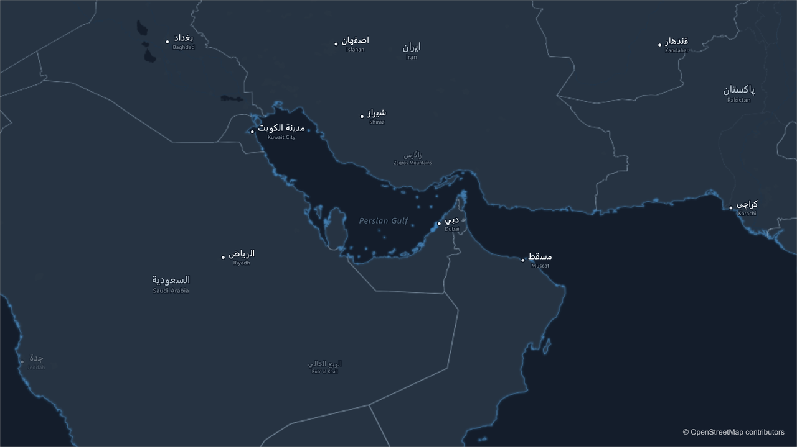
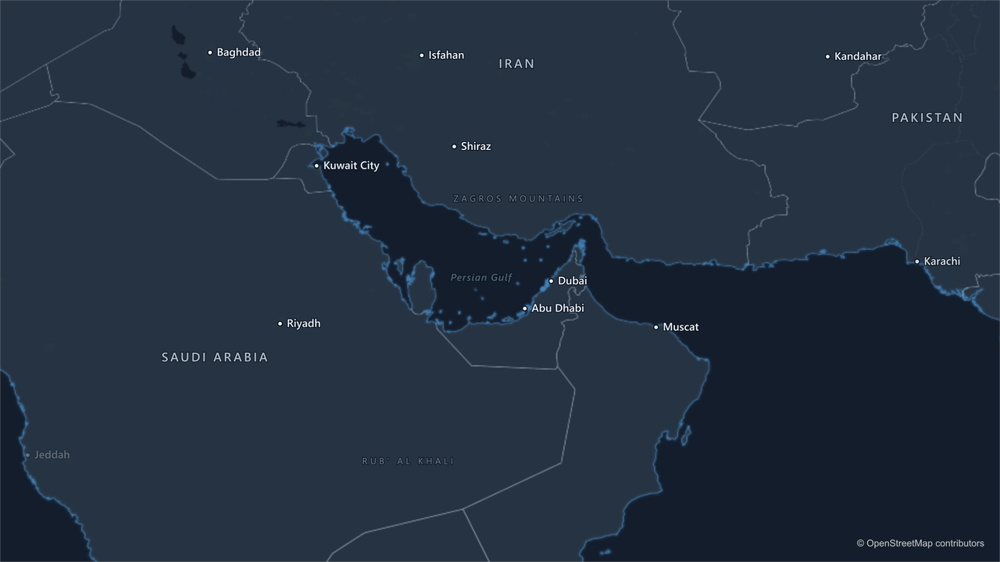
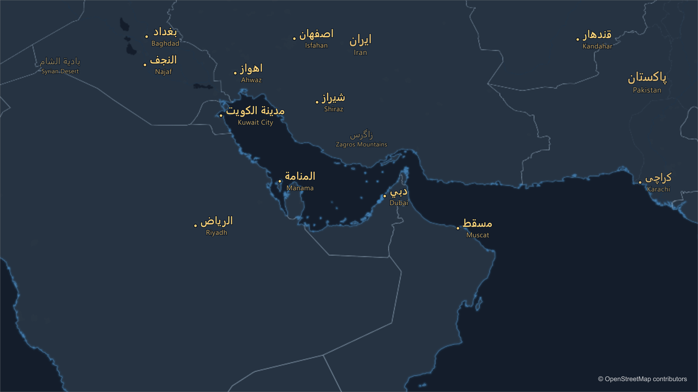
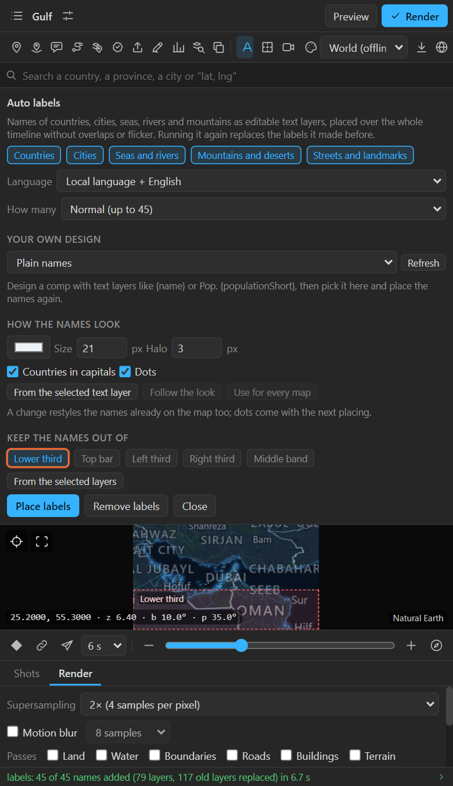
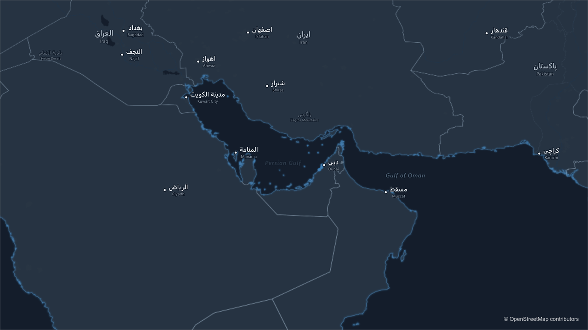

# 20. Auto labels

**Auto labels** names the map: countries, cities, seas, rivers, mountains, and inside a downloaded
city its districts, landmarks and streets. It places the names **over the whole timeline** at once,
so they never overlap and never flicker as the camera moves, and every name is an ordinary,
editable **text layer**.

## Place the names

1. Select the map and key its camera first: the names are placed for the camera you have.
2. Click **Auto labels** in the tool row (the letter A). The sheet opens:

   

3. Choose what to name (1), how many (2), and the rest below.
4. **Place labels**. A progress bar counts through the timeline; the log says how many names went in.

**Running it again replaces the names it made before.** Change the camera, then place the names
again. **Remove labels** takes them all off in one undo step.

## What to name

The chips at the top switch kinds on and off. At least one stays on.

| Chip | Names | How they look |
|---|---|---|
| **Countries** | Country names | Larger, in capitals with spacing (switchable) |
| **Cities** | Capitals, cities and towns | With a dot |
| **Seas and rivers** | Oceans, seas, bays, rivers, lakes, waterfalls | In italic, in the colour of water |
| **Mountains and deserts** | Continents, ranges, deserts, islands, regions, and peaks | Ranges and deserts in spaced capitals; a peak with a small triangle and its height |
| **Streets and landmarks** | Inside a downloaded area: districts, parks, landmarks, stations, airports, the river through town, the main streets | Street and river names bend along their line and turn with the camera |

## Language

| Choice | Result |
|---|---|
| **Local language + English** (default) | Each place in its own language and script, with an English line under it where they differ |
| **Local language only** | Each place in its own language |
| **All in …** | Every name in one of 26 languages: Arabic, Bengali, German, Greek, English, Spanish, Persian, French, Hebrew, Hindi, Hungarian, Indonesian, Italian, Japanese, Korean, Dutch, Polish, Portuguese, Russian, Swedish, Turkish, Ukrainian, Urdu, Vietnamese, Chinese (simplified and traditional) |

Every script is shaped correctly: Arabic and Hebrew run right to left, Bengali, Devanagari and Thai
join as they should, Chinese, Japanese and Korean use fonts that carry them.

## How many

**Few** (up to 20), **Normal** (up to 45) or **Many** (up to 120) names on screen at once. The most
important come first: countries, capitals, large cities, then the rest as room allows.

## How placing works

The panel looks at the whole timeline before it places anything. For every frame it knows where each
name would be, gives each name the room it needs, and keeps the important ones. A name that loses its
room **fades out** and fades in again when it gets it back, instead of popping. Names keep their
place relative to their dot; they do not slide around.

## How the names look

| Control | What it does |
|---|---|
| **Colour** | The colour of the names (countries take it too) |
| **Size** | City name size in pixels at 1080 lines; countries are a little larger. Scaled for 4K and other sizes |
| **Halo** | The outline that keeps a name readable on any map, 0 for none |
| **Countries in capitals** | Country names in capitals with spacing (scripts without capitals are left alone) |
| **Dots** | The dot next to a city name |
| **From the selected text layer** | Takes the font, size, colour and halo of a text layer you styled yourself. Latin, Cyrillic and Greek use that font; other scripts keep fonts that shape them |
| **Follow the look** | Back to the look's own names |
| **Use for every map** | The other maps of the project take these names and keep-out zones, and their names are placed again |

**A change restyles the names already on the map** and places them again, so larger names step apart
instead of overlapping. One that no longer fits anywhere fades out, and the log says how many.

## Keep the names out of

Leave room for your own titles:

| Chip | Keeps free |
|---|---|
| **Lower third** | The bottom 38 % of the frame |
| **Top bar** | The top 18 % |
| **Left third**, **Right third** | A third at the side |
| **Middle band** | A band across the middle |

**From the selected layers** takes the bounds of layers you select in After Effects (a lower third
you designed, a logo) and keeps names away from them **only for the seconds those layers are on
screen**. Each zone is listed with its times and a **Remove**. Zones are drawn over the preview.

## Your own design

Instead of plain names, put **a comp you designed** on every place: a box, an icon, a rule, a photo.

1. Make a comp. Add text layers whose text holds **fields** in braces:

| Field | Becomes |
|---|---|
| `{name}` | The name in the chosen language |
| `{english}` | The English name |
| `{country}`, `{countryName}` | The country code, the country's name |
| `{region}` | The region |
| `{population}`, `{populationShort}` | 13,500,000 or 13.5M |
| `{capital}` | Whether it is a capital |
| `{lat}`, `{lng}` | Its coordinates |

   A text layer like `Pop. {populationShort}` works too.
2. Add a layer called **Anchor** where the place should sit (the tip of an arrow, the centre of a
   dot).
3. Optional: a picture layer named like `{flag}` gets a picture per place from a folder: press
   **Pictures for {flag}…** and pick a folder of files named by country code (`BGD.png`, `BD.png`)
   or by name (`Bangladesh.png`). A city with none takes its country's.
4. In the sheet, under **Your own design**, pick the comp (**Refresh** if you just made it).
5. **Place labels**. Every place gets a copy of your comp with its fields filled, placed with the same
   collision rules as plain names.

## Tips and pitfalls

- **Names did not follow my new camera**: names are placed for the camera you had. Place them again
  after changing the camera.
- **Too busy**: **Few**, or switch off a kind. **Look > Details** also has fewer names for the names
  drawn into the basemap itself.
- **A name I need is missing**: it lost its room to more important names. **Many**, a larger frame,
  or add it yourself with a text layer or a **Callout** ([chapter 11](11-callouts.md)).
- **A name I do not want**: delete its layer. Placing again brings it back; a keep-out zone over it
  does not.
- **Streets and landmarks do nothing**: they need a downloaded area under the camera
  ([chapter 27](27-download-area.md)).

## Related

- [11. Callouts](11-callouts.md)
- [22. The looks](22-looks.md)
- [27. Downloading an area](27-download-area.md)
- [Historical borders](historical-borders.md): with a year on the map, the names are that year's states, and they change with the History Year slider.
