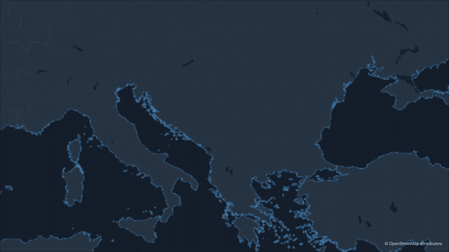
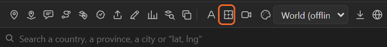

# 21. Animate borders

**Animate borders** makes the country borders of the basemap draw on, over four seconds from the
current time. It is the classic opening of a map piece: the land is there, then the lines between
the countries appear.

## Step by step

1. Select the map and put the time indicator where the borders should start.
2. Click **Animate borders** in the tool row (the square with a cross).

   

3. **Preview** or **Render**: the borders are drawn by the renderer, so you see them after a render.

## What it does

The map layer gets a slider, **Borders Draw-on**, keyed from **0** at the current time to **100** four
seconds later. The renderer reads it for every frame and draws each border that much along its
length.

Because it is a slider, you own the timing:

- **Longer or shorter**: move the second key.
- **Another curve**: change the keys' easing in the graph editor.
- **Undraw**: key it back to 0 at the end.
- **Start drawn**: delete the keys and set the slider to 100.

Only the frames whose value changed are rendered again.

## Good to know

- It animates the **country borders of the basemap**. Province lines and the outlines of highlights
  are not part of it; a highlight's **Shape** layer draws on by itself ([chapter 14](14-highlights.md)).
- With the **Boundaries** pass on in the Render tab, the borders come on their own layer, to glow or
  colour them in After Effects ([chapter 36](36-render.md)).

## Related

- [14. Highlights](14-highlights.md)
- [36. Preview, Render and the Render tab](36-render.md)
