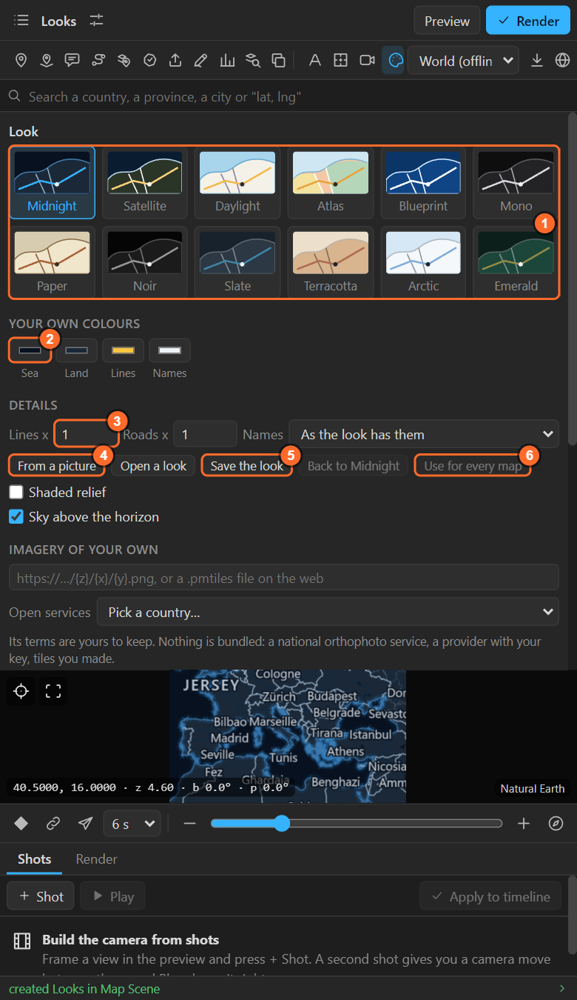
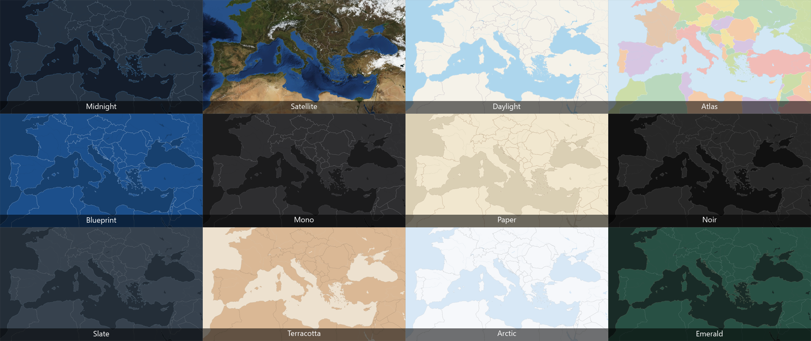
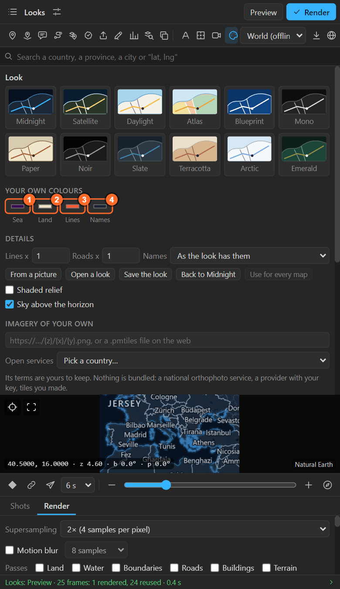
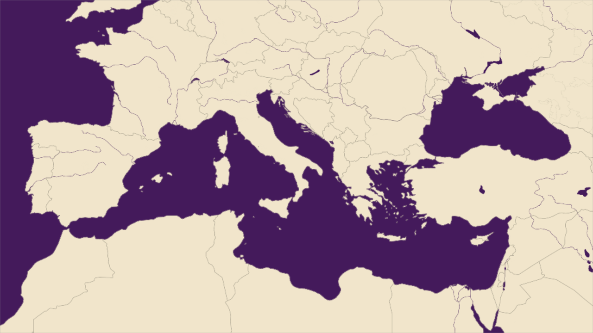
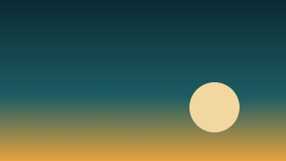
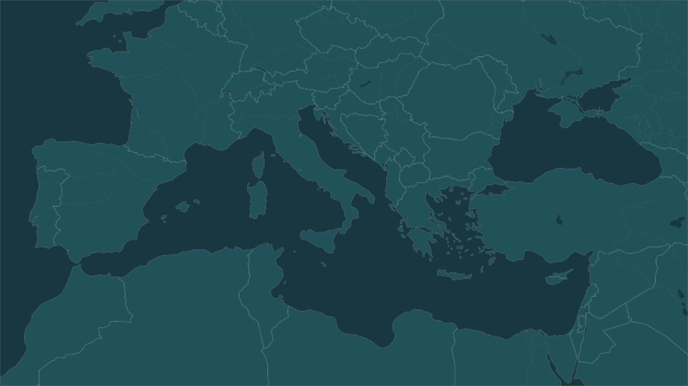
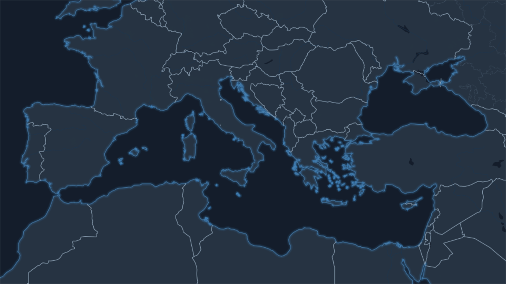

# 22. The looks, and a look of your own

**Look** (the palette in the tool row) sets how the map is drawn: twelve ready looks, your own
colours, a look taken from a picture, and how heavy the lines and how many the names. The same sheet
holds the sky, relief, imagery, terrain and map furniture, which the next chapters cover.

## The twelve looks

| Look | Made for |
|---|---|
| **Midnight** | Deep navy with glowing coasts: the broadcast look (the default) |
| **Satellite** | NASA Blue Marble imagery: continents and countries (it softens closer than a large city) |
| **Daylight** | Bright and clean, like a modern web map |
| **Atlas** | A political map: every country in its own soft colour |
| **Blueprint** | White lines on engineering blue |
| **Mono** | Neutral greys, made to be coloured and graded in After Effects |
| **Paper** | Warm, printed-atlas tones for history and documentary |
| **Noir** | Black and white, high contrast: film titles |
| **Slate** | Blue-grey newsroom: calm land, bright lines |
| **Terracotta** | Warm sand and clay, ink-dark names: editorial and travel |
| **Arctic** | Ice-blue sea, near-white land: clean and cold |
| **Emerald** | Deep green land under a dark sea, gold lines |

Click a card. The preview changes at once; **render again** to see it in the comp. The look is saved
with the map, and labels, pins, routes and callouts made from then on match it.

## Your own colours

Four swatches set the whole map:

| Swatch | Sets | And from it the panel works out |
|---|---|---|
| **Sea** | The water | Rivers, lakes, the coast's glow |
| **Land** | The land | Roads, buildings, parks, borders, the sky |
| **Lines** | The pins, routes and callouts this map makes, and its brightest roads | |
| **Names** | The names drawn in the basemap | Pushed lighter or darker until they read on your land |

**Back to Midnight** (or whichever look you started from) drops your colours.

## From a picture

**From a picture** takes the palette of an image (a still from your film, a mood board, a brand
sheet) and makes a look of it. The panel finds the picture's six main colours. In a dark picture
the darkest becomes the **sea** (in a light one, the lightest), the next colour that stands apart
from it becomes the **land**, and the most saturated of the rest becomes the **lines**. The names
are worked out to read on that land.

## Open a look, save the look

- **Save the look**: writes your look (colours, details, layer style, relief, sky, imagery) to a
  file you can keep with the project or send to a colleague.
- **Open a look**: reads a saved look, or a palette from **Illustrator or Photoshop** (`.ase`,
  `.act`): a brand's colours become a map look in one step.

## Details

In every look:

| Control | What it does |
|---|---|
| **Lines ×** | Borders, coasts, rivers and province lines, ×0.25 to ×3 the look's own width |
| **Roads ×** | Roads and railways of a downloaded area, ×0.25 to ×3 |
| **Names** | How many names the basemap itself draws: **Fewer**, as the look has them, **More** |

The **Names** detail is about the names painted into the basemap. The names the panel adds as text
layers are set in Auto labels ([chapter 20](20-auto-labels.md)); with Auto labels on, set the
basemap's own names to **Fewer** so the two do not compete.

## Use for every map

**Use for every map** gives this look to every other map in the project: the colours, the details,
the layer style, relief, sky and imagery. Render them again to see it.

## Related

- [23. Sky, shaded relief, and the style of pins, routes and callouts](23-sky-relief-layer-style.md)
- [Historical borders](historical-borders.md): the world in another year, from the same sheet.
- [24. Imagery](24-imagery.md)
- [36. Render passes](36-render.md): grade the land and the water separately in After Effects.
