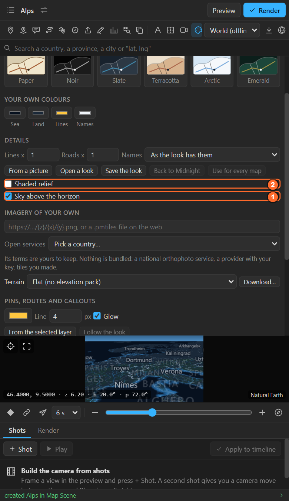
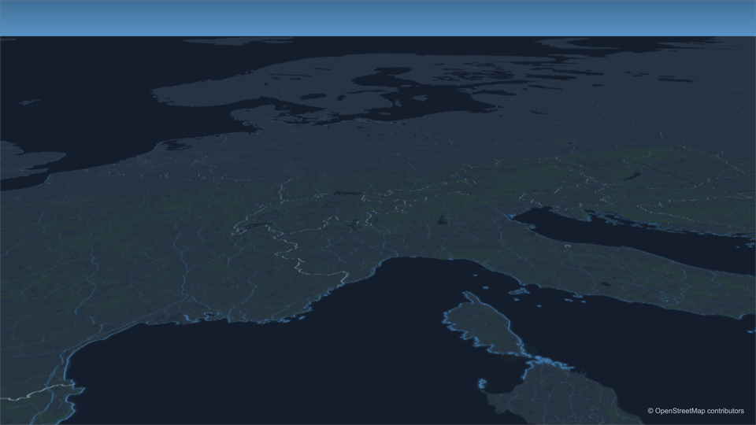
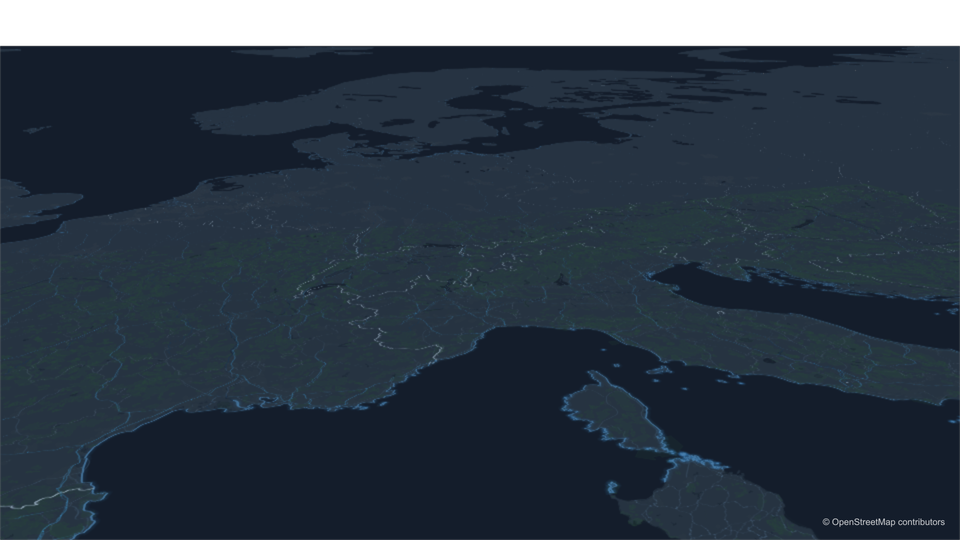
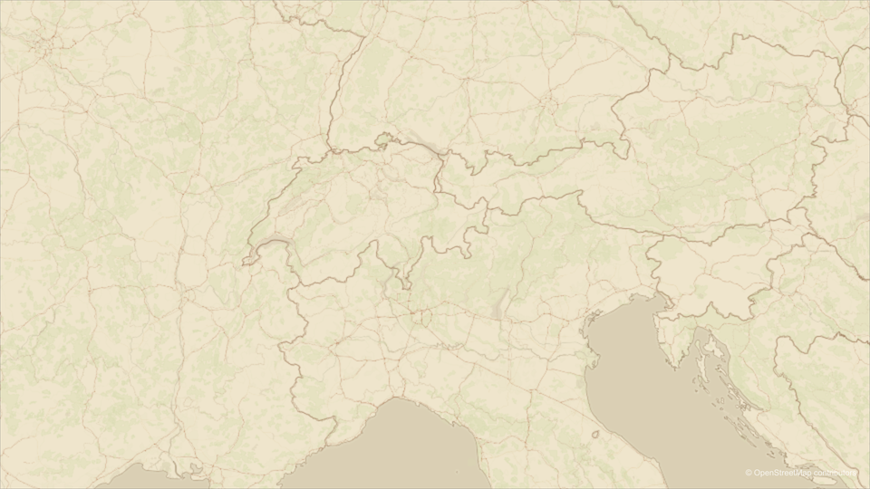
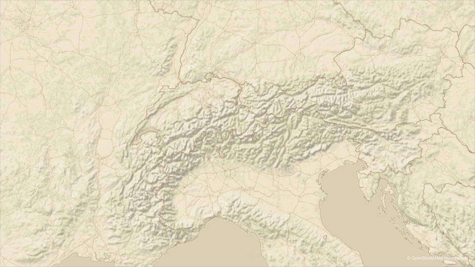
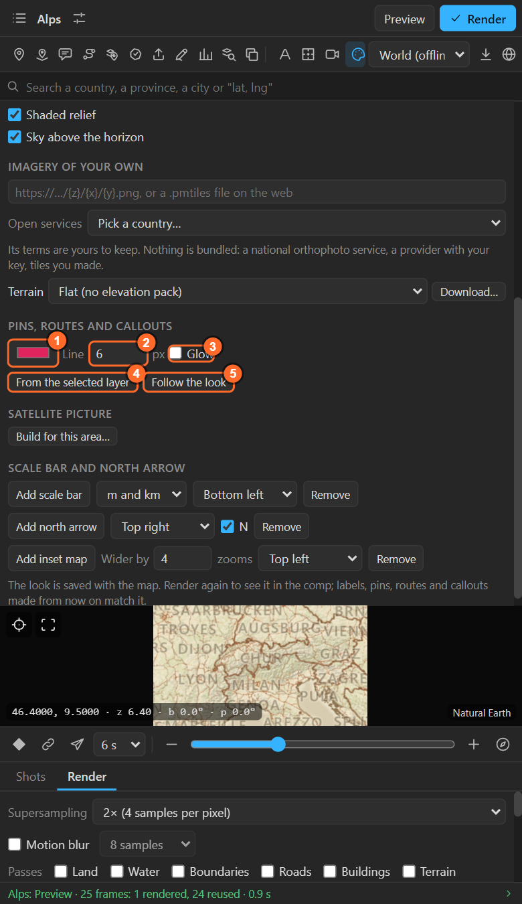

# 23. Sky, shaded relief, and the style of pins, routes and callouts

Three more switches in the Look sheet: what fills the sky of a tilted map, soft mountain shadows over
the land, and the colour and line of everything the panel adds on top.

## Sky above the horizon

Tilt a map far enough and the horizon shows.

- **On** (default): the look's own sky fills it, fading into the horizon haze.
- **Off**: it is transparent, so a sky of your own (a photo, a gradient, a time-lapse) shows through
  from below the map layer.

The globe always has its atmosphere, whatever the switch.

## Shaded relief

**Shaded relief** lays soft shadows of mountains and valleys over the land (Natural Earth's shaded
relief, which comes with the panel). It reads at country and continent scale.

The **Satellite** look has its own relief in the picture, so the switch is off there. For sharp
shading at any zoom, from real elevation data, use **Terrain > Shaded slopes**
([chapter 25](25-terrain.md)).

## Pins, routes and callouts

| Control | What it does |
|---|---|
| 1. **Colour** | The colour of the pins, routes, callout leaders and travellers the panel makes **from now on** |
| 2. **Line** | Line width in pixels at 1080 lines, scaled for the comp |
| 3. **Glow** | A soft glow around routes and callout leaders (it reads on dark maps, less on light ones) |
| 4. **From the selected layer** | Takes the colour and line width of a layer you select in After Effects: style one route by hand, then make every next one match |
| 5. **Follow the look** | Back to the look's own colour, line and glow |

Layers already made keep their style; change those in After Effects (the stroke of a route, the fill
of a pin's Marker group).

## Related

- [22. The looks](22-looks.md)
- [25. Terrain](25-terrain.md)
