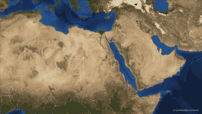
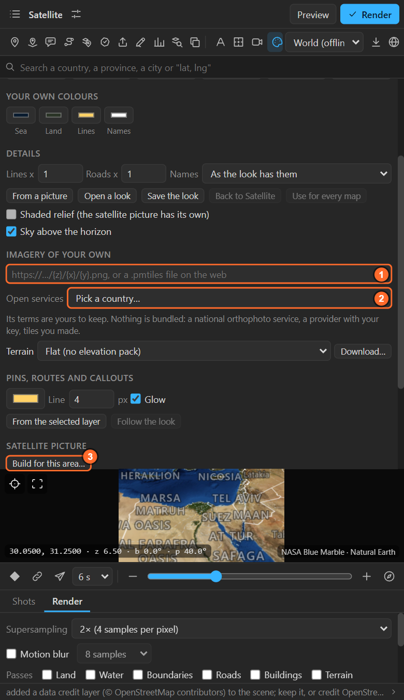

# 24. Imagery

Pictures of the ground under the map's lines and names: the **Satellite** look that comes with the
panel, **imagery of your own** from any tile address, **open government aerial pictures**, and a
real **Sentinel-2 satellite picture** of any area, built for you.

## The Satellite look

The **Satellite** card in the Look sheet ([chapter 22](22-looks.md)) draws NASA's Blue Marble under
the borders, coasts and names. It comes with the panel and works offline. It is made for continents
and countries; closer than a large city it softens. For a sharp ground closer in, build a Sentinel-2
picture (below) or use an open service.

## Imagery of your own

1. Type a tile address into the box: an **XYZ** address such as
   `https://example.com/tiles/{z}/{x}/{y}.png` (with your own key in it if the service needs one), or
   a **PMTiles** archive on the web (`https://…/area.pmtiles`).
2. The row below appears:

| Control | What it does |
|---|---|
| **Credit** | The credit the source asks for. It goes on the preview's credit line and into the scene's credit layer |
| **Opacity** | How strongly the tiles show over the ground, 0 to 100 % |
| **256 px / 512 px tiles** | The tile size of the service: 256 for most, 512 for some |
| **Off** | Back to the map's own data |

The tiles are drawn **over the ground and under every line and name**, in the preview and in the
render. They are fetched from that address while you preview and render, so the service's terms are
yours to keep: the panel bundles nothing and asks for no keys.

## Open services

**Open services** lists aerial pictures that governments publish for anyone to use, commercial work
included, with the credit shown. Picking one fills the address and the credit.

| Country | Service | Licence |
|---|---|---|
| United States | USGS The National Map: orthoimagery | Public domain |
| Netherlands | PDOK Luchtfoto, 8 cm | CC BY 4.0 |
| Switzerland | swisstopo SWISSIMAGE | Free under the FSDI terms of use |
| France | IGN BD ORTHO (Géoplateforme) | Licence Ouverte (Etalab 2.0) |
| Japan | GSI seamless aerial photo | GSI tile terms: state the source |
| Spain | PNOA orthophotos (IGN) | CC BY 4.0 SCNE |
| Austria | basemap.at orthophoto, 30 cm | CC BY 4.0 |
| Czechia | ČÚZK Ortofoto ČR | CC BY 4.0 |
| Luxembourg | BD-L-ORTHO | CC0 1.0 |
| Estonia | Maa-amet orthophoto | CC BY 4.0 |

These pictures only cover their own country. Outside it, the map's own ground shows.

## A satellite picture of your area (Sentinel-2)

**Build for this area…** makes a real satellite basemap of whatever the preview shows, at **ten
metres a pixel**, from the European Union's Sentinel-2 imagery. It is free for any use, films you
are paid for included, as long as the credit stays on the map, and it needs no account and no key.

1. Frame the area in the preview. The closer, the smaller the download.
2. **Build for this area…** The sheet asks the Copernicus catalogue what it has:

| Setting | What it does |
|---|---|
| **Name** | The area's name on your computer |
| **Detail** | Zoom 11 to 15. **Zoom 14 is ten metres a pixel**, the finest the satellites hold; 15 only enlarges it |
| **Within** | How far back to look for a clear pass: 3, 6, 14 or 24 months |

3. The sheet says how many passes it found, the clearest ones with their date and cloud, and about
   how much it will download. Press **Build N tiles (about … MB)**.

Each pixel comes from the clearest pass over that ground; where it had cloud or cloud shadow, the
next pass fills in. The finished area stays on your computer and is drawn under every line and name,
like any imagery. Pick it again for another map from **Pick an area…**; the **✕** next to its name
removes it.

| Area | Zoom 13 | Zoom 14 |
|---|---|---|
| A city | A few MB, a couple of minutes | About four times that |

Very cloudy places may need a longer **Within**; the panel says when it found nothing clear.

## Tips

- **The picture is blurry close in**: Blue Marble is for continents. Use Sentinel-2 (to street-block
  scale) or an open service (to the house).
- **Tiles do not show**: check the address in a browser with real numbers for `{z}/{x}/{y}`; some
  services need 512 px tiles or a key.
- **Credits**: the credit you type goes into the scene's credit layer. Keep it, or put it in your end
  titles.

## Related

- [22. The looks](22-looks.md)
- [25. Terrain](25-terrain.md)
- [39. Data, downloads, credits and working offline](39-data-offline.md)
