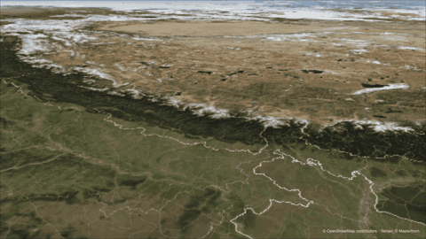
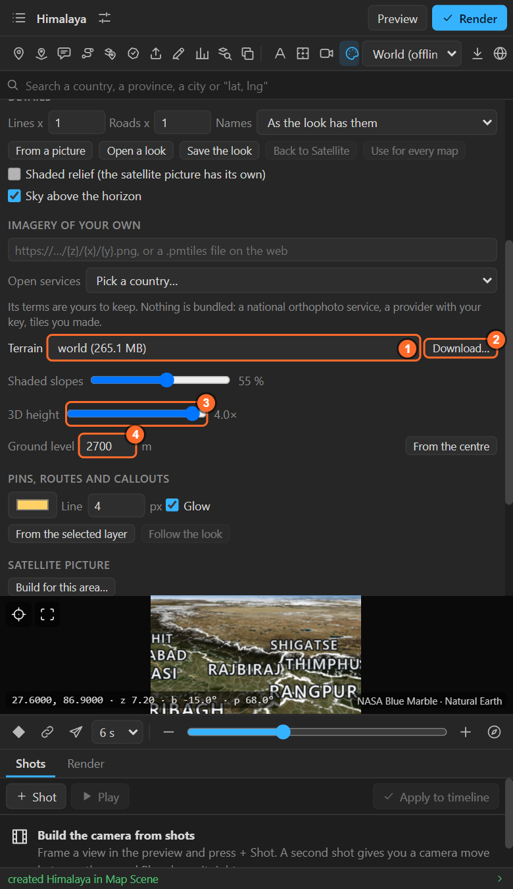
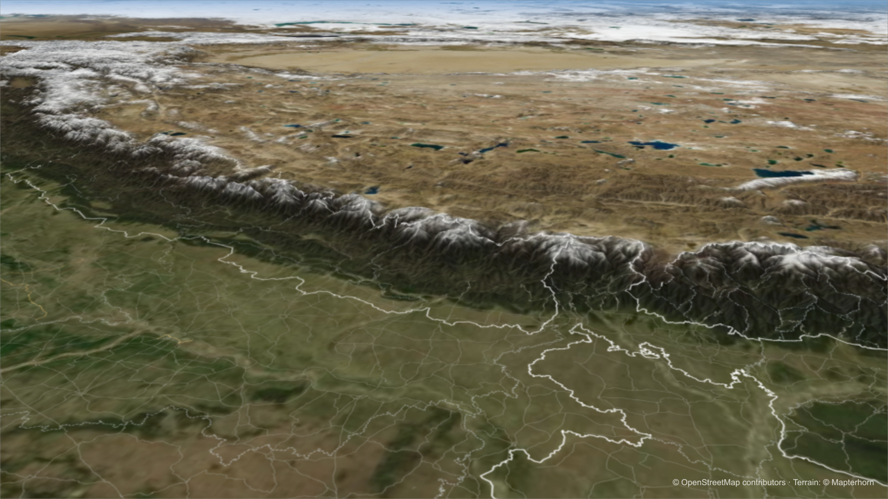

# 25. Terrain

With an **elevation pack**, the map gets real ground: **shaded slopes** that stay sharp at any zoom,
and **3D height**, real mountains that rise out of the map under a tilted camera. Pins, routes,
callouts and names made with the pack sit on the ground.

## Where it is

Look sheet > **Terrain**:

| Control | What it does |
|---|---|
| 1. **Pack** | The elevation pack this map uses, or **Flat (no elevation pack)** |
| 2. **Download…** | Downloads a finer pack for the area in the preview |
| 3. **3D height** | 0 (flat) to 4×: **1× is true to scale**, more exaggerates. Lives in the map layer's **Terrain Height** slider |
| 4. **Ground level** | The elevation, in metres, the camera counts from. **From the centre** reads the ground at the map's centre |
| **Shaded slopes** | How strongly slopes are shaded, 0 % (off) to 100 % |

## The world pack

The panel comes with an elevation pack called **world**: the whole planet to zoom 6, enough for
3D mountains at country and range scale. Pick it in the list and it works offline.

## A finer pack for your area

For a valley, a city on hills, a single mountain:

1. Frame the area in the preview.
2. **Download…** opens the download sheet: a **name**, and the **detail** (the zoom the pack goes
   to, 7 to 12, with the number of tiles).
3. **Check size**, then **Download**. The data is open elevation (the Copernicus 30 m model and
   national surveys) through **Mapterhorn**, kept on your computer from then on.

The same rules as downloading an area apply: too large a download is refused, a large one is
flagged, and a name that exists is replaced ([chapter 27](27-download-area.md)).

## 3D height

- **1×** is the real height: mountains look as they would from a plane.
- **2–3×** reads better from far away or in a short shot.
- **0** keeps the map flat but keeps the shaded slopes.

The value lives in the map layer's **Terrain Height** slider. **Keyframe it** and the mountains rise
or settle during the shot, in the render and for every layer that sits on the ground.

### Ground level

The camera's height is counted from **Ground level**. On a high plateau (Tibet, the Andes, the Alps),
set it to the ground at the map's centre (**From the centre**), so the camera keeps its usual height
above the ground there instead of crashing into it.

## Layers on the ground

Pins, 3D pins, routes, callouts and auto labels made **while the map has its pack** read the ground
height at their place and sit on it, including when you key Terrain Height. Layers made before you
picked the pack stay at sea level: make them again.

## Shaded slopes alone

With 3D height at 0, the pack still shades the slopes: sharp hillshading at any zoom, much finer
than the look's **Shaded relief** ([chapter 23](23-sky-relief-layer-style.md)). The **Terrain**
render pass gives the shading as a layer of its own ([chapter 36](36-render.md)).

## Credits

Rendering terrain adds a small *Terrain: © Mapterhorn* credit layer to the scene. Keep it, or put the
credit in your end titles.

## Related

- [23. Sky and shaded relief](23-sky-relief-layer-style.md)
- [27. Downloading an area](27-download-area.md)
- [34. Prism maps](34-prism.md): numbers as height.
