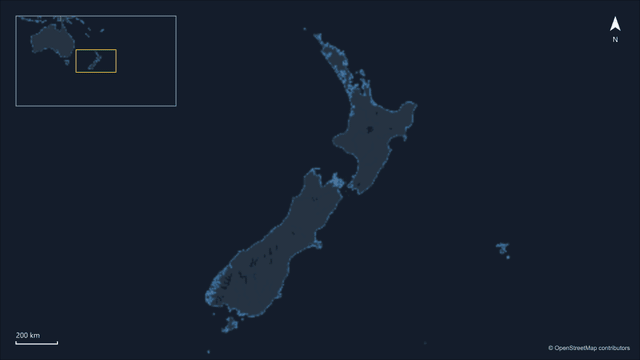
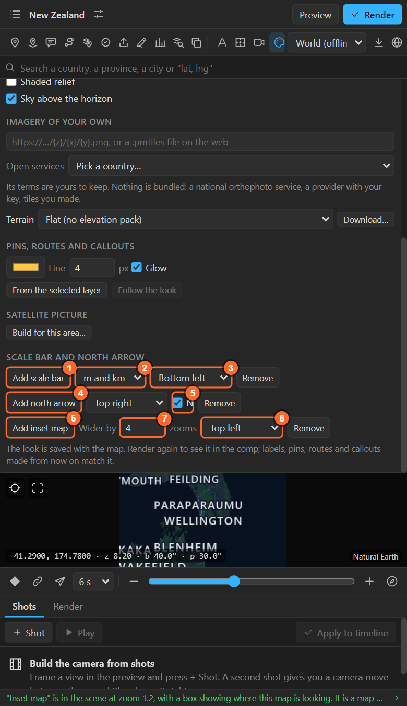
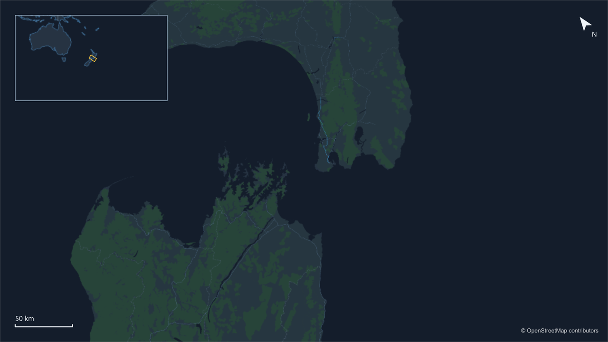

# 26. Inset map, scale bar and north arrow

The furniture of a real map, live: an **inset map** that shows where you are, a **scale bar** that
measures itself on every frame, and a **north arrow** that turns with the map. All three are plain
After Effects layers you can move, recolour and animate.

## Where they are

At the bottom of the Look sheet:

## Scale bar

| Control | What it does |
|---|---|
| 1. **Add scale bar** | Puts the bar in the scene |
| 2. **m and km / ft and mi** | Metric or imperial |
| 3. **Corner** | Which corner of the frame it sits in |
| **Remove** | Takes it off |

The bar **measures itself from the map on every frame**: it always shows a round distance (1, 2, 5,
10, 20, 50 …) and changes its length and its number as the camera zooms. It stays right through a
flight, on the globe, and even if you scale the map layer.

## North arrow

| Control | What it does |
|---|---|
| 4. **Add north arrow** | Puts the arrow in the scene |
| **Corner** | Where it sits |
| 5. **N** | An upright letter N under the arrow, staying upright while the arrow turns |
| **Remove** | Takes it off |

On a flat map it turns with the **bearing**. On the globe it points to the **pole**, which is not
always "up" even with a bearing of 0.

## Inset map

| Control | What it does |
|---|---|
| 6. **Add inset map** | A small locator map in a corner, with a frame and a box on it showing where this map is looking |
| 7. **Wider by** | How many zoom levels wider than this map the inset looks: 1 to 12 (default 4) |
| 8. **Corner** | Where it sits |
| **Remove** | Takes the inset, its frame and its box off |

The box **moves and turns with the main map on every frame**. The inset is **a map of its own**: it
appears in the Maps list, and you select it there to give it its own look, names and render. Render
it once, like any map; it does not need its own camera, it follows the main one.

For a split screen or an overview of your own design instead, use **Follow the camera of**
([chapter 5](05-map-settings.md)).

## Make them yours

All three are ordinary layers made by the panel (and tagged `LML:`):

- Move them anywhere, scale them, change their colours and fonts.
- Fade them in with opacity keys.
- **Remove** in the sheet takes them off; adding again replaces them.

## Related

- [5. Map settings: following another map](05-map-settings.md)
- [31. Legend and chart](31-legend-chart.md): the other things that sit in a corner.
