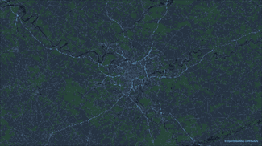
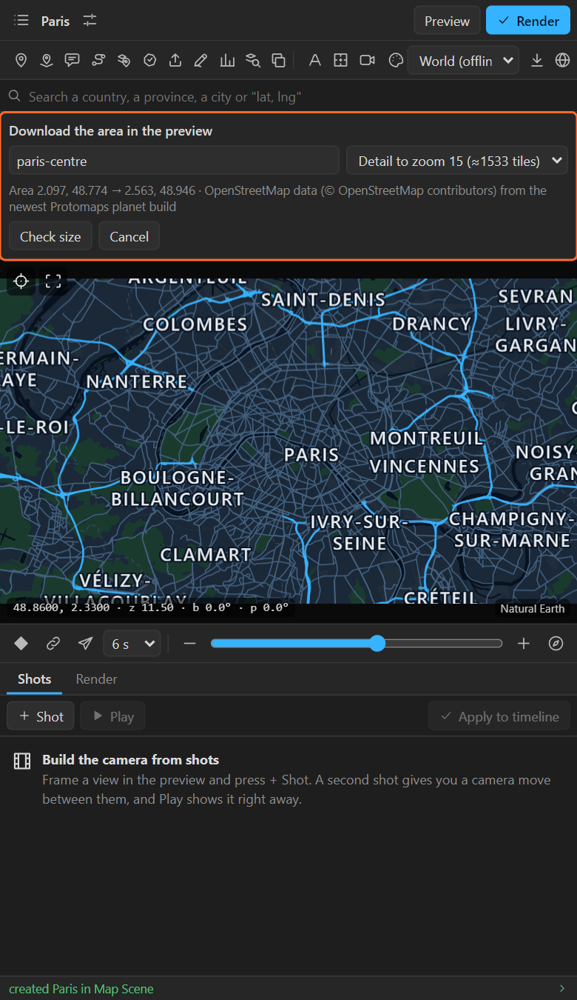
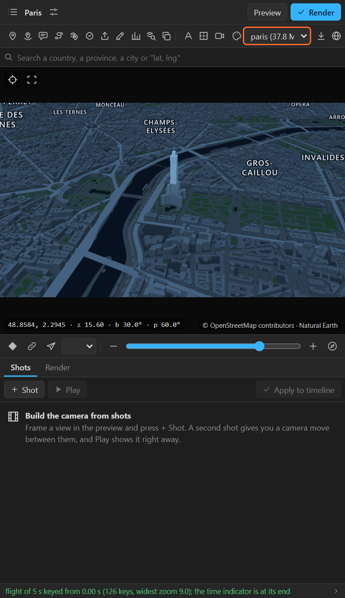
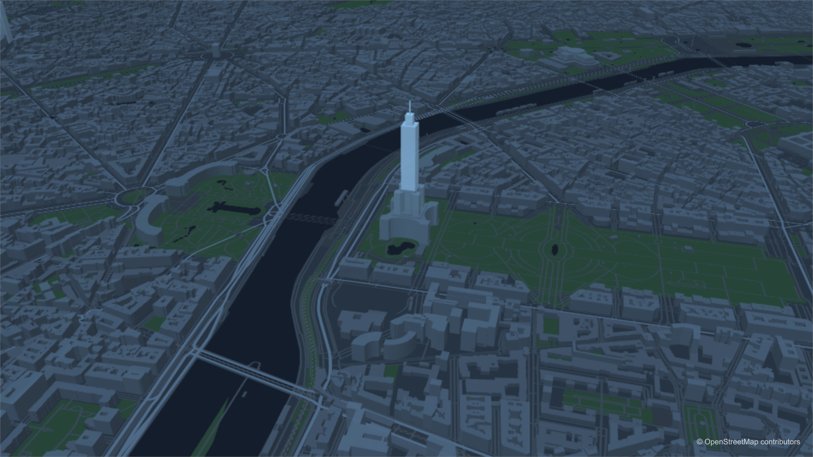

# 27. Downloading an area for street-level detail

The world that comes with the panel goes down to city level (zoom 9). For **streets, buildings, 3D
buildings and the names inside a city**, download the area once. From then on it works offline, and
a flight from space lands on its streets.

## Download an area

1. Frame the area in the preview. **The smaller the area, the smaller the download**: zoom in until
   the city fills the preview.
2. Click **Download this area** (the downward arrow at the right of the tool row).
3. The sheet:

   

| Field | What it does |
|---|---|
| **Name** | The area's name on your computer. Spaces become dashes: *New York* is `new-york` |
| **Detail to zoom …** | How far down the detail goes, 10 to 15, with the number of tiles. Each step closer is about four times the tiles; 14 or 15 is street level for a city |

   The line under it shows the area's corners and the source: OpenStreetMap data from the newest
   free Protomaps planet build.

4. **Check size**: the number of tiles and the megabytes to download.
5. **Download**. A progress bar counts the tiles. When it is done, the area is in the basemap list.

| What the sheet says | Means |
|---|---|
| *This is a large download* | Fine for a large city; for one district, zoom in or pick less detail |
| *Too large to download in one go* | Refused. Zoom in to the part you need, or pick less detail |
| *A region named … already exists* | Downloading replaces it (the button says **Replace existing region**) |

## Use it

You usually do not have to do anything: the world is always drawn under a downloaded area, and the
area draws over it where it has detail. To choose explicitly, pick it in the **basemap** list (in the
tool row or Map settings): the area alone, or **World + all N regions**.

What an area adds:

- **Streets** and railways, in the look's road colours (**Roads ×** in Look > Details sets their
  weight).
- **Buildings**, which rise in 3D when you tilt the camera.
- **Names inside the city** for Auto labels' **Streets and landmarks**: districts, parks,
  landmarks, stations, the river through town, and the main streets bent along their line
  ([chapter 20](20-auto-labels.md)).
- **Render passes** for Roads and Buildings ([chapter 36](36-render.md)).

## Where it is kept

Areas live in `%APPDATA%\LazyMapLayers\regions` (Windows) or
`~/Library/Application Support/LazyMapLayers/regions` (macOS), one `.pmtiles` file each. Delete the
file to remove an area. Rendering an area adds a small *© OpenStreetMap contributors* credit layer
to the scene.

## Tips

- **Download several areas** for a journey: each city its own. They layer over the world together.
- **The world flight sample** looks for areas named `paris` and `tokyo` (and `paris-wide`,
  `tokyo-wide`) and flies down to street level when they exist ([chapter 4](04-maps-screen.md)).
- **Terrain** for the same area is a separate download in the Look sheet ([chapter 25](25-terrain.md)).

## Related

- [5. Map settings: basemap](05-map-settings.md)
- [20. Auto labels: streets and landmarks](20-auto-labels.md)
- [39. Data, downloads, credits and working offline](39-data-offline.md)
