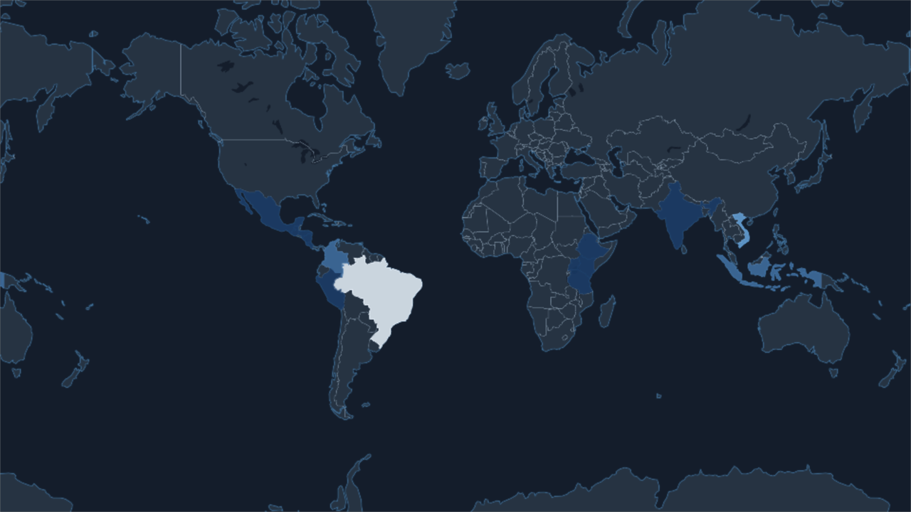
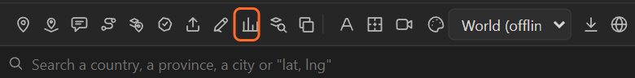
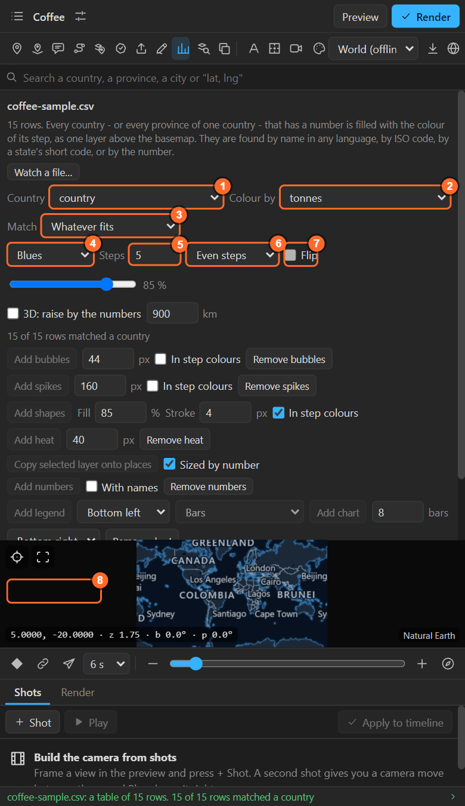
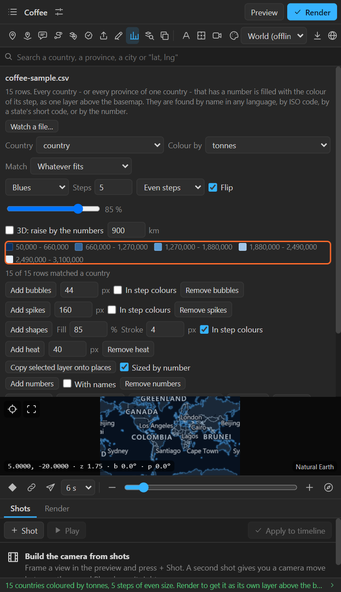
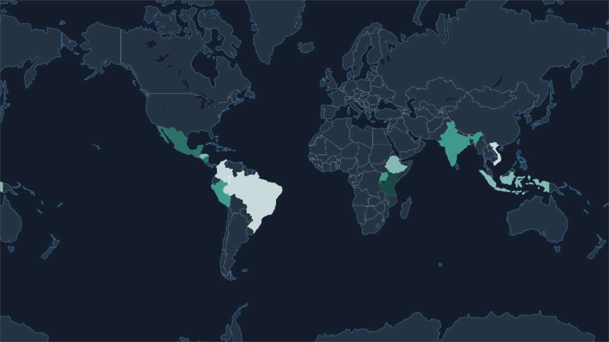
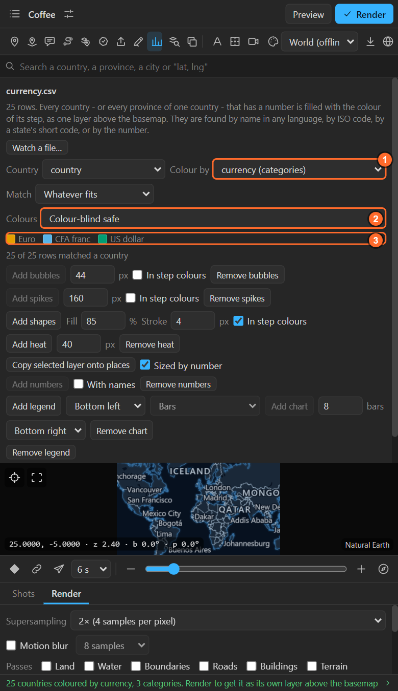
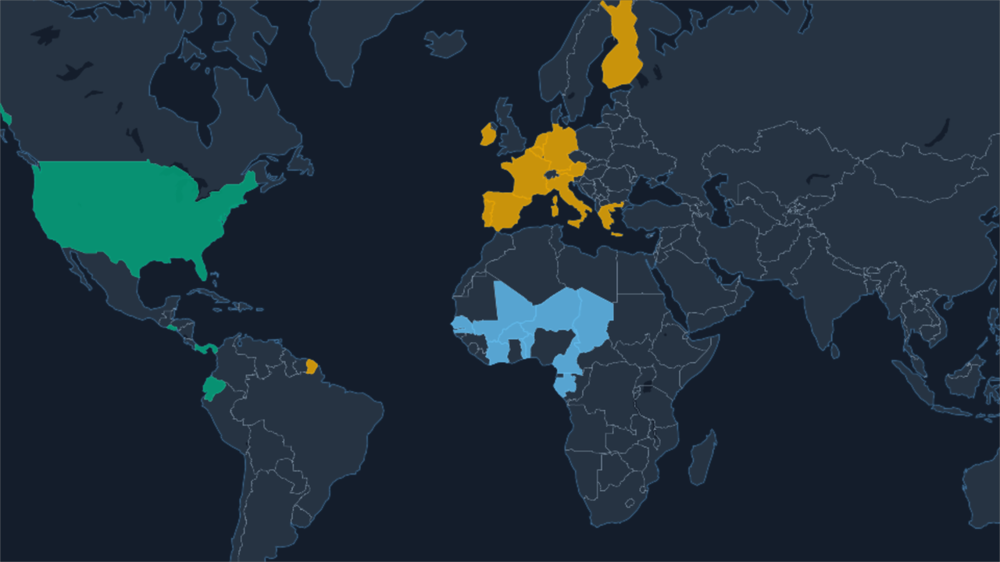

# 28. Colouring places by a number

**Numbers** turns a table into a map: every country, province or district the table names is filled
with the colour of its value. From the same table you can then add bubbles, spikes, heat, labels,
a legend and a chart (the next chapters).



> The tables in these chapters are sample values made up for the tutorial, not statistics.

## Your table

A CSV (or TSV) with **a column that names the places** and **a column of numbers**:

```
country,tonnes
Brazil,3100000
Vietnam,1800000
Colombia,750000
```

Names can be in any of 26 languages, an ISO code (`BR`, `BRA`), a state's short code (`CA`,
`US-CA`) or the map's own code. A header row is expected.

## Open it

1. Select a map.
2. Click **Numbers** in the tool row (the bar chart) and pick the CSV. (A CSV opened with **Import**
   that has names and numbers and no coordinates opens here too.)

   

3. The Numbers sheet opens with the columns guessed:

   

| # | Control | What it does |
|---|---|---|
| 1 | **Country** | The column that names the places |
| 2 | **Colour by** | The column to colour by: numbers for amounts, or a column of a few kinds for categories |
| 3 | **Match** | **Whatever fits** (the panel decides from the table), **Countries**, **Provinces** or **Districts (downloaded)**, and for the last two the country |
| 4 | **Ramp** | The colours the steps run through: Blues, Warm, Teal, Purple, Red to blue |
| 5 | **Steps** | How many steps, 3 to 9 |
| 6 | **Even steps / Equal counts** | How the numbers are cut into steps (below) |
| 7 | **Flip** | Which end of the ramp means more. A dark map starts flipped, because a pale country reads as more on it |
| 8 | **Colour the map** | Colours the map. Afterwards it reads **Colour again**: press it after changing the columns or the match |

Under them: the fill's **opacity**, and **3D: raise by the numbers** ([chapter 34](34-prism.md)).

## Colour

**Colour the map** fills every matched place as **one layer above the basemap**, each in the colour of
its step. The sheet shows the legend's steps, and a line says how many rows matched:



**Rows that match nothing are listed, never coloured on a guess.** Fix their names in the table (or
use the ISO code) and open it again.

Render to see the fill in the comp ([chapter 36](36-render.md)). Change the ramp, the steps or the
opacity and the layer follows.

## Even steps or equal counts

| | Even steps | Equal counts (quantiles) |
|---|---|---|
| Cuts | The range into equal widths | So every step holds about as many places |
| Honest about | Distances: twice the colour is twice the number | Order: who is above whom |
| Use when | Numbers are spread evenly | A few large numbers would flatten the rest into one colour |



## Provinces and districts

With **Match: Provinces** and a country, the rows name that country's provinces, states or regions
(in any language, or a short code like `CA`). **Districts** need the country's district set: if it
is not on the computer, the sheet offers the download right there ([chapter 14](14-highlights.md)).

## Categories

**Colour by** also lists columns of a few kinds, marked *(categories)*: a party, a region, yes or no.
Each kind gets its own colour and a row in the legend; **Colours** chooses the palette:
**Colour-blind safe**, **Bold** or **Soft**. The most common kind comes first.





## Remove

**Remove** at the bottom of the sheet takes the numbers off the map. Each extra (bubbles, legend …)
has its own **Remove** too.

## Related

- [29. Bubbles, spikes, heat and shapes](29-bubbles-spikes-heat-shapes.md)
- [31. Legend and chart](31-legend-chart.md)
- [33. Years](33-years.md) · [34. Prism maps](34-prism.md) · [35. Live numbers](35-live-numbers.md)
