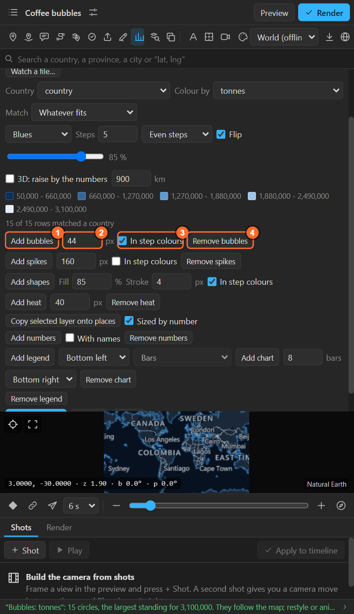
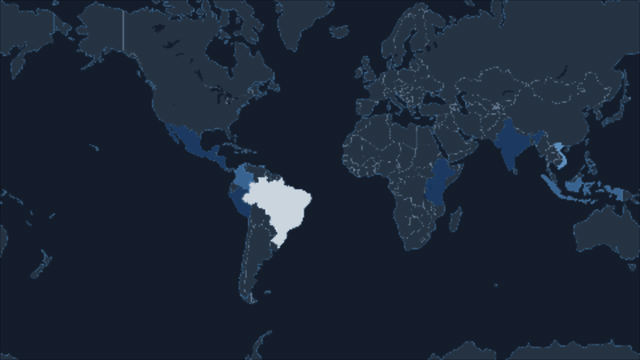
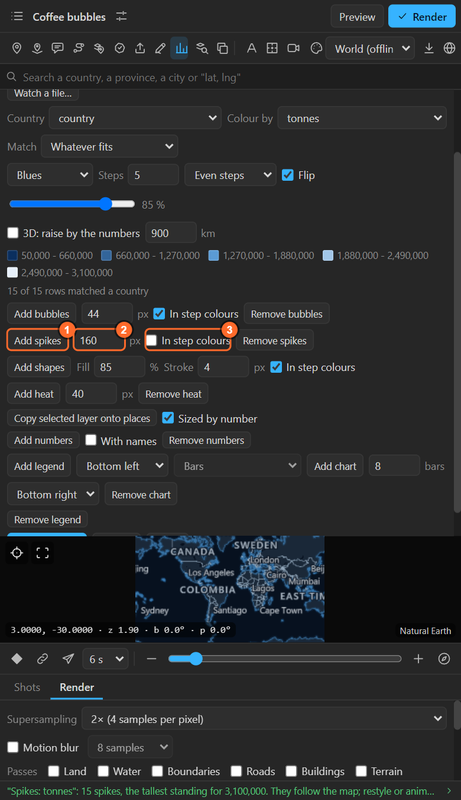
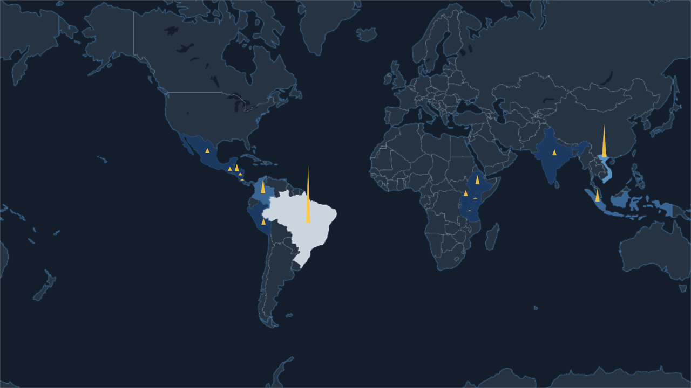
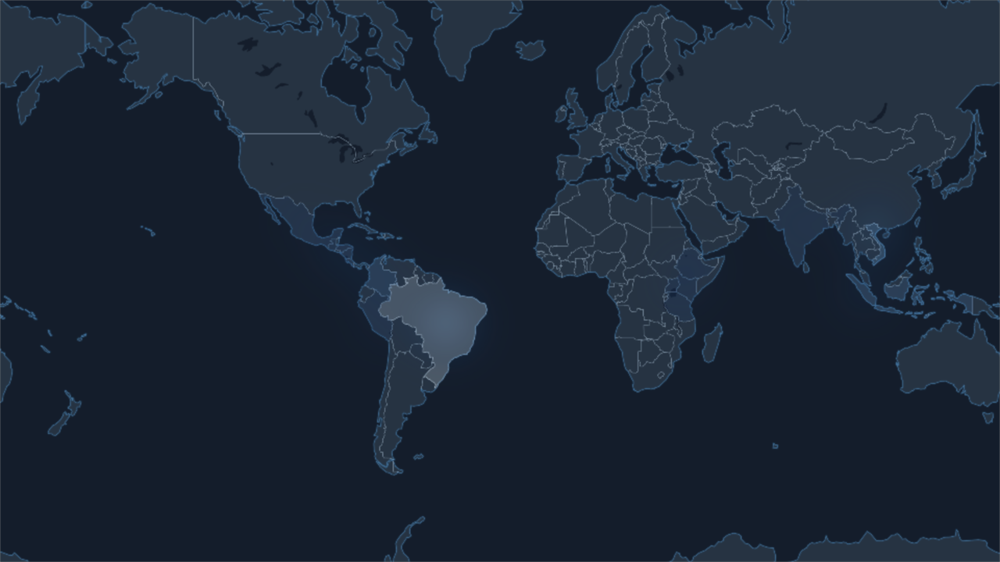
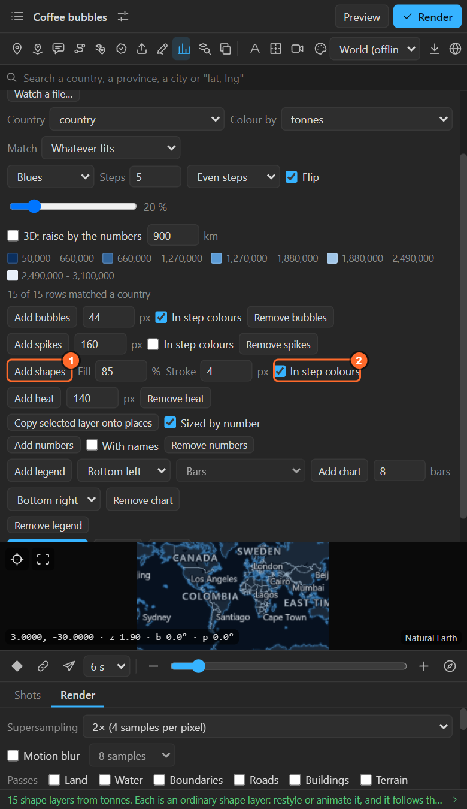
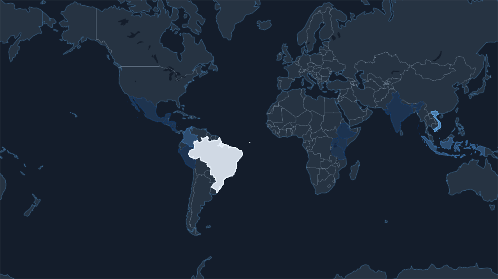

# 29. Bubbles, spikes, heat and shapes

Four ways to show the numbers of a table on top of (or instead of) the colour fill. All four come
from the Numbers sheet once a table is open ([chapter 28](28-numbers-colour.md)), and each has its
own **Remove**.

## Bubbles

**Circles whose area stands for the value**, as one shape layer with **a group per place**.

| Control | What it does |
|---|---|
| **Add bubbles** | Puts a circle on every place with a number |
| **Size** | The largest circle, in pixels at 1080 lines |
| **In step colours** | Each circle in its step's colour, instead of the map's layer colour |

Because each circle is its own group with its own transform, you can pop them on one by one. In this
example each group's Scale is keyed from 0 to 100 % a little after the last:

The **area**, not the diameter, follows the value: a place with four times the number has a circle
twice as wide. That is how readers judge circles.

## Spikes

**A triangle per place rising straight up the frame**, its height the value, read straight.

| Control | What it does |
|---|---|
| **Add spikes** | A spike on every place |
| **Height** | The tallest spike, in pixels at 1080 lines |
| **In step colours** | Each spike in its step's colour |

Spikes read best on a flat map and from a distance. Each spike has its own transform to animate,
like the bubbles. For heights that stand on a tilted map, use a prism map ([chapter 34](34-prism.md)).

## Heat

**Every place warms the map around it by its number**; the renderer draws the warmth in the ramp's
colours as a layer of its own that follows the camera.

| Control | What it does |
|---|---|
| **Add heat** | Adds the heat layer (render to see it) |
| **Radius** | How far each place's warmth reaches, in pixels at 1080 lines |

Heat reads best when the numbers are of a similar size, or many places are close together; a single
very large value takes all the warmth. Heat also works **without numbers**: with the places of the
last imported file (a CSV of locations, a GPX's waypoints), every place counts the same, so the map
shows where they cluster.

## Shapes

**Every place that has a number as its own editable shape layer**: real paths that follow the map,
with the fill strength and stroke width from the value and the colour from its step.

| Control | What it does |
|---|---|
| **Add shapes** | One shape layer per place, up to forty, largest first |
| **Fill** | How strongly the largest value is filled (the smallest gets a quarter of it) |
| **Stroke** | The stroke of the largest value, in pixels at 1080 lines |
| **In step colours** | Each shape in its step's colour; off, all in the map's layer colour |

Use shapes when one country has to do something of its own: glow, pulse, lift out, draw on with
Trim Paths.

## Which one when

| Show | Use |
|---|---|
| A rate or a share (per person, per cent) | The colour fill |
| An amount (tonnes, people, dollars) | Bubbles, or spikes |
| Where things cluster | Heat |
| One or a few places animated by hand | Shapes |

Combine them: a fill for a rate with bubbles for the amount is a classic.

## Related

- [28. Colouring places by a number](28-numbers-colour.md)
- [30. Numbers as text, and copies of your own layer](30-values-and-copies.md)
- [31. Legend and chart](31-legend-chart.md): the legend shows the bubble sizes and spike heights too.
