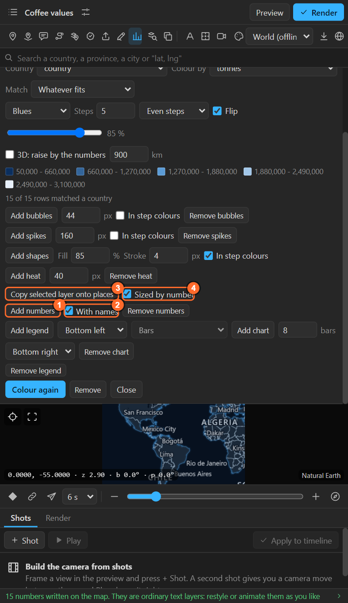
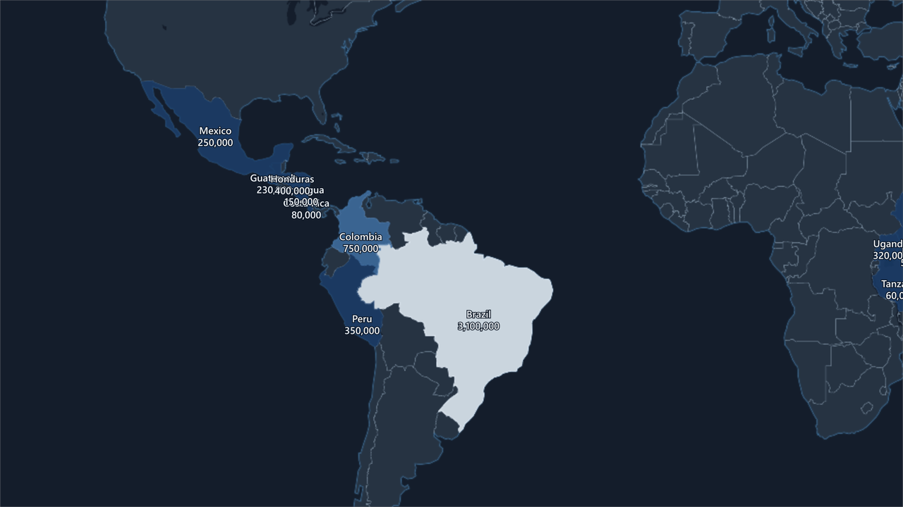
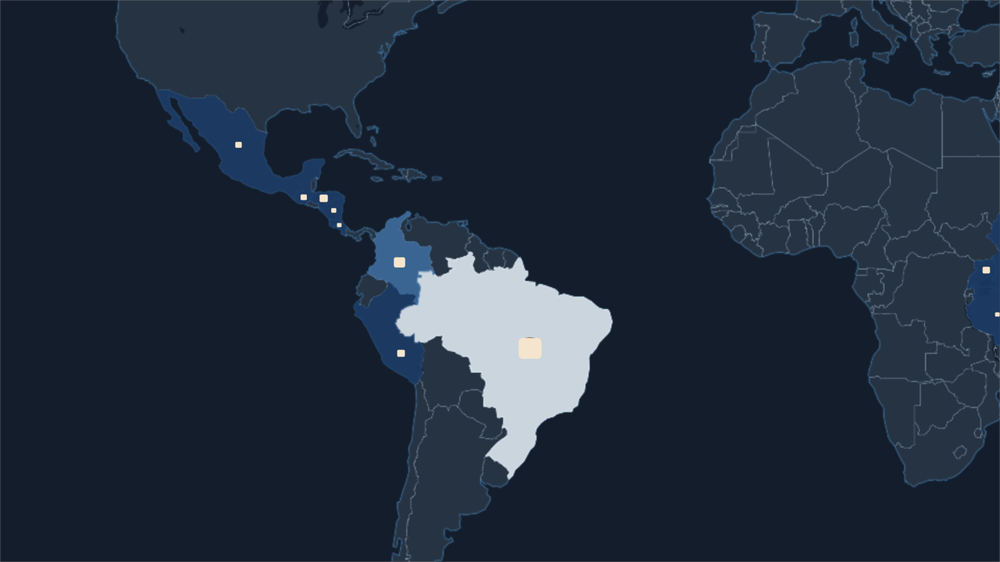

# 30. Numbers as text, and copies of your own layer on every place

Two more things the Numbers sheet puts on the map: the **values as text layers**, and **your own
artwork copied onto every place**.

## Add numbers

**Add numbers** writes every value onto the map as a **text layer** under its place's circle (or on
the place when there are no bubbles). **With names** puts the place's name above its number.

They are ordinary text layers that follow the map: restyle them, animate them with text animators,
count them up with an expression of your own. **Remove** takes them off.

Unlike Auto labels, the numbers do not step out of each other's way: small neighbours (Central
America above) overlap. Zoom in, delete the ones you do not need, or move a layer's anchor point to
nudge it.

## Copy selected layer onto places

Put **your own** artwork (an icon, a flag, a photo, a precomp) on every place of the table:

1. Make the layer in the map's scene comp and **select** it.
2. In the Numbers sheet, switch **Sized by number** on or off.
3. **Copy selected layer onto places**.

Every place gets a copy, **named after the place** and wired to it like an attached layer
([chapter 13](13-attach.md)): it stays on the place while the camera moves. **The original is left
as it is**; hide or delete it.

| Sized by number | Result |
|---|---|
| Off | Every copy has the layer's own size |
| On | Each copy's **area** stands for its number; the largest keeps the layer's own size, and none shrinks below a fifth |

It also works **without numbers**: with the places of the last imported file, every place gets a copy
(an icon per city, a photo per stop).

## Recipes

- **A different picture on every country** (its flag, its leader): copies are all the same layer, so
  use **Auto labels** with your own design and a `{flag}` picture layer instead
  ([chapter 20](20-auto-labels.md)), which takes a picture per place from a folder.
- **Your logo on every store**: import a CSV of store locations, select your logo, **Copy selected
  layer onto places** with Sized by number off.
- **Pop them on**: select the copies in the timeline, keyframe Scale from 0, then use
  **Animation > Keyframe Assistant > Sequence Layers** or offset them by hand.

## Related

- [13. Attaching your own layers](13-attach.md)
- [29. Bubbles, spikes, heat and shapes](29-bubbles-spikes-heat-shapes.md)
