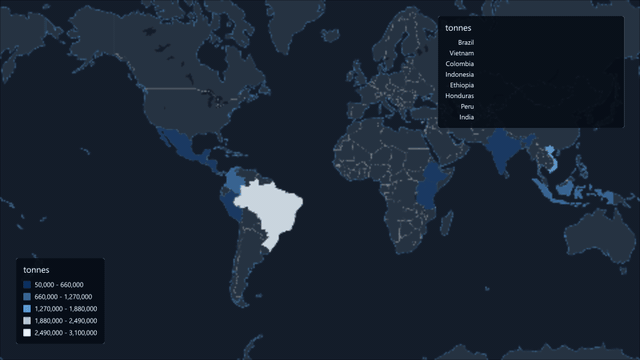
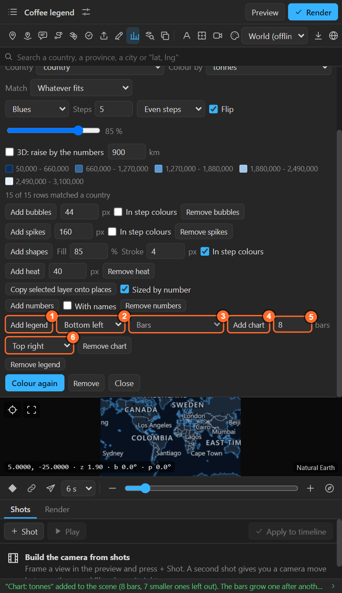
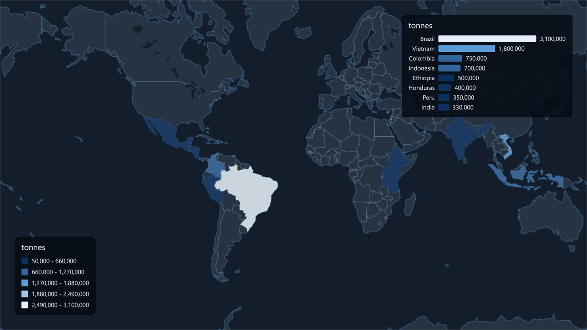

# 31. Legend and chart

A data map needs a key. The Numbers sheet builds a **legend** and a **chart** as precomps you can
move, restyle and animate like any layer.

## Where they are

## Legend

| Control | What it does |
|---|---|
| 1. **Add legend** | Adds the legend to the scene as a precomp: a background, the title and one row per step |
| 2. **Corner** | Which corner of the frame it starts in |
| **Remove** | Takes it off |

The legend shows everything the map holds from the table: the **colour steps** (or the categories),
the **bubble sizes**, the **spike heights** and the heat's **three steps**. Add the legend after the
bubbles or spikes so it includes them; add it again to bring it up to date.

## Chart

| Control | What it does |
|---|---|
| 3. **Kind** | **Bars**; with a table of years, also **Lines over the years** or **Areas over the years** ([chapter 33](33-years.md)) |
| 4. **Add chart** | Adds the chart as a precomp |
| 5. **Bars** | How many bars, longest first |
| 6. **Corner** | Where it starts |
| **Remove** | Takes it off |

**Bars**: a bar per place, longest first, **each growing in turn from the current time**, with the
name and the number beside it in that place's colour.

## Make them yours

Both are ordinary precomps made by the panel:

- **Move and scale** the precomp layer anywhere; the corner only sets where it starts.
- **Open the precomp** to change fonts, colours, the background box, the spacing.
- **Retime** the bars by moving their keys inside the chart precomp.
- **Fade** the whole thing in with opacity keys on the precomp layer.

Adding again replaces the panel's precomp, so make your design changes last, or duplicate the
precomp first.

## Related

- [28. Colouring places by a number](28-numbers-colour.md)
- [33. Years](33-years.md)
