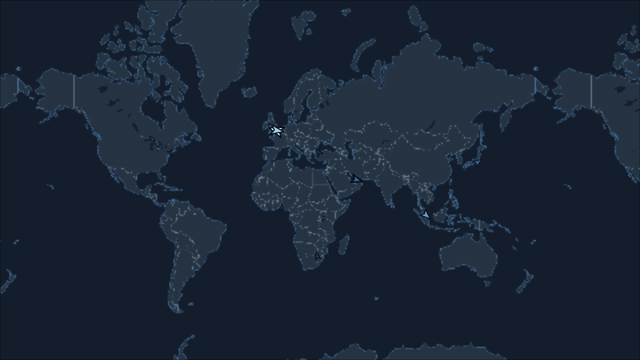
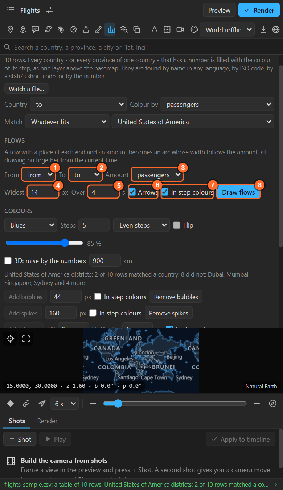

# 32. Flows between places

A table with **a place at each end of a row and an amount** (origin, destination, passengers;
exporter, importer, tonnes) becomes a **flow map**: one great-circle arc per row, its width the
amount, all drawing on together.



## Your table

```
from,to,passengers
London,New York,4000
London,Dubai,3200
Dubai,Mumbai,3000
```

The ends can be cities, countries or any place the search knows, in any of 26 languages.

## Draw the flows

1. Open the table with **Numbers** ([chapter 28](28-numbers-colour.md)). When it has two columns of
   places, the sheet shows a **Flows** section:

   

| # | Control | What it does |
|---|---|---|
| 1 | **From** | The column that says where a flow starts |
| 2 | **To** | The column that says where it ends |
| 3 | **Amount** | The amount, which sets the width of the arc |
| 4 | **Widest** | The widest arc, in pixels at 1080 lines |
| 5 | **Over** | How long the arcs take to draw on |
| 6 | **Arrows** | An arrow rides every arc |
| 7 | **In step colours** | Each arc in the colour of its step of the ramp, instead of the one layer colour |
| 8 | **Draw flows** | Draws every row as an arc, all from the current time |

2. Put the time indicator where they should start and press **Draw flows**.

Rows without a place at both ends, or with no amount above zero, are left out, and the log says so.

## What it makes

Every arc is a route layer ([chapter 12](12-routes.md)): a great-circle line that follows the map,
with Trim Paths keyed to draw it on, and with **Arrows** a Traveller riding it. So everything you can
do to a route works on a flow: retime it, recolour it, stagger the arcs by hand.

## Tips

- **Too many arcs**: filter the table to the largest rows first; a flow map reads best with 10 to 30.
- **Arcs over the globe**: switch **Globe** on for long-distance flows; the arcs then curve over the
  planet ([chapter 5](05-map-settings.md)).
- **A legend for widths**: write the scale in your own text layer; the legend shows the colour steps.

## Related

- [12. Routes](12-routes.md)
- [15. The feature browser: Connect](15-feature-browser.md), for lines without amounts.
