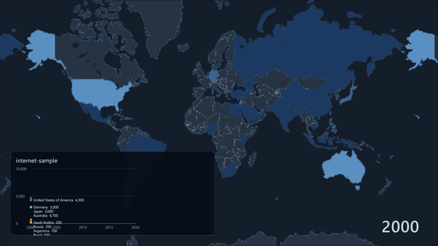
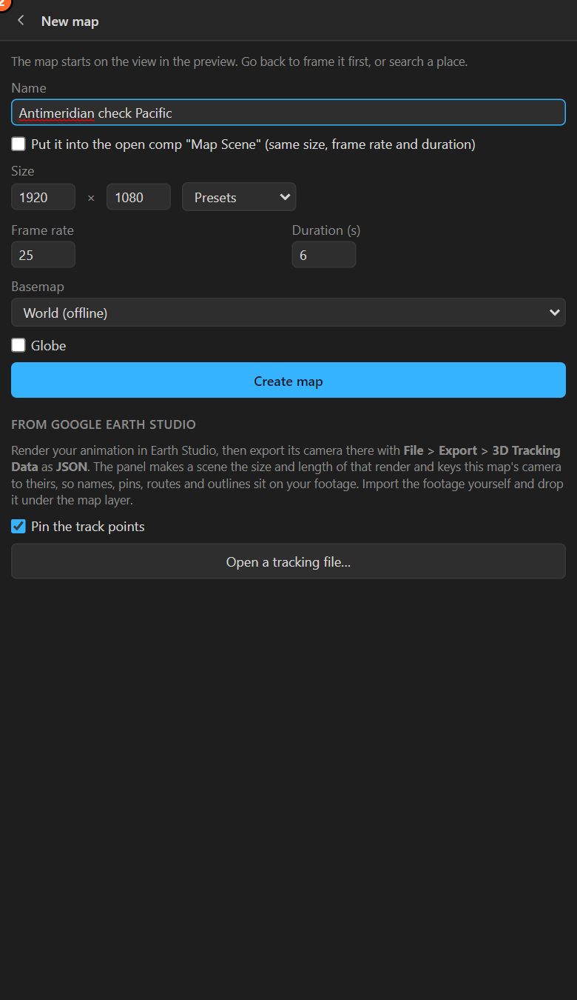

# 33. Years: a map that moves through time

A table with **years** makes the map move: the colours change from the first year to the last over
the comp, the year counts on screen, and a line chart grows with it.



## Your table

Either shape works:

**Wide**, a column per year:

```
country,2000,2005,2010,2015,2020
Germany,3000,6900,8200,8800,9000
Brazil,300,2100,4000,5900,8100
```

**Long**, a row per place per year (as Our World in Data publishes):

```
country,year,value
Brazil,2000,300
Brazil,2005,2100
```

## Animate over the years

1. Open the table with **Numbers**. The sheet sees the years and shows **Animate over the years**
   with the range it found:

   

2. Tick **Animate over the years** and press **Colour the map**.

The map layer gets a **Data Time** slider that runs from the first year at the start of the comp to
the last at the end. The renderer reads it every frame and blends the colours between the years.
**Retime it like any keyframes**: hold on a year, speed through a decade, go backwards.

## The year on screen

**Add the year** puts a text layer with the year the map shows, counting with the Data Time slider.
Move it, restyle it, give it a box.

## Lines and areas over the years

In the chart controls ([chapter 31](31-legend-chart.md)), a table with years offers **Lines over the
years** and **Areas over the years**: a line (or area) per place, growing with the map and following
the same Data Time slider.

## With the other extras

Everything that reads the numbers follows the years: the fill, **3D: raise by the numbers** (prisms
grow and shrink, [chapter 34](34-prism.md)), and the legend's steps, which are cut over all the years
so a colour means the same thing in 2000 and in 2020.

## Tips

- **Small numbers are fine**: before 1.0.2, a wide table of small numbers (percentages) could be
  read as coordinates and open as places. Update to 1.0.2 or later if that happens.
- **The comp is the timeline of the data**: a 20-second comp for 20 years is a year a second. Change
  the comp's length, or the slider's keys.
- **Categories cannot animate**: Animate over the years works for numbers only.

## Related

- [28. Colouring places by a number](28-numbers-colour.md)
- [31. Legend and chart](31-legend-chart.md)
- [34. Prism maps](34-prism.md)
