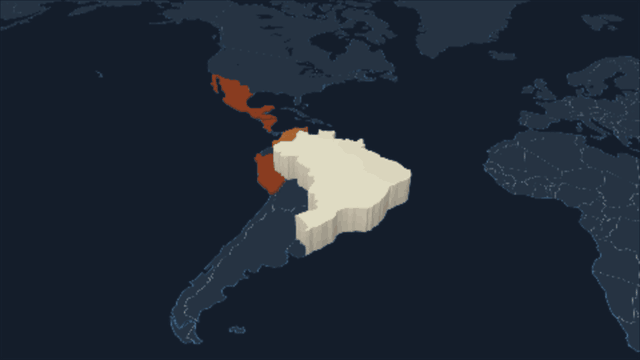
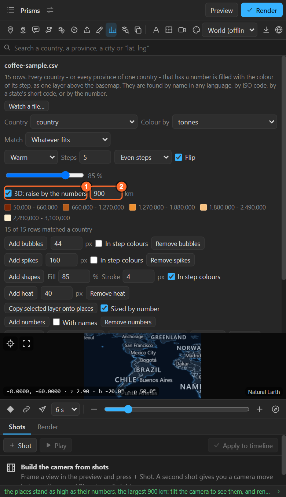

# 34. Prism maps

**3D: raise by the numbers** turns a coloured map into a **prism map**: every place stands as high as
its number, so under a tilted camera a height reads straight as an amount.

## Make one

1. Colour the map by a column of numbers ([chapter 28](28-numbers-colour.md)).
2. Tick **3D: raise by the numbers** in the Numbers sheet.

   

3. Set the height of the **largest** number, in **km**. The others scale from it, straight (a place
   with half the number is half as high). The default is 900 km for countries, 250 for provinces
   and 40 for districts.
4. **Tilt the camera**: 40 to 60 degrees works well. Then render.

The prisms are drawn by the renderer, so pins and names still sit on the ground among them. With
years, the largest height is taken over every year, so heights compare across the years.

## Tips

- **The tallest runs out of the top of the frame**: lower the km, or tilt less.
- **Small places vanish behind big ones**: turn the camera (Bearing) so the tall ones are at the back,
  or orbit during a hold ([chapter 9](09-shots.md)).
- **With years**: the prisms grow and shrink with the Data Time slider ([chapter 33](33-years.md)).
- **On the globe**: prisms stand out of the planet too.
- **Not for categories**: heights need numbers.

## Related

- [28. Colouring places by a number](28-numbers-colour.md)
- [25. Terrain](25-terrain.md): real heights, of the ground.
