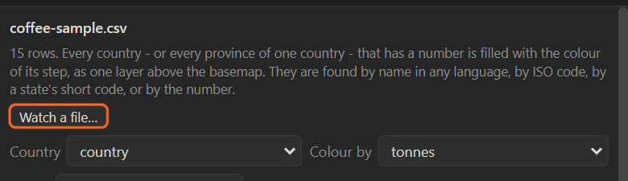

# 35. Live numbers from a watched file

**Watch a file…** reads a table from a file on disk and **keeps reading it**. Edit and save that file
anywhere (in a spreadsheet, from a script, as an export from another program) and the map is
coloured again, with no import.

## Watch

1. Open the Numbers sheet (with any table, or the one you want to watch).
2. **Watch a file…** and pick the CSV.
3. The sheet says **Watching *file name*** and counts how many times it has read it again.

From then on, every time the file is saved:

- the table is read again;
- the columns you picked are kept, as long as the headings still fit;
- the map is coloured again, and the extras (bubbles, spikes, values …) follow.

If a save makes the file unreadable (half-written, a heading gone), the sheet says so in orange and
keeps the last good numbers.

**Stop watching** leaves everything on the map as it is.

## Uses

- **Election night**: a script writes the latest results to the CSV every few minutes; render the
  map whenever you need a new graphic.
- **A template for a show**: keep the CSV in a shared folder; the producer edits it, the map follows.
- **Fine-tuning the data**: keep the CSV open in a spreadsheet next to After Effects and watch the map
  change as you correct it.

## Related

- [28. Colouring places by a number](28-numbers-colour.md)
- [38. Driving the panel from a script](38-scripting.md)
