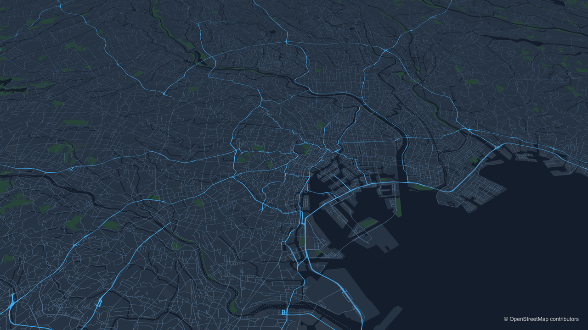
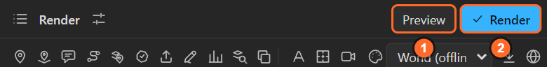
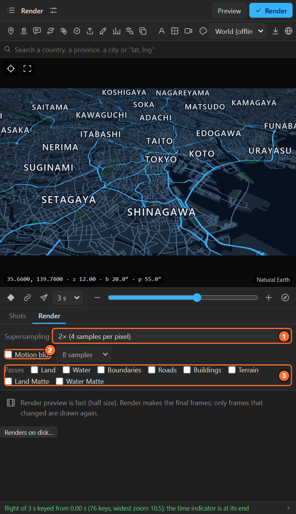
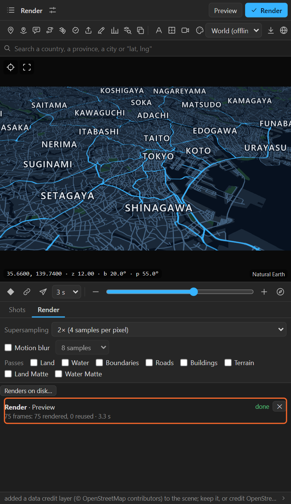
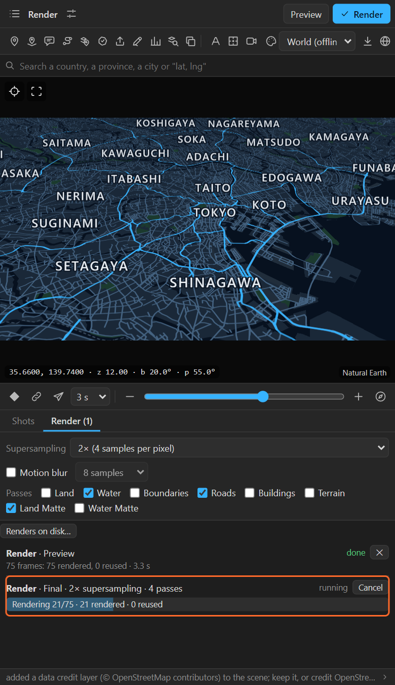
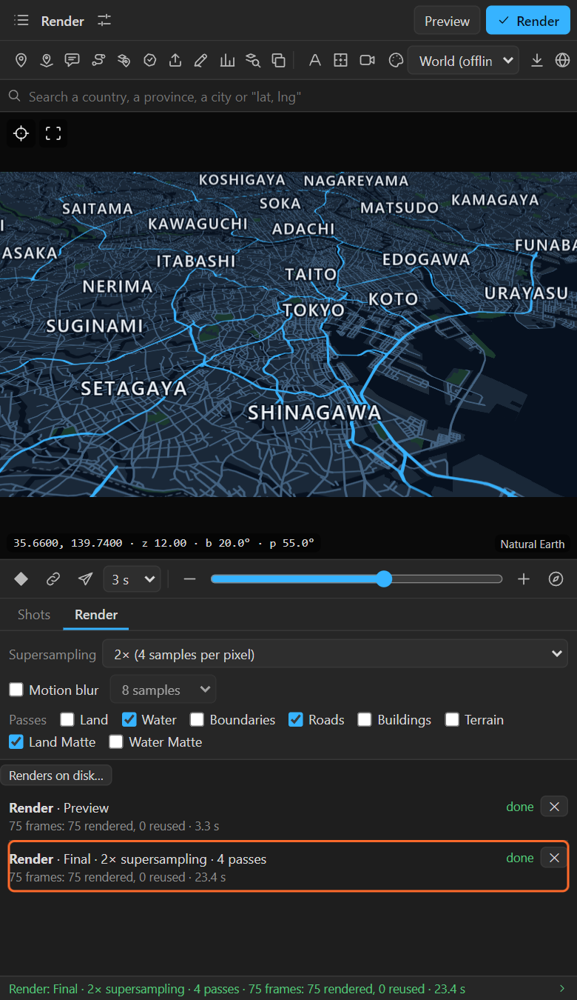
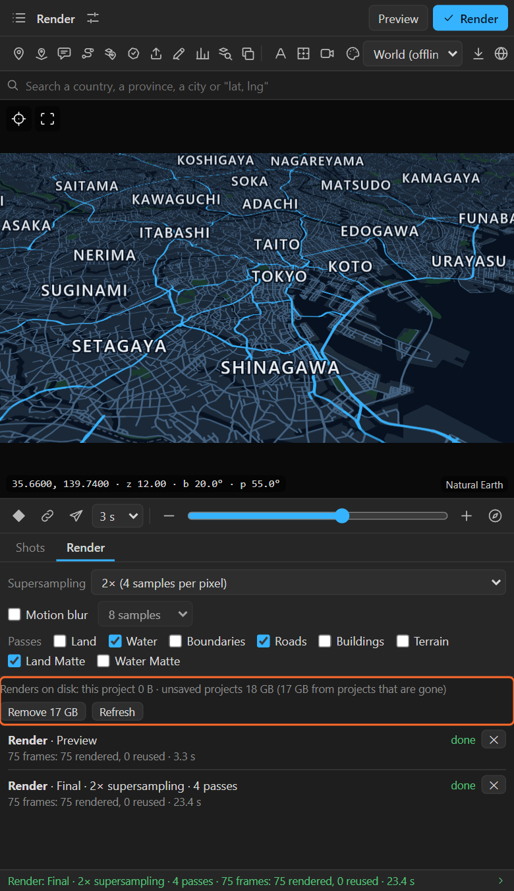

# 36. Preview, Render and the Render tab

Everything above the basemap is a live After Effects layer. The basemap itself (land, water, roads,
borders, buildings, terrain, highlights, fills) is drawn by the panel, frame by frame, and imported
into the map comp as image sequences. Two buttons do it; the Render tab sets how.

## Preview and Render

| | 1. **Preview** | 2. **Render** |
|---|---|---|
| Size | Half the comp's size | Full size |
| Supersampling | Off | As set in the Render tab |
| Settings | Fixed, for speed | The Render tab's supersampling, motion blur and passes |
| Use it for | Timing, framing, checking moves | The frames you deliver |

A preview becomes an After Effects **proxy** once a final render exists: After Effects shows the fast
preview frames while you work and the final frames when you render the comp.

**Only frames that changed are drawn again.** Change a keyframe and only the frames it moved are
rendered; change the look and every frame is. The job line says how many frames were rendered and how
many reused.

## The Render tab

### Supersampling

**Off**, **2×** (4 samples a pixel, the default), **3×** (9) or **4×** (16). Each pixel is averaged
from several samples on the GPU: smoother lines and text edges, at the cost of time. 2× is right for
most work; 3× or 4× for thin lines in a slow move.

### Motion blur

On, the basemap is drawn from **4, 8, 16 or 32 sub-frame samples**. The **shutter angle and phase
come from the scene comp**, so the basemap blurs exactly like the layers above it. Switch on the comp's
motion blur in After Effects for those layers too.

### Passes

The base render holds everything. Ticked passes come **as separate layers in the map comp, above the
base, switched off**, for grading and compositing:

| Pass | Holds |
|---|---|
| **Land** | The land alone |
| **Water** | Seas, lakes and rivers |
| **Boundaries** | Country and province borders |
| **Roads** | Roads and railways |
| **Buildings** | Buildings (from a downloaded area) |
| **Terrain** | The shaded slopes alone, when the map has an elevation pack |
| **Land Matte**, **Water Matte** | White where land or water is, with alpha: track mattes for your own effects |

Ground passes are **held out by 3D buildings**, so a glow on the roads never shows through a building.
Highlights and the numbers fill always come as their own layers, whatever is ticked.

Ideas: a glow on **Roads** only; a colour grade on **Water**; your own texture on the land through
**Land Matte**; a different border colour per shot with **Boundaries**.

## The job list

Every render is a job in the list:

| State | Buttons |
|---|---|
| queued, running | **Cancel** |
| cancelled, failed, interrupted | **Resume**: frames already rendered are reused |
| done | **✕** removes it from the list (the frames stay) |

A job from another project waits in the list, with a plain sentence, until its project is open.
Renders keep going while you work in After Effects.

## Renders on disk

**Renders on disk…** counts what the renders take:

- A **saved** project's renders live in a **LazyMapLayers Renders** folder next to the project file.
  Delete it when the project is finished.
- An **unsaved** project's renders live in the data folder. **Remove …** deletes the ones of projects
  that are no longer open, and only those.
- A map you rendered before saving its project keeps its frames in the data folder, where its footage
  points, for as long as that project exists.

## Rendering in After Effects

After **Render** in the panel, render the scene comp in After Effects as usual (Render Queue or
Media Encoder). The basemap is now ordinary footage.

## Related

- [3. How the panel thinks](03-how-it-thinks.md)
- [22. The looks](22-looks.md)
- [39. Data, downloads, credits and working offline](39-data-offline.md)
