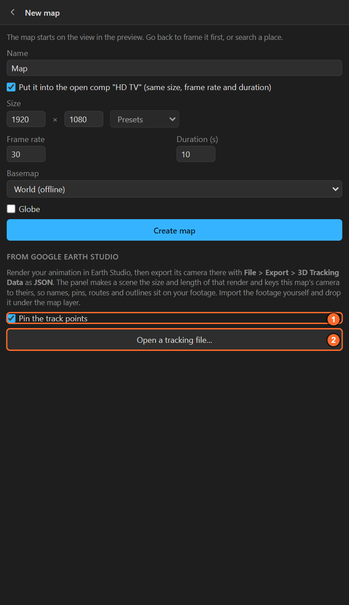

# 37. A camera from Google Earth Studio

**Google Earth Studio** (earth.google.com/studio, free with a Google account) renders photoreal Google
Earth animations in the browser. LazyMapLayers can take the **camera** of such a render, so the
panel's names, pins, routes and outlines sit on that footage.

## Step by step

1. Animate and render your shot in Earth Studio as usual.
2. In Earth Studio: **File > Export > 3D Tracking Data…**, choose **JSON**, save it.
3. In the panel: **Maps** > **New map**, scroll down to *From Google Earth Studio*.
4. **Pin the track points**: on, a pin on every track point you set in Earth Studio, with its name.
5. **Open a tracking file…** and pick the JSON.

The panel makes a scene **the size, length and frame rate of your render** and keys the map's camera
to Earth Studio's, **frame by frame**.

6. Import your rendered Earth Studio frames in After Effects and drop them **under the map layer** in
   that scene. Switch the map layer off, or keep it for its lines and names over the footage.
7. Add names ([chapter 20](20-auto-labels.md)), pins, routes, highlights' **Shape** layers: they sit on
   the footage.

## How well it lines up

| Shot | Line-up |
|---|---|
| Flat or gently tilted | Close |
| Steep and low over hills or tall buildings | Less: Earth Studio renders real 3D, the panel a map |

The panel says so when the camera tilts past 25 degrees. Elevation helps: give the map an elevation
pack ([chapter 25](25-terrain.md)) so pins and routes sit on the ground's real height.

## Licensing

Earth Studio footage has Google's own attribution and terms; they are yours to follow. LazyMapLayers
only reads the camera file.

## Related

- [4. The Maps screen: New map](04-maps-screen.md)
- [8. The quick camera: 3D camera](08-quick-camera.md)
