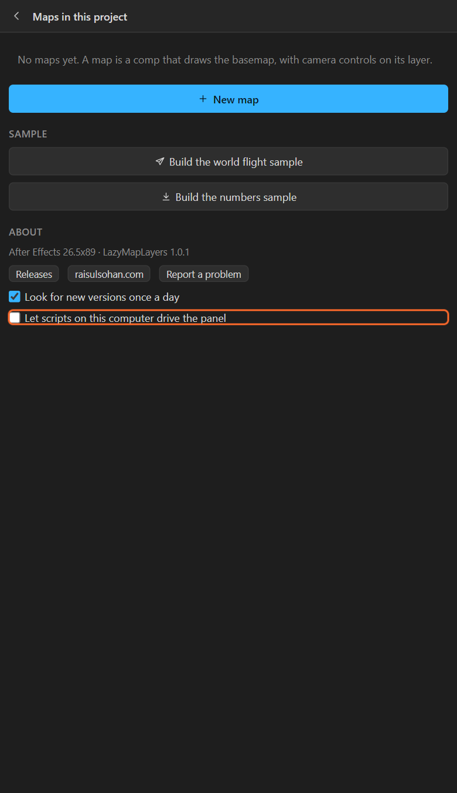

# 38. Driving the panel from a script

Another program on the same computer (your own ExtendScript, a Node script, a Python job, anything
that can write a file) can ask the panel to make a map, move and key the camera, add pins, names,
highlights, a scale bar, an inset map, colour the map from a CSV, and render.



## Turn it on

**Maps** > **About** > **Let scripts on this computer drive the panel**. It is **off** until you turn
it on, and only the listed calls can ever be asked for: nothing in a request is run as code.

## How it works

1. Your program writes a request, `<name>.json`, into the **api** folder:
   - Windows: `%APPDATA%\LazyMapLayers\api`
   - macOS: `~/Library/Application Support/LazyMapLayers/api`
2. The panel picks it up, does it, removes it and writes `<name>.result.json` next to it, usually
   within a second.

```json
{ "id": "job-1", "call": "addPin", "args": { "lat": 23.8106, "lng": 90.4125, "name": "Dhaka" } }
```

```json
{ "id": "job-1", "ok": true, "result": { "log": ["pin added at 23.81, 90.41"] } }
```

The panel does one thing at a time; a call that arrives while it is busy is refused with *the panel
is busy*, to try again.

## The calls, in short

| Call | Does |
|---|---|
| `version`, `maps`, `select`, `view` | Ask about the panel and the maps; choose one |
| `newMap`, `setView` | Make a map; move or key the camera |
| `addPin`, `labels`, `removeLabels` | Pins and names |
| `highlight`, `clearHighlights` | Countries by their three-letter codes |
| `look` | One of the twelve looks |
| `csv`, `colour` | Read (and keep reading) a table; colour the map |
| `scaleBar`, `northArrow`, `inset` | Map furniture |
| `render` | `preview` or `final`, in the background |

The full list, every argument, and an ExtendScript helper you can paste into your own script are in
[SCRIPTING.md](../SCRIPTING.md).

## Example: a map per country, overnight

A Node script loops over a list of countries: `newMap`, `setView` on the country, `highlight` it,
`labels`, `render final`, waits for the result, and moves to the next. In the morning, the project
holds a finished map per country.

## Related

- [35. Live numbers from a watched file](35-live-numbers.md)
- [SCRIPTING.md](../SCRIPTING.md)
