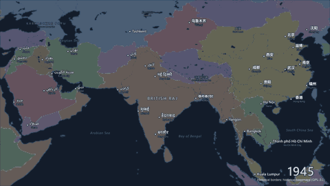
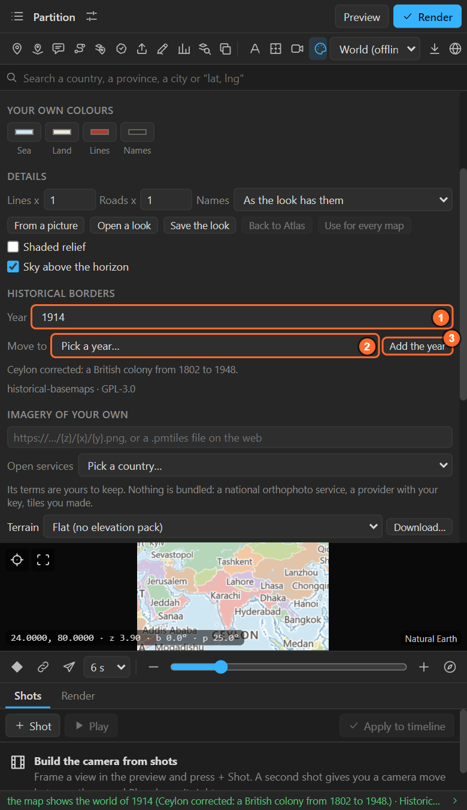
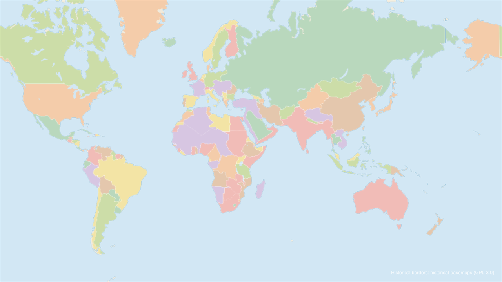
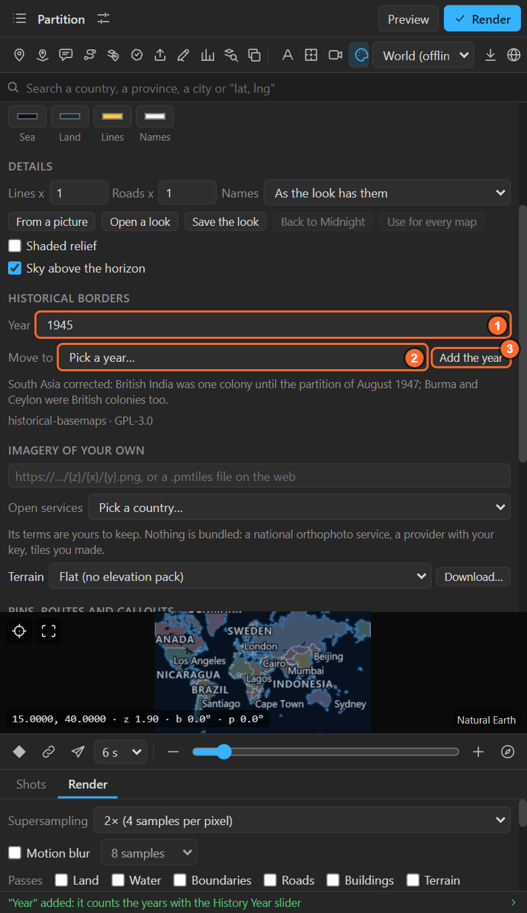
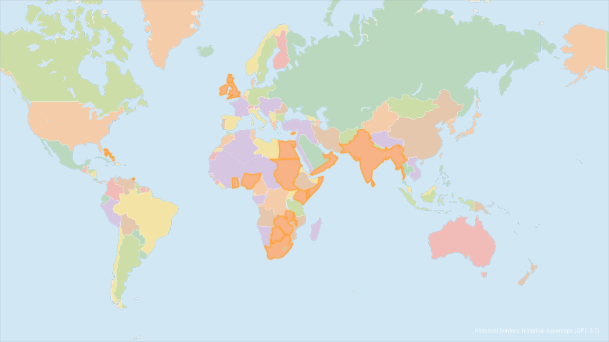
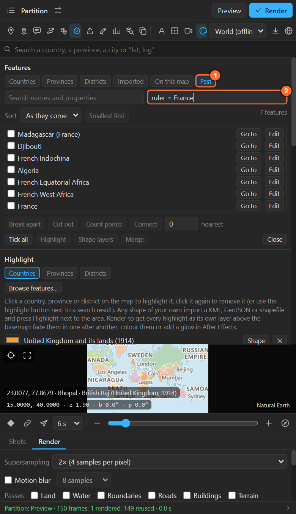

# Historical borders: the world in any year

**Historical borders** puts the world as it was on the map: the states, empires and colonies of
one of 56 moments from 123,000 BC to 2010. Pick a year and today's countries give way to that
year's, each colony in its ruling power's colour, with the borders between them and their names.
Key the year and the map moves through history in one shot, fading only what changed hands.

New in LazyMapLayers 1.1; the colours as in 1.1.2.

## Download the pack once

The borders are a separate download, so the main install stays small.

1. Open **Look** (the palette in the tool row) and scroll to **Historical borders**.
2. **Download** (13.9 MB, once). The pack goes into your LazyMapLayers data folder and works offline
   from then on.

When a newer build of the pack is out (with corrections), the section offers **A newer historical
pack** with an **Update** button.

## Pick a year

**Year** lists **Today** and the 56 moments of the pack:

| Era | Years |
|---|---|
| Prehistory | 123000 BC, 10000 BC, 8000 BC, 5000 BC, 4000 BC, 3000 BC, 2000 BC, 1500 BC, 1000 BC |
| Antiquity | 700 BC, 500 BC, 400 BC, 323 BC, 300 BC, 200 BC, 100 BC, 1 BC, AD 100 to AD 900 by the century |
| Middle Ages and after | 1000, 1100, 1200, 1279, 1300, 1400, 1492, 1500, 1530, 1600, 1650, 1700, 1715, 1783 |
| Modern | 1800, 1815, 1878, 1880, 1900, 1914, 1920, 1930, 1938, 1945, 1947, 1960, 1971, 1994, 2000, 2010 |

Pick one and the preview shows that world. Render to see it in the comp.

What changes on the map, and what stays:

| Changes | Stays |
|---|---|
| Today's country colours, borders, province lines and country names give way to that year's states, borders and names | Coasts, lakes, rivers, relief, terrain, imagery and cities |
| Every colony takes its **ruling power's colour**, and two neighbours never share one. The largest powers of each year (six on Atlas, eight on a ten-colour look) always get colours of their own, chosen over all the years at once, so an empire keeps **the same colour in every year** | Your look: the colours are mixed from it, or a look's own country colours are used (Atlas) |
| Borders between powers in the look's border colour; borders inside one power's lands (between two of its colonies) dashed | **Animate borders** draws the year's borders on ([chapter 21](21-animate-borders.md)) |

The year is saved with the map. **Today** at the top of the list puts today's world back.

### Corrected and made years

Some years are corrected or made by LazyMapLayers, and the sheet says so under the list:

- **1945**: British India as one colony until the partition, Burma and Ceylon as British colonies.
- **1947**: made from 1945: South Asia after the partition of 15 August 1947 (India; Pakistan with
  East Bengal).
- **1960** and **1971**: Vietnam divided at 17° N; Yemen divided into north and south.
- **1971**: made from 1960: Bangladesh, and the colonies, names and annexations of 1971.
- **1800** to **1945**: Ceylon as a British colony.

Borders of the distant past are approximate by nature; the source marks how precise each one is
(see **Past** in the feature browser below).

## Move through history

With a year picked, **Move to** another year animates the map from one to the other:

1. **Year**: where the shot starts, say 1945.
2. **Move to**: where it ends, say 1947.

The map layer gets a **History Year** slider keyed from 1945 at the comp's start to 1947 at its end.
The render fades through every year of the pack in between:

- A power that **holds its land keeps its colour** all the way; only what changed hands changes
  colour.
- Land that becomes **nobody's** fades back to plain land.
- Borders and names cross-fade. Shapes do not morph from one year to the next.

The keys are ordinary After Effects keys: move them, add more (1914, 1945, 1947, 1971 in one shot),
ease them, or drive the slider with an expression. The line under **Move to** shows the range,
**History Year slider: 1945 → 1947**.

| Button | Does |
|---|---|
| **Add the year** | A text layer that counts the year with the slider: "1947", "323 BC" |
| **Hold still** | Takes the keys off: the map holds the year picked above |

The preview shows the year of the pack nearest to where the slider stands at the current time. A
long range costs more: every year passed is drawn on its frames.

## The past in the other tools

With a year on the map, the rest of the panel speaks that year:

| Tool | With a year |
|---|---|
| **Highlight** (Countries) ([chapter 14](14-highlights.md)) | A click picks the state of that year under the pointer (the British Raj in 1914, not India). **Shift+click** picks every land of its ruling power: "United Kingdom and its lands". The highlight's name carries the year, "British Raj (1914)", and it stays right on a map of today too |
| **Search** ([chapter 6](06-search.md)) | That year's states and powers come first; choosing one frames its lands |
| **The readout** under the pointer ([chapter 7](07-moving-the-preview.md)) | Names what lay there then: "British Raj (United Kingdom, 1914)" |
| **Auto labels** ([chapter 20](20-auto-labels.md)) | That year's states are the country names (cities, water and land names stay). With a keyed slider, each name shows only on its years' frames: the British Raj fades out where India and Pakistan fade in, and Nepal, Bhutan and Burma stay on screen throughout |
| **Feature browser** ([chapter 15](15-feature-browser.md)) | A **Past** list: every named shape of the year with its ruling power, year, border precision and area. Filter it, `ruler = France`, then highlight, make shape layers, merge or cut |

The names of the past are in English: the source has no other languages.

## Credit

A render that shows historical borders, or a highlight of a state of the past, adds **Historical
borders: historical-basemaps (GPL-3.0)** to the scene's credit layer. Keep it, or put it in your end
titles. The borders come from historical-basemaps by A. Ourednik and contributors, with
LazyMapLayers' own corrections; the licence text travels in the pack.

## Recipes

- **A partition map.** Year 1945, Move to 1947, Add the year, Auto labels. South Asia, tilted, with a
  slow push in ([chapter 9](09-shots.md)).
- **An empire at its height.** Year 1914, Shift+click a colony of the power you want, **Shape** on
  the highlight with **Shape layers draw on** ([chapter 14](14-highlights.md)): its whole empire draws
  on over the map of 1914.
- **The century in one shot.** Key the History Year slider at 1900, 1914, 1920, 1938, 1945, 1960 and
  2000 over a minute; Add the year; hold each key a beat with Easy Ease.
- **Then and now.** Two maps in one comp, side by side ([chapter 5](05-map-settings.md)): the left one
  at a year, the right one Today, the right following the left's camera.

## Tips and pitfalls

- **The list is greyed out**: download the pack first.
- **Today's borders still show close in**: the year's fills fade out between zoom 7.5 and 9.5, as a
  look's own country colours do; the past is drawn for world and continent scale.
- **Coasts look coarser than the map's**: the past's shapes are drawn for world scale; the map's own
  coastline is drawn over them, so nothing spills into the sea.
- **Borders Draw-on does nothing while the year moves**: with several years drawn at once, each year's
  borders fade instead.
- **A border looks wrong**: the source is a scholarly reconstruction, approximate in the distant
  past. Please report a clear error (Maps > About > Report a problem) with the year and a source.

## Related

- [22. The looks](22-looks.md)
- [33. Years: a map that moves through time](33-years.md): the same idea for a table of numbers.
- [39. Data, downloads, credits and working offline](39-data-offline.md)
